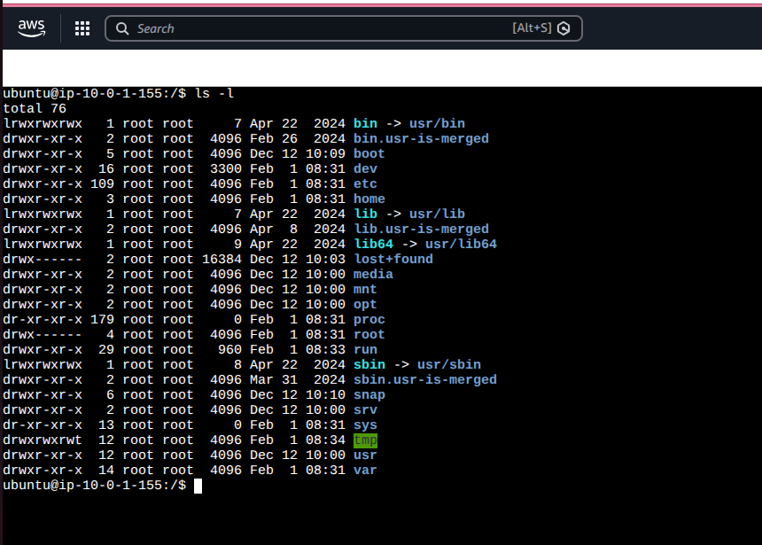
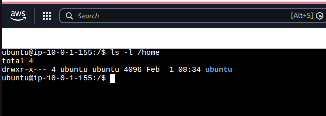
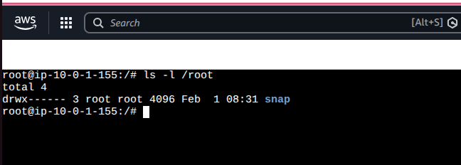
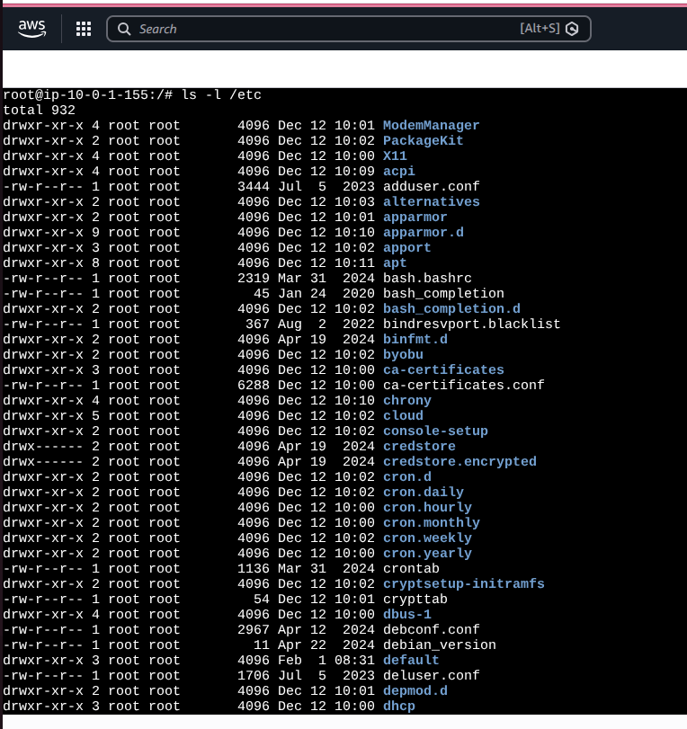
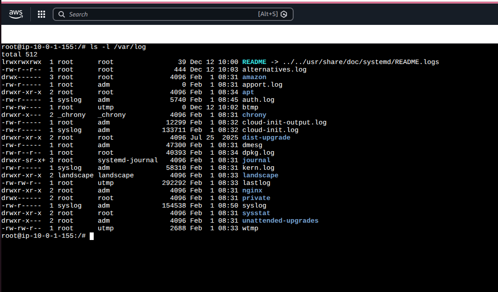
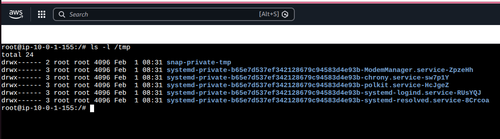
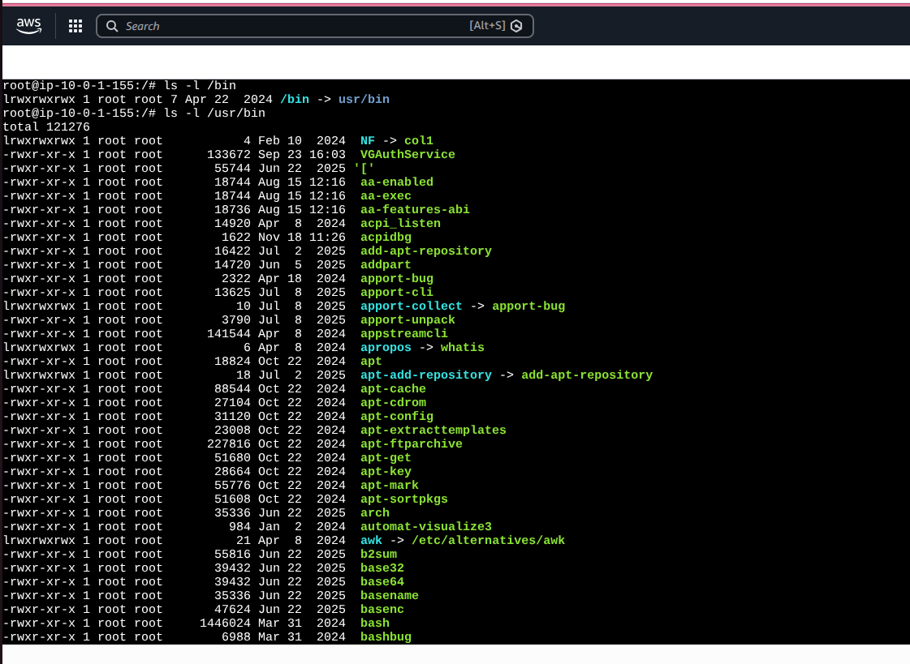
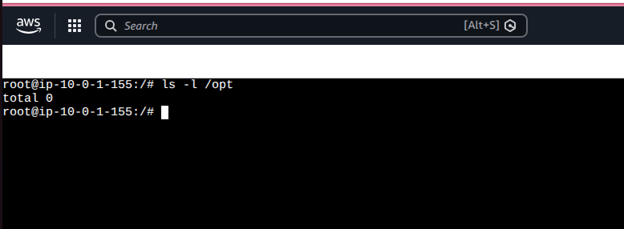

# Day 07 – Linux File System Hierarchy & Scenario-Based Practice

## Part 1: Linux File System Hierarchy

Understanding where things live in Linux helps in faster debugging, automation, and incident response.

---

### / (Root Directory)
Starting point of the entire Linux file system.
All files and directories branch from here.

Command run:
```ls -l```



Observed:
Directories like bin, etc, home, var, usr

I would use this when:
Navigating the system or understanding disk layout issues.

### /home

Contains home directories for all normal users.
User-specific files, configs, scripts live here.

Command run: 
```ls -l /home```



Observed:
User directories like /home/ubuntu

I would use this when:
Checking user files, scripts, or permission issues.

### /root

Home directory for the root user.
Only accessible by root.

Command run:
```ls -l /root```



Observed:
Root-owned files and configs

I would use this when:
Logged in as root during critical admin tasks.

### /etc

Contains system-wide configuration files.
No binaries, only configs.

Command run:
```ls -l /etc```



Observed:
Files like hostname, hosts, ssh

I would use this when:
Debugging service configuration issues.

### /var/log

Stores logs generated by services and the system.
One of the most important directories for DevOps.

Command run:
ls -l /var/log



Observed:
Logs for syslog, nginx, auth.log

I would use this when:
Investigating crashes, errors, or incidents.

### /tmp

Temporary files.
Usually cleared on reboot.

Command run:
ls -l /tmp



Observed:
Temporary runtime files

I would use this when:
Creating temporary test files or scripts.

### /bin

Essential system binaries (ls, cp, mv).

Command run:
ls -l /bin | head



I would use this when:
Running basic commands even in recovery mode.

### /usr/bin

User-level binaries installed by the OS or packages.

Command run:
ls -l /usr/bin | head


I would use this when:
Working with installed tools like curl, git, docker.

### /opt

Optional or third-party applications.

Command run:
ls -l /opt



I would use this when:
Managing custom or vendor applications.
