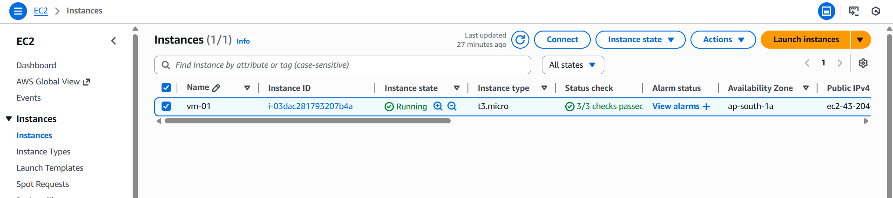
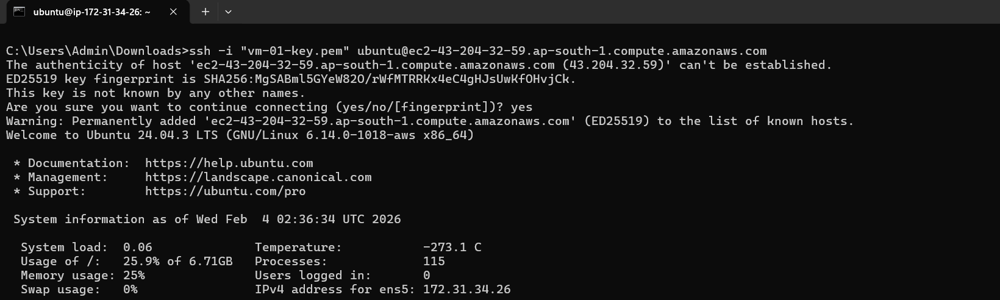
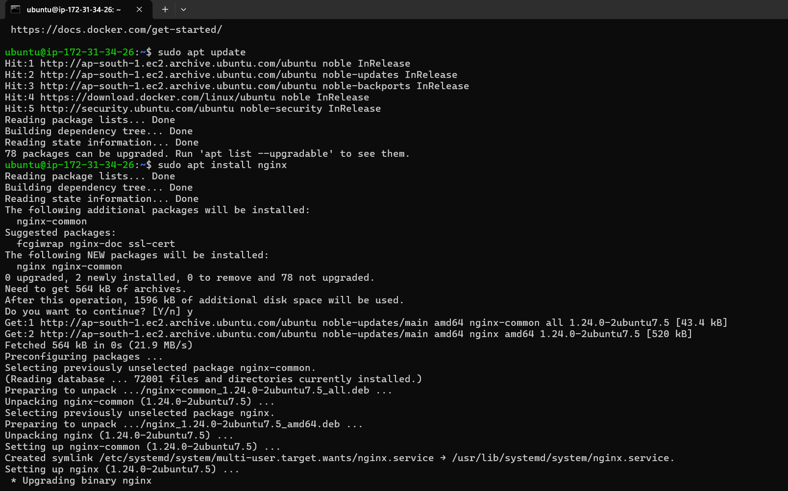
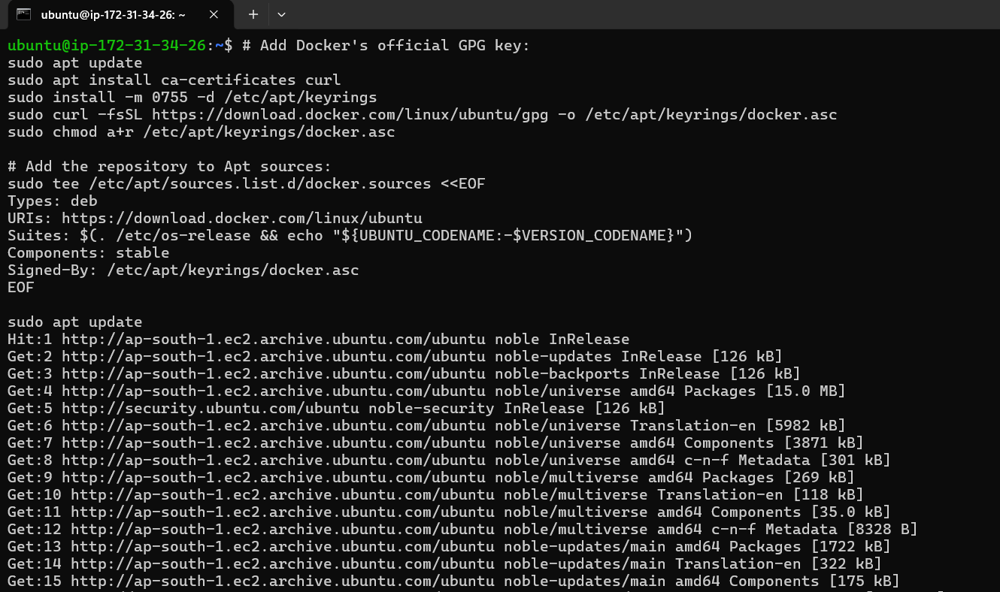
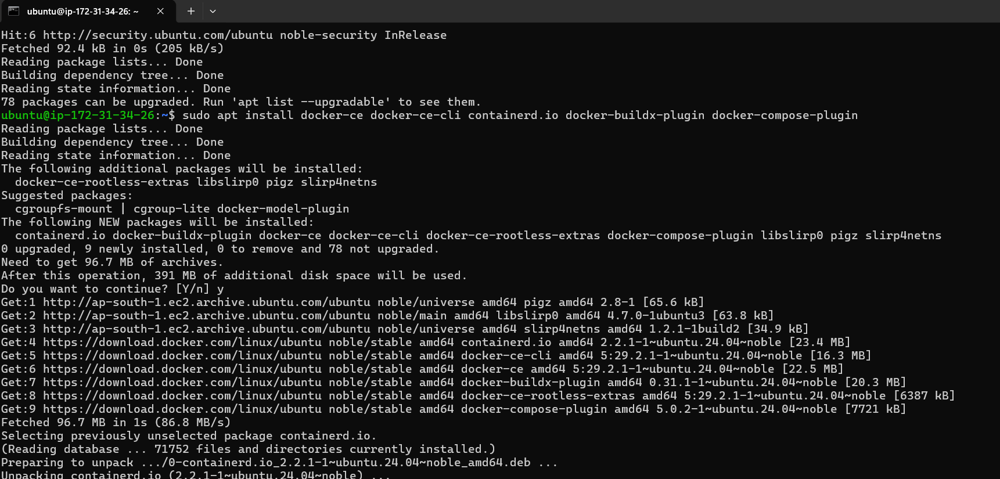
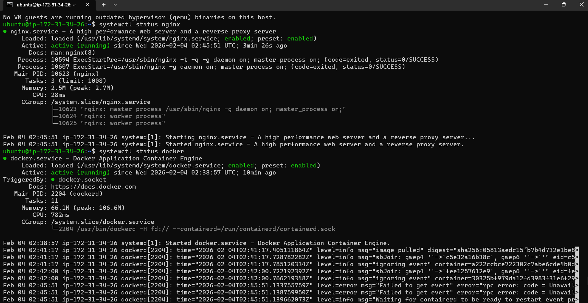
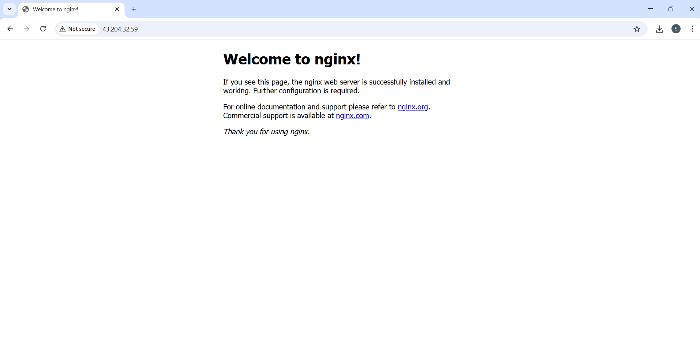
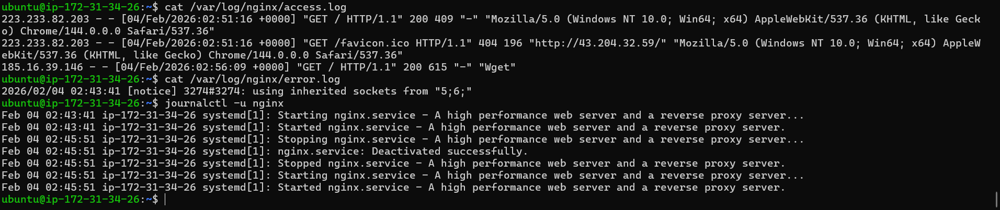
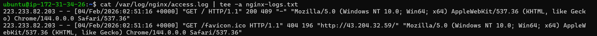
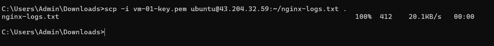

# Day 08 – Cloud Server Setup: Docker, Nginx & Web Deployment

### Launch a cloud instance (AWS EC2 )

### Connect via SSH

### Install Nginx

### Install Docker

### Verify Nginx & Docker is running:

### Test Web Access to Nginx:

### View Nginx Logs

### Save Logs to File

### Download Log File to Your Local Machine

### Commands Used
- cat /var/log/nginx/access.log
- cat /var/log/nginx/access.log | tee -a nginx-logs.txt
- cat /var/log/nginx/error.log
- docker run hello-world
- journalctl -u nginx
- ss -tuln
- sudo apt install nginx
- sudo apt update
- sudo apt upgrade
- systemctl status docker
- systemctl status nginx
- systemctl status nginx
- scp -i your-key.pem ubuntu@<your-instance-ip>:~/nginx-logs.txt .

### What I Learned
- How to install Docker
- How to install NGINX
- How to update Ubuntu system
- How to check logs of NGINX
- How to check service status, service logs
- How to store logs of service to a file
- How to download a file from ec2-instance to local using scp

