# Day 09 – Linux User & Group Management Challenge

### Task 1: Create Users

Create three users with home directories and passwords:
- `tokyo`
- `berlin`
- `professor`

**Verify:** Check `/etc/passwd` and `/home/` directory

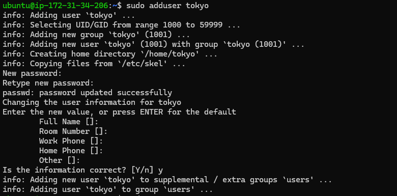
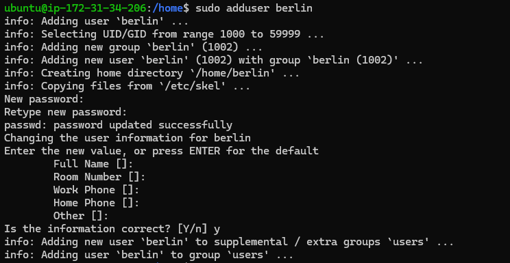
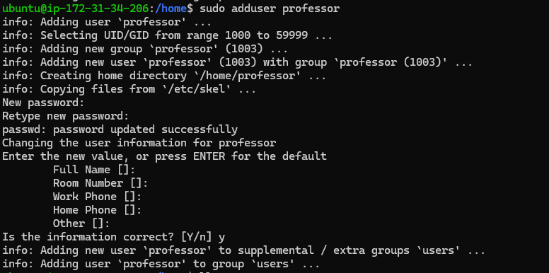
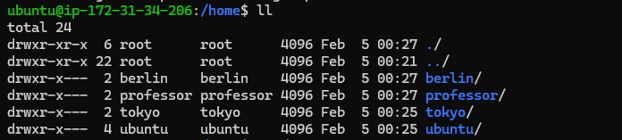
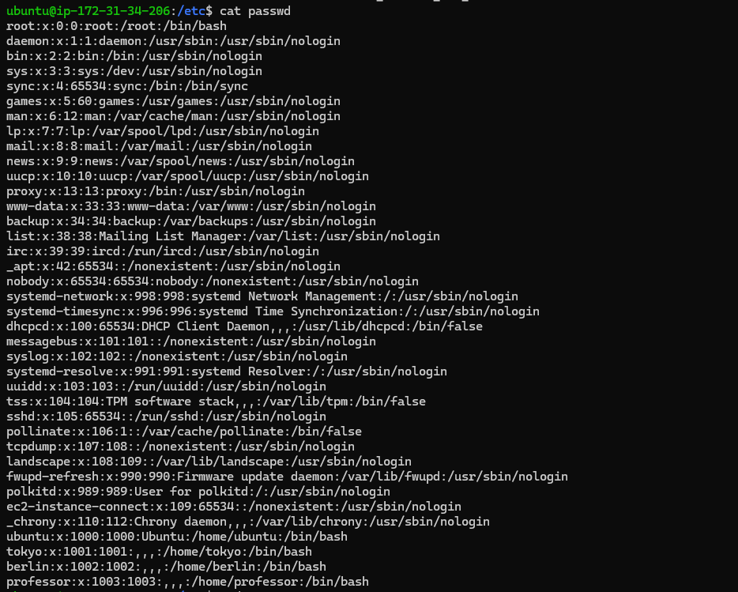

---

### Task 2: Create Groups

Create two groups:
- `developers`
- `admins`

**Verify:** Check `/etc/group`

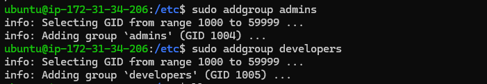
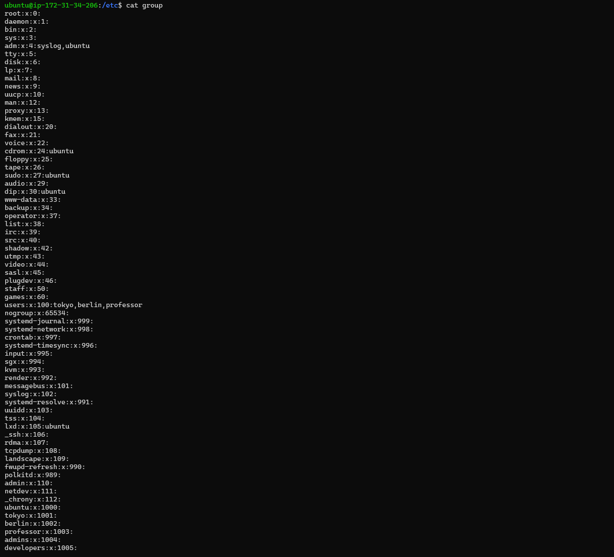

---

### Task 3: Assign to Groups

Assign users:
- `tokyo` → `developers`
- `berlin` → `developers` + `admins` (both groups)
- `professor` → `admins`

**Verify:** Use appropriate command to check group membership

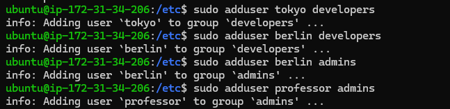
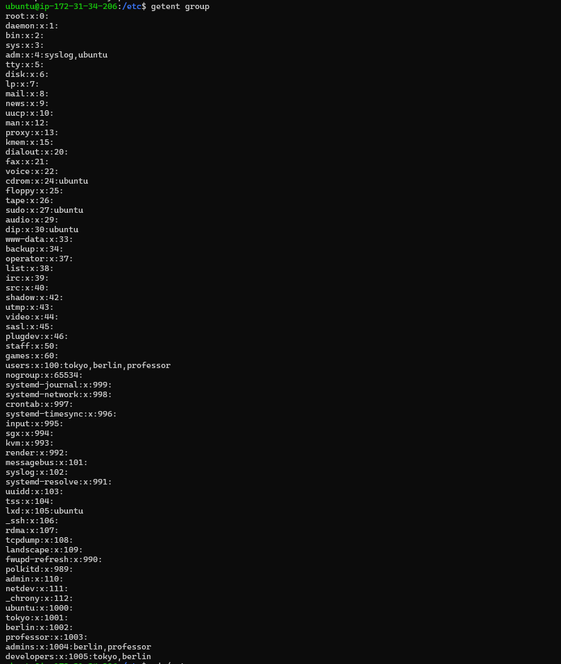
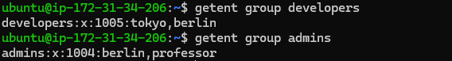

---

### Task 4: Shared Directory

1. Create directory: `/opt/dev-project`
2. Set group owner to `developers`
3. Set permissions to `775` (rwxrwxr-x)
4. Test by creating files as `tokyo` and `berlin`

**Verify:** Check permissions and test file creation

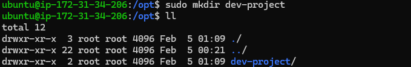
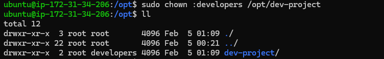
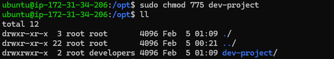
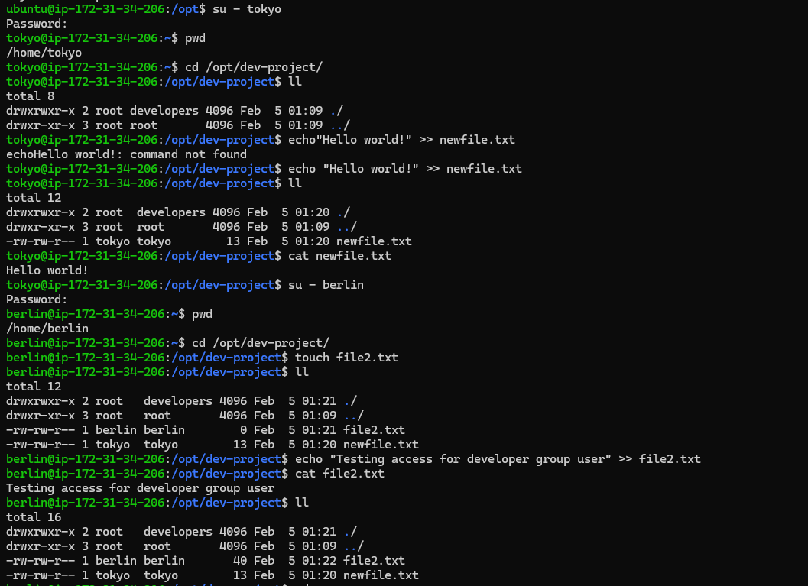

---

### Task 5: Team Workspace

1. Create user `nairobi` with home directory
2. Create group `project-team`
3. Add `nairobi` and `tokyo` to `project-team`
4. Create `/opt/team-workspace` directory
5. Set group to `project-team`, permissions to `775`
6. Test by creating file as `nairobi`

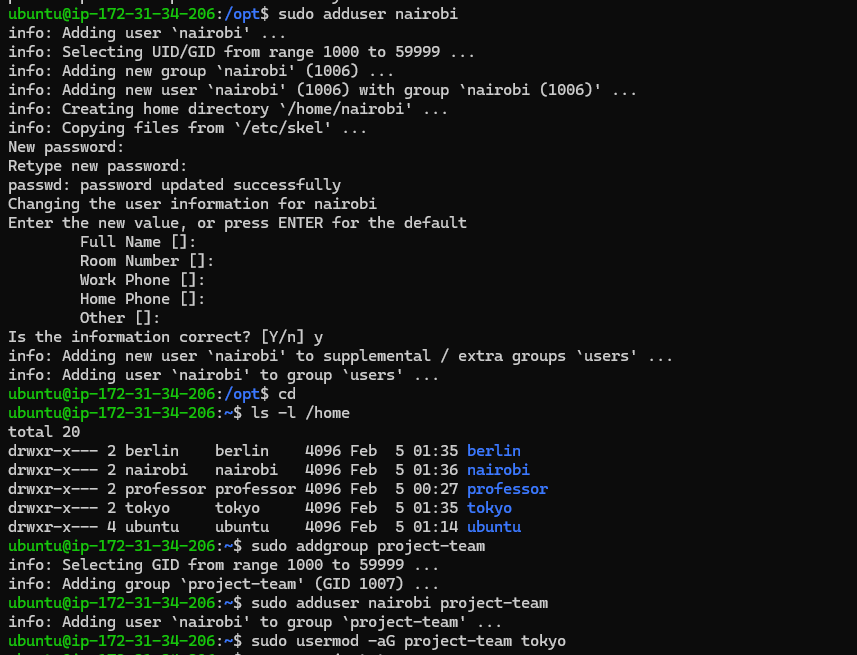
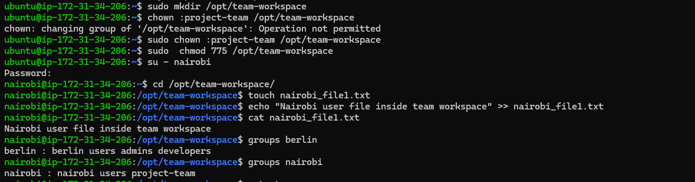

---

## Users & Groups Created
- Users: tokyo, berlin, professor, nairobi
- Groups: developers, admins, project-team

## Group Assignments
- admins: berlin, rofessor
- developers: tokyo, berlin
- project-team: nairobi, tokyo

## Directories Created
- directory: /opt/team-workspace , permission: 775 , owner: project-team 
- directory: /opt/dev-project , permission: 775 , owner: developers 

## Commands Used
- cat group
- cat passwd
- chown :developers /opt/dev-project
- chown :project-team /opt/team-workspace
- getent group
- getent group admins
- getent group developers
- getent group project-team
- ll
- ls -l /home
- ls -ld dev-project/
- man chown
- mkdir /opt/team-workspace
- mkdir dev-project
- su - nairobi
- su - tokyo
- sudo  chmod 775 /opt/team-workspace
- sudo addgroup admins
- sudo addgroup developers
- sudo addgroup project-team
- sudo adduser berlin
- sudo adduser berlin admins
- sudo adduser berlin developers
- sudo adduser nairobi
- sudo adduser nairobi project-team
- sudo adduser professor
- sudo adduser professor admins
- sudo adduser tokyo
- sudo adduser tokyo developers
- sudo chmod 775 dev-project
- sudo chown :developers /opt/dev-project
- sudo chown :project-team /opt/team-workspace
- sudo mkdir /opt/team-workspace
- sudo mkdir dev-project
- sudo passwd ubuntu
- sudo usermod -aG project-team tokyo

## What I Learned
[3 key points]
- User & Group creation
- Manage Group memberships
- Create workspace directory for team
- Switch between users in Linux

---

