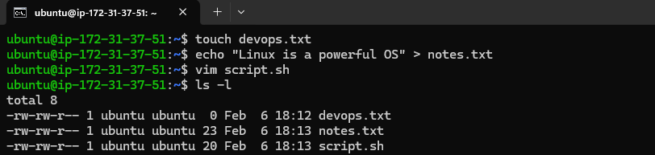
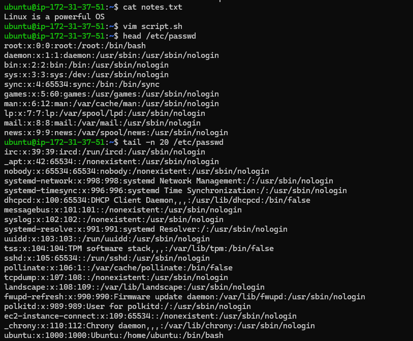
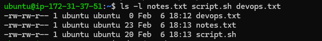
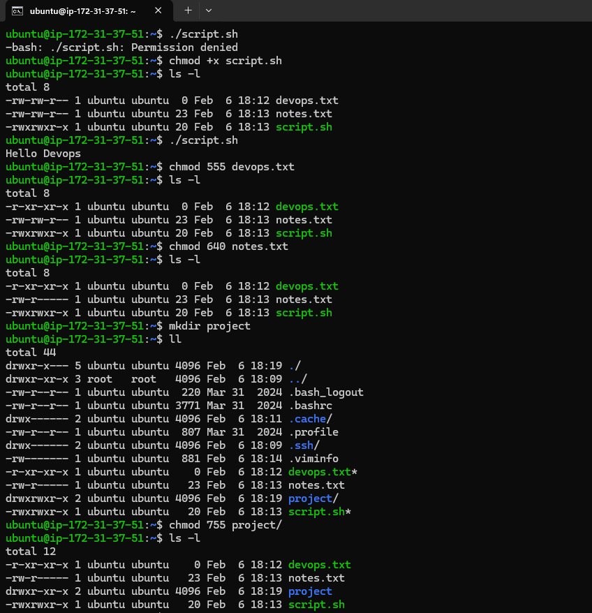
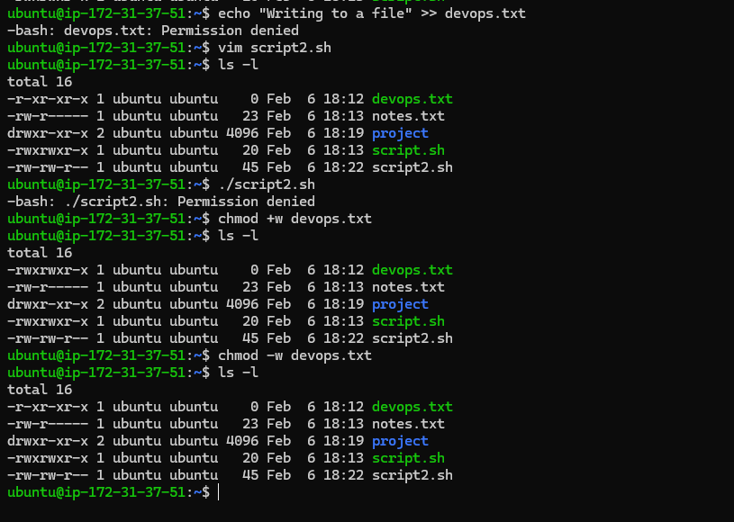

# Day 10 – File Permissions & File Operations Challenge

## Challenge Tasks

### Task 1: Create Files (10 minutes)

1. Create empty file `devops.txt` using `touch`
2. Create `notes.txt` with some content using `cat` or `echo`
3. Create `script.sh` using `vim` with content: `echo "Hello DevOps"`

**Verify:** `ls -l` to see permissions

---

### Task 2: Read Files (10 minutes)

1. Read `notes.txt` using `cat`
2. View `script.sh` in vim read-only mode
3. Display first 5 lines of `/etc/passwd` using `head`
4. Display last 5 lines of `/etc/passwd` using `tail`

---

### Task 3: Understand Permissions (10 minutes)

Format: `rwxrwxrwx` (owner-group-others)
- `r` = read (4), `w` = write (2), `x` = execute (1)

Check your files: `ls -l devops.txt notes.txt script.sh`

Answer: What are current permissions? Who can read/write/execute?

---

### Task 4: Modify Permissions (20 minutes)

1. Make `script.sh` executable → run it with `./script.sh`
2. Set `devops.txt` to read-only (remove write for all)
3. Set `notes.txt` to `640` (owner: rw, group: r, others: none)
4. Create directory `project/` with permissions `755`

**Verify:** `ls -l` after each change

---

### Task 5: Test Permissions (10 minutes)

1. Try writing to a read-only file - what happens?
2. Try executing a file without execute permission
3. Document the error messages

---

## Files Created
- devops.txt
- notes.txt
- project (dir)
- script.sh
- script2.sh

## Permission Changes
- Default permission for all files was 664 -rw-rw-r--
- script.sh was changed to 775 using chmod +x
- chmod 555 devops.txt
- chmod 640 notes.txt
- chmod 755 project/
- chmod +w devops.txt
- chmod -w devops.txt

## Commands Used
- touch devops.txt
- echo "Linux is a powerful OS" > notes.txt
- vim script.sh
- ls -l
- cat notes.txt
- head /etc/passwd
- tail -n 20 /etc/passwd
- ls -l notes.txt script.sh devops.txt
- ./script.sh
- chmod +x script.sh
- chmod 555 devops.txt
- chmod 640 notes.txt
- mkdir project
- ll
- chmod 755 project/
- echo "Writing to a file" >> devops.txt
- vim script2.sh
- ./script2.sh
- chmod +w devops.txt
- chmod -w devops.txt

## What I Learned
- Permissions control access at a very granular level
- Execute permission is mandatory to run scripts
- Numeric permissions (755, 640) are faster and clearer
