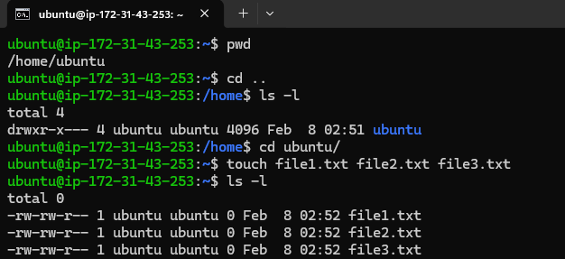
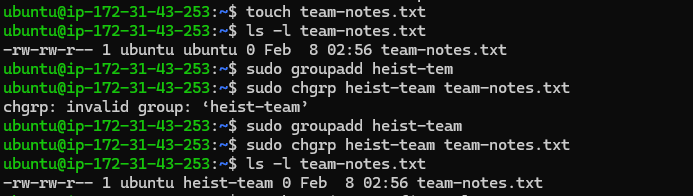
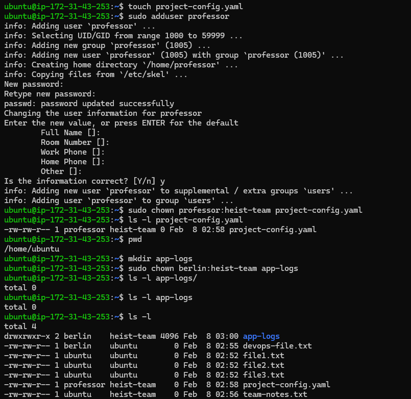
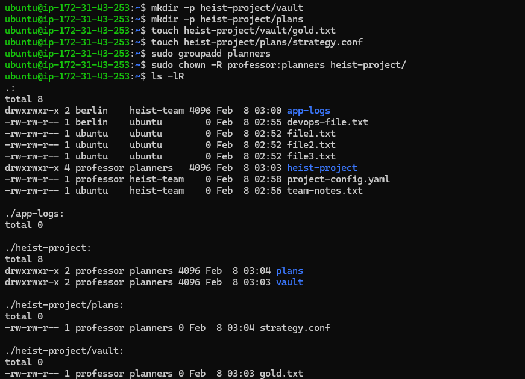
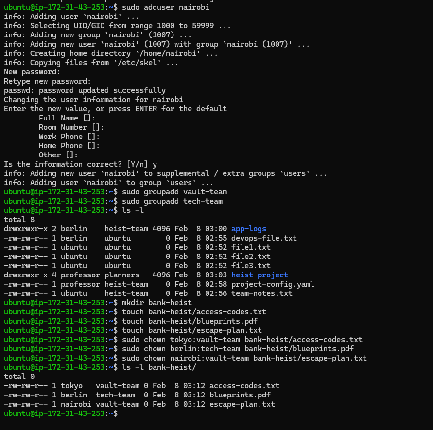
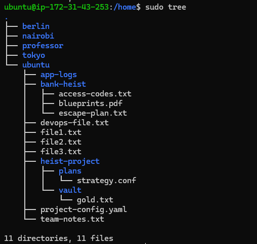

# Day 11 – File Ownership Challenge (chown & chgrp)

## Task
Master file and directory ownership in Linux.

- Understand file ownership (user and group)
- Change file owner using `chown`
- Change file group using `chgrp`
- Apply ownership changes recursively

## Challenge Tasks

### Task 1: Understanding Ownership (10 minutes)

1. Run `ls -l` in your home directory
2. Identify the **owner** and **group** columns
3. Check who owns your files

**Format:** `-rw-r--r-- 1 owner group size date filename`

Document: What's the difference between owner and group?
- Owner → Owner is a single specific user account associated with a file or directory.
- Group → A group is a collection of user accounts that all share the same set of permissions to that file or directory.



---

### Task 2: Basic chown Operations (20 minutes)

1. Create file `devops-file.txt`
2. Check current owner: `ls -l devops-file.txt`
3. Change owner to `tokyo` (create user if needed)
4. Change owner to `berlin`
5. Verify the changes

**Try:**
```bash
sudo chown tokyo devops-file.txt
```


---

### Task 3: Basic chgrp Operations (15 minutes)

1. Create file `team-notes.txt`
2. Check current group: `ls -l team-notes.txt`
3. Create group: `sudo groupadd heist-team`
4. Change file group to `heist-team`
5. Verify the change



---

### Task 4: Combined Owner & Group Change (15 minutes)

Using `chown` you can change both owner and group together:

1. Create file `project-config.yaml`
2. Change owner to `professor` AND group to `heist-team` (one command)
3. Create directory `app-logs/`
4. Change its owner to `berlin` and group to `heist-team`

**Syntax:** `sudo chown owner:group filename`



---

### Task 5: Recursive Ownership (20 minutes)

1. Create directory structure:
   ```
   mkdir -p heist-project/vault
   mkdir -p heist-project/plans
   touch heist-project/vault/gold.txt
   touch heist-project/plans/strategy.conf
   ```

2. Create group `planners`: `sudo groupadd planners`

3. Change ownership of entire `heist-project/` directory:
   - Owner: `professor`
   - Group: `planners`
   - Use recursive flag (`-R`)

4. Verify all files and subdirectories changed: `ls -lR heist-project/`



---

### Task 6: Practice Challenge (20 minutes)

1. Create users: `tokyo`, `berlin`, `nairobi` (if not already created)
2. Create groups: `vault-team`, `tech-team`
3. Create directory: `bank-heist/`
4. Create 3 files inside:
   ```
   touch bank-heist/access-codes.txt
   touch bank-heist/blueprints.pdf
   touch bank-heist/escape-plan.txt
   ```

5. Set different ownership:
   - `access-codes.txt` → owner: `tokyo`, group: `vault-team`
   - `blueprints.pdf` → owner: `berlin`, group: `tech-team`
   - `escape-plan.txt` → owner: `nairobi`, group: `vault-team`

**Verify:** `ls -l bank-heist/`



---

## Key Commands Reference

```bash
# View ownership
ls -l filename

# Change owner only
sudo chown newowner filename

# Change group only
sudo chgrp newgroup filename

# Change both owner and group
sudo chown owner:group filename

# Recursive change (directories)
sudo chown -R owner:group directory/

# Change only group with chown
sudo chown :groupname filename
```
---

## Hints

- Most `chown`/`chgrp` operations need `sudo`
- Use `-R` flag for recursive directory changes
- Always verify with `ls -l` after changes
- User must exist before using in `chown`
- Group must exist before using in `chgrp`/`chown`

---
## Files & Directories Created



---

## Ownership Changes
**devops-file.txt**
- ubuntu:ubuntu → tokyo:ubuntu → berlin:ubuntu

**team-notes.txt**
- ubuntu:ubuntu → ubuntu:heist-team

**project-config.yaml**
- ubuntu:ubuntu → professor:heist-team

**app-logs/**
- ubuntu:ubuntu → berlin:heist-team

**heist-project/**
- ubuntu:ubuntu → professor:planners (recursive)

**heist-project/vault/gold.txt**
- ubuntu:ubuntu → professor:planners

**heist-project/plans/strategy.conf**
- ubuntu:ubuntu → professor:planners

**bank-heist/access-codes.txt**
- ubuntu:ubuntu → tokyo:vault-team

**bank-heist/blueprints.pdf**
- ubuntu:ubuntu → berlin:tech-team

**bank-heist/escape-plan.txt**
- ubuntu:ubuntu → nairobi:vault-team

## Commands Used

```markdown
ls -l
ls -l app-logs
ls -l app-logs/
ls -l bank-heist/
ls -l devops-file.txt
ls -l project-config.yaml
ls -l team-notes.txt
ls -lR

mkdir -p heist-project/plans
mkdir -p heist-project/vault
mkdir app-logs
mkdir bank-heist

sudo adduser berlin
sudo adduser nairobi
sudo adduser professor
sudo adduser tokyo


sudo chgrp heist-team team-notes.txt
sudo chown -R professor:planners heist-project/
sudo chown berlin devops-file.txt
sudo chown berlin:heist-team app-logs
sudo chown berlin:tech-team bank-heist/blueprints.pdf
sudo chown nairobi:vault-team bank-heist/escape-plan.txt
sudo chown professor:heist-team project-config.yaml
sudo chown tokyo devops-file.txt
sudo chown tokyo:vault-team bank-heist/access-codes.txt

sudo groupadd heist-team
sudo groupadd heist-tem
sudo groupadd planners
sudo groupadd tech-team
sudo groupadd vault-team

touch bank-heist/access-codes.txt
touch bank-heist/blueprints.pdf
touch bank-heist/escape-plan.txt
touch devops-file.txt
touch file1.txt file2.txt file3.txt
touch heist-project/plans/strategy.conf
touch heist-project/vault/gold.txt
touch project-config.yaml
touch team-notes.txt

sudo apt install tree -y
sudo apt update
tree
```
---
## What I Learned

- User & Group changes - separate, combined & recursive ways
- chown can change both owner and group in one command
- In Linux, the owner is a single specific user account associated with a file or directory, while a group is a collection of user accounts that all share the same set of permissions to that file or directory.  
