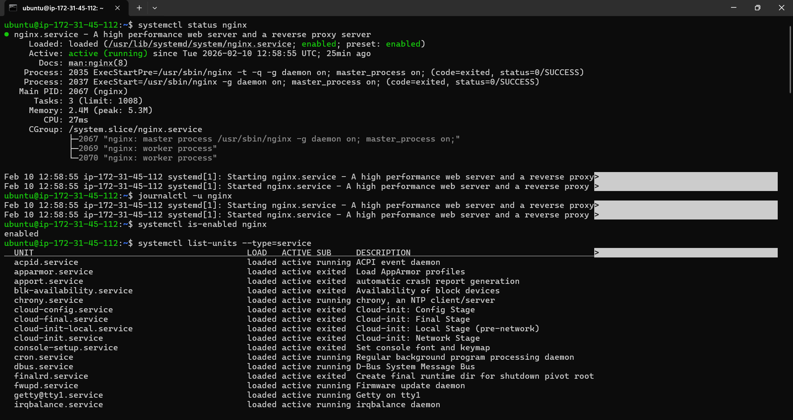
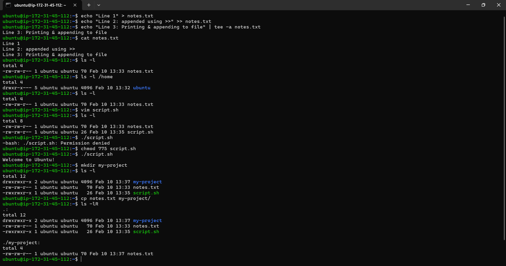
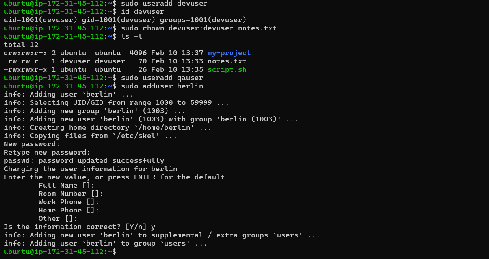

# Day 12 – Breather & Revision (Days 01–11)

## 1. Mindset & Plan Review
- **Mindset & plan:** revisit your Day 01 learning plan—are your goals still right? any tweaks?  
-> Goals still aligned, committed to the journey

## 2. Processes & Services Review (Days 04–05)
- **Processes & services:** rerun 2 commands from Day 04/05 (e.g., `ps`, `systemctl status`, `journalctl -u <service>`);

## 3. File Skills Practice (Days 06–11)

- **File skills:** practice 3 quick ops from Days 06–11 (e.g., `echo >>`, `chmod`, `chown`, `ls -l`, `cp`, `mkdir`).
  

## 4. Cheat Sheet Refresh (Day 03)
Top 5 Commands for Incidents
- ls -l → permissions & ownership
- df -h → disk space issues
- free -m → memory check
- ps -ef → running processes
- systemctl status <service> → service health

## 5. User / Group Sanity Check (Days 09 & 11)

- **User/group sanity:** recreate one small scenario from Day 09 or Day 11 (create a user or change ownership) and verify with `id`/`ls -l`.

observation : adduser & useradd are two different commands for adding user, while running adduser it asks you to provide password for the user

## 6. Mini Self-Check

- Q1. Which 3 commands save you the most time right now?
  - ls -l → instant permission clarity
  - systemctl status → fastest service health check
  - journalctl -u → quick root cause analysis

- Q2. How do you check if a service is healthy?
  - systemctl status <service>
  - ps -ef | grep <service>
  - journalctl -u <service>

- Q3. How do you safely change ownership and permissions?
  - sudo chown appuser:appgroup app.log
  - chmod 640 app.log

- Q4. Focus for the next 3 days
  - Practice advanced shell scripting along with linux commands
