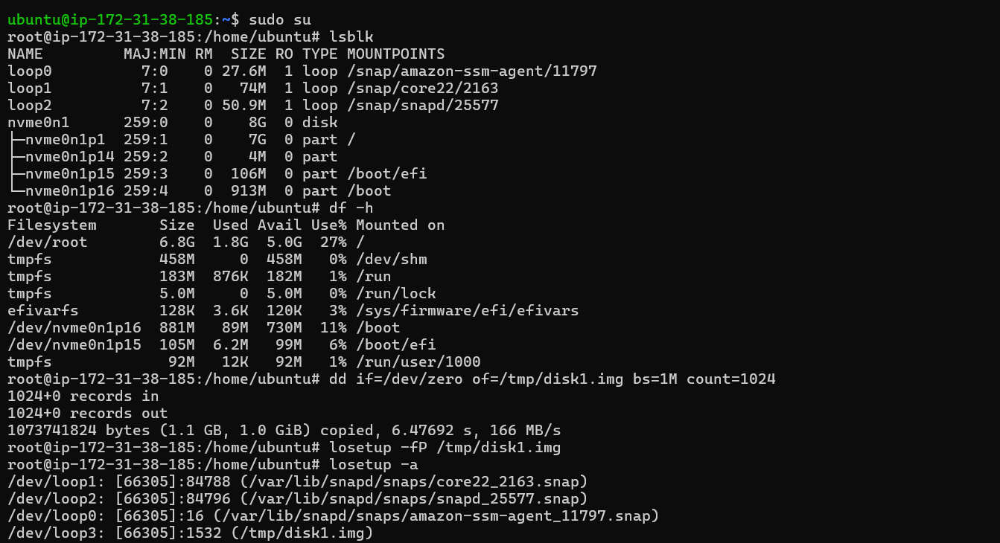
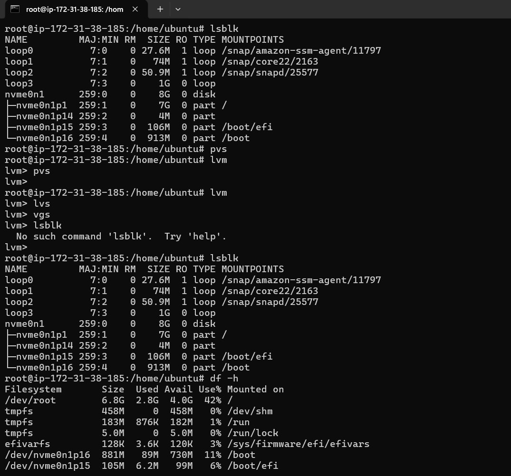
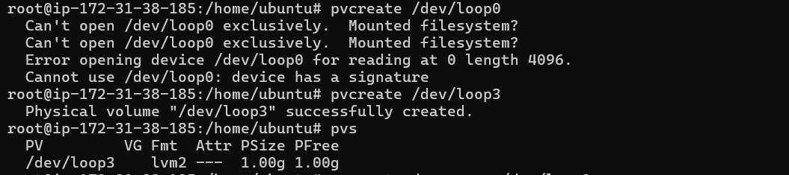
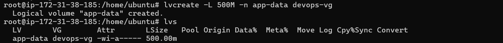
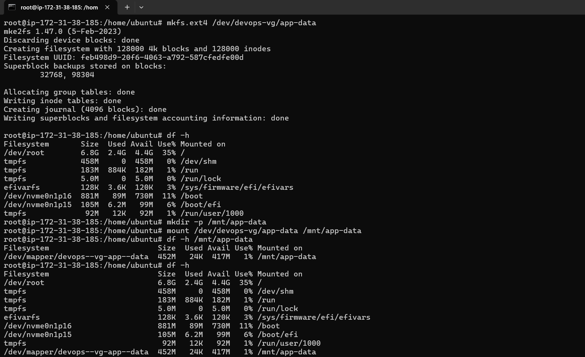
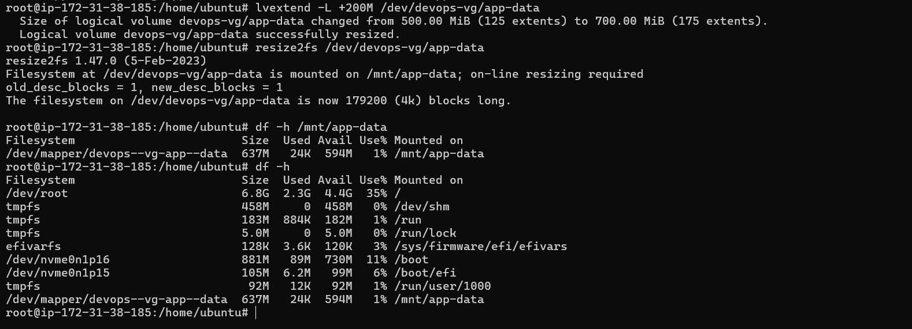

# Day 13 – Linux Volume Management (LVM)

## Task
Learn LVM to manage storage flexibly – create, extend, and mount volumes.

---

## Before You Start

Switch to root user:
```bash
sudo -i
```
or
```bash
sudo su
```
No spare disk? Create a virtual one :
```bash
dd if=/dev/zero of=/tmp/disk1.img bs=1M count=1024
losetup -fP /tmp/disk1.img
losetup -a   # Note the device name (e.g., /dev/loop0)
```


---

## Challenge Tasks

### Task 1: Check Current Storage
Run: `lsblk`, `pvs`, `vgs`, `lvs`, `df -h`



### Task 2: Create Physical Volume
```bash
pvcreate /dev/sdb   # or your loop device
pvs
```



### Task 3: Create Volume Group
```bash
vgcreate devops-vg /dev/sdb
vgs
```


### Task 4: Create Logical Volume
```bash
lvcreate -L 500M -n app-data devops-vg
lvs
```



### Task 5: Format and Mount
```bash
mkfs.ext4 /dev/devops-vg/app-data
mkdir -p /mnt/app-data
mount /dev/devops-vg/app-data /mnt/app-data
df -h /mnt/app-data
```



### Task 6: Extend the Volume
```bash
lvextend -L +200M /dev/devops-vg/app-data
resize2fs /dev/devops-vg/app-data
df -h /mnt/app-data
```



---

## Documentation

- Commands used
  ```bash
  dd if=/dev/zero of=/tmp/disk1.img bs=1M count=1024
  df -h
  df -h /mnt/app-data
  losetup -a
  losetup -fP /tmp/disk1.img
  lsblk
  lvcreate -L 500M -n app-data devops-vg
  lvextend -L +200M /dev/devops-vg/app-data
  lvm
  lvs
  mkdir -p /mnt/app-data
  mkfs.ext4 /dev/devops-vg/app-data
  mount /dev/devops-vg/app-data /mnt/app-data
  pvcreate /dev/loop0
  pvcreate /dev/loop3
  pvs
  resize2fs /dev/devops-vg/app-data
  vgcreate devops-vg /dev/loop3
  vgs
  ```
- What you learned (3 points)
  - How to create virtual disk
  - How to create physical volumes, filesystems, volume groups, logical volumes, mount volumes
  - How to extend/resize volumes

---
