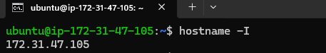
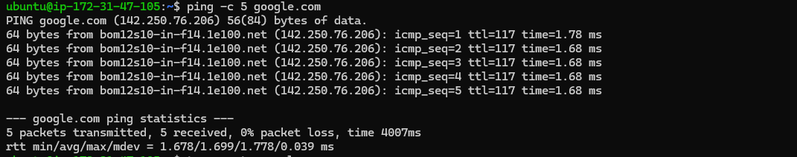
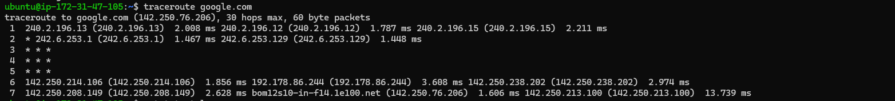
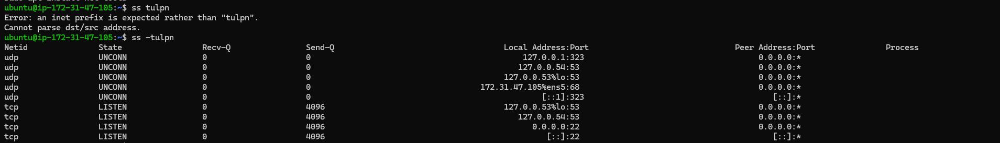
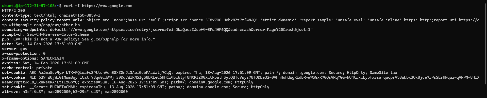
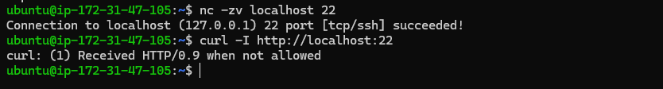

# Day 14 – Networking Fundamentals & Hands-on Checks

### OSI vs TCP/IP Models

**OSI Model**
```bash
  Application Layer  – HTTP, DNS, FTP  
  Presentation Layer – Encryption/format  
  Session Layer      – Connection management  
  Transport Layer    – TCP/UDP  
  Network Layer      – IP routing  
  Data Link Layer    – MAC address, switches  
  Physical Layer     – Cables, signals
```

**TCP/IP Model**
```bash
  Application Layer    - HTTP, HTTPS
  Transport Layer      - TCP(used for browsing), UDP(used for streaming media)
  Internet Layer       - IP addresses/Route
  Network Access Layer - Cables, MAC address
```

`curl -I https://example.com`
Application (HTTP) → TCP → IP → Link  


---

## Hands-on Checklist (run these; add 1–2 line observations)
- **Identity:** `hostname -I` (or `ip addr show`) — note your IP.
  - 
  - ```bash
    Observation:
    Displays private IP address of this machine - 172.31.47.105
    
- **Reachability:** `ping <target>` — mention latency and packet loss.
  - 
  - ```bash
    Observation:
    Packets received successfully.
    Latency observed ~1.68–1.78 ms.
    No packet loss.
    
- **Path:** `traceroute <target>` (or `tracepath`) — note any long hops/timeouts.
  - 
  - ```bash
    Observation:
    Multiple hops shown.
    Some hops may show * * * (ICMP blocked).
    Final destination reachable.
- **Ports:** `ss -tulpn` (or `netstat -tulpn`) — list one listening service and its port.
  - 
  - ```bash
    Observation:
    ssh listening on port 22
    systemd-resolved on port 53
    Shows which services are actively listening.
    
- **Name resolution:** `dig <domain>` or `nslookup <domain>` — record the resolved IP.
  - 
  - ```bash
    Observation:
    Resolved to public IP 142.250.76.206
    DNS response received successfully.
    
- **HTTP check:** `curl -I <http/https-url>` — note the HTTP status code.
  - 
  - ```bash
    Observation:
    HTTP/1.1 200 OK
    Shows headers only.
    Confirms application layer working.
    
- **Connections snapshot:** `netstat -an | head` — count ESTABLISHED vs LISTEN (rough).
  - 
  - ```bash
    Observation:
    LISTEN – services waiting for connection
    ESTABLISHED – active connections
    Quick view of connection state.
    ```

Pick one target service/host (e.g., `google.com`, your lab server, or a local service) and stick to it for ping/traceroute/curl where possible.

---
## Mini Task: Port Probe & Interpret
1) Identify one listening port from `ss -tulpn` (e.g., SSH on 22 or a local web app).  
  - 
  
2) From the same machine, test it: `nc -zv localhost <port>` (or `curl -I http://localhost:<port>`).  
  - 
  
3) Write one line: is it reachable? If not, what’s the next check? (e.g., service status, firewall).
  - Result: Connection successful.    
    If not reachable:   
    Next checks:   
    `systemctl status ssh`
---

## Reflection (add to your markdown)
- Which command gives you the fastest signal when something is broken?
  - ping or curl -I gives quickest indication of reachability and application response.
  
- What layer (OSI/TCP-IP) would you inspect next if DNS fails? If HTTP 500 shows up?
  - Check Application layer first (DNS service). Then verify UDP/TCP 53 at Transport layer.
  - HTTP 500: Application layer issue.    
    Next checks:    
      - Service logs    
      - Application logs     
      - Backend service health    
      
- Two follow-up checks you’d run in a real incident.
  1) Check firewall/security group rules.
  2) Inspect service logs (journalctl or app logs).

---
