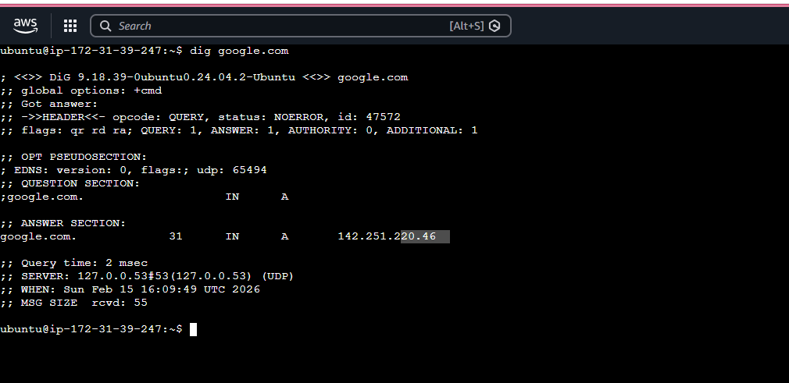
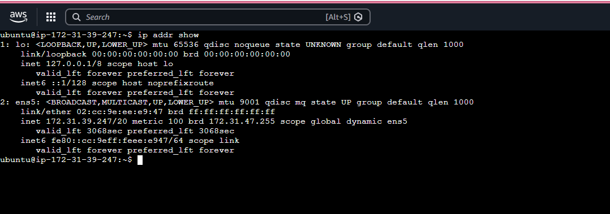
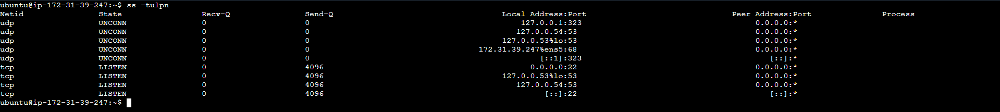

# Day 15 – Networking Concepts: DNS, IP, Subnets & Ports

## Task

- Understand how **DNS** resolves names to IPs
- Learn **IP addressing** (IPv4, public vs private)
- Break down **CIDR notation** and **subnetting** basics
- Know common **ports** and why they matter

### Task 1: DNS – How Names Become IPs
1. Explain in 3–4 lines: what happens when you type `google.com` in a browser?
	- The browser checks local DNS cache.
	- If not found, it queries the configured DNS resolver.
	- The resolver contacts root → TLD → authoritative name server.
	- The IP address is returned and the browser connects to that IP.
  
2. What are these record types? Write one line each:
   - `A`, `AAAA`, `CNAME`, `MX`, `NS`
	- A – Maps domain name to IPv4 address  
	- AAAA – Maps domain name to IPv6 address  
	- CNAME – Alias of one domain to another  
	- MX – Mail server record for receiving emails  
	- NS – Name server responsible for the domain  
  
3. Run: `dig google.com` — identify the A record and TTL from the output    

- A Record IP: 142.251.220.46
- TTL: 31 seconds
- TTL = Time DNS response is cached.

---

### Task 2: IP Addressing
1. What is an IPv4 address? How is it structured? (e.g., `192.168.1.10`)
An IPv4 address is a 32-bit numeric address written in dotted decimal format.   

Example:   
192.168.1.10   

Structure:   
4 octets (8 bits each) → 32 bits total.   

2. Difference between **public** and **private** IPs — give one example of each
**Public IP:**   
Routable on the internet.   
Example: 8.8.8.8   

**Private IP:**   
Used inside internal networks.   
Example: 192.168.1.10   


3. What are the private IP ranges?
   - 10.0.0.0 – 10.255.255.255
   - 172.16.0.0 – 172.31.255.255
   - 192.168.0.0 – 192.168.255.255
   
4. Run: `ip addr show` — identify which of your IPs are private   
   
Identified private IP: 172.31.39.247 (falls under range 172.xxxx)

---

### Task 3: CIDR & Subnetting
1. What does `/24` mean in `192.168.1.0/24`?
- ```bash
  /24 means:
  24 bits are for network portion.
  Remaining 8 bits are for hosts.

  Subnet mask:
  255.255.255.0
  ```
  
2. How many usable hosts in a `/24`? A `/16`? A `/28`?
- ```bash
  Usable Hosts

  /24 → 256 total IPs → 254 usable
  /16 → 65,536 total IPs → 65,534 usable
  /28 → 16 total IPs → 14 usable

  Formula:
  Usable Hosts = 2^(32 - CIDR) - 2
  ```
  
3. Explain in your own words: why do we subnet?
  - Efficient IP utilization
  - Network segmentation
  - Improve security
  - Reduce broadcast domains   
     

4. Quick exercise — fill in:

| CIDR | Subnet Mask | Total IPs | Usable Hosts |
|------|-------------|-----------|--------------|
| /24  | 255.255.255.0           | 256         | 254            |
| /16  | 255.255.0.0           | 65,536         | 65,534            |
| /28  | 255.255.255.240           | 16         | 14            |

---

### Task 4: Ports – The Doors to Services
1. What is a port? Why do we need them?
  - A port is a logical communication endpoint.
  - It allows multiple services to run on the same IP.
  - IP = House     Port = Door

2. Document these common ports:

| Port | Service |
|------|---------|
| 22   | SSH       |
| 80   | HTTP       |
| 443  | HTTPS       |
| 53   | DNS       |
| 3306 | MySQL       |
| 6379 | Redis       |
| 27017| MongoDB       |

3. Run `ss -tulpn` — match at least 2 listening ports to their services

SSH - 22, DNS - 53   

---

### Task 5: Putting It Together
Answer in 2–3 lines each:
- You run `curl http://myapp.com:8080` — what networking concepts from today are involved?
  - DNS resolves myapp.com
  - TCP connects to port 8080
  - HTTP request sent over TCP
  - IP routes packets to destination
  
- Your app can't reach a database at `10.0.1.50:3306` — what would you check first?
  - Checks:
  
  - Is DB service running?
  - Is port 3306 open?
  - Security group / firewall rules?
  - Network route between app and DB?

### What I Learned (Key Points)

- DNS translates human-readable names into IP addresses.

- CIDR helps efficiently divide networks and control traffic.

- Ports allow multiple services to operate on a single IP.

---
