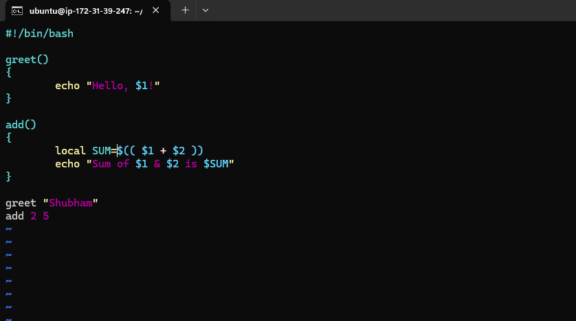
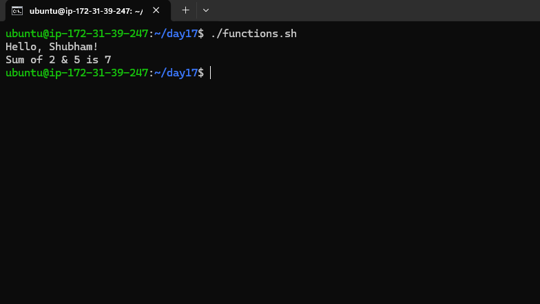
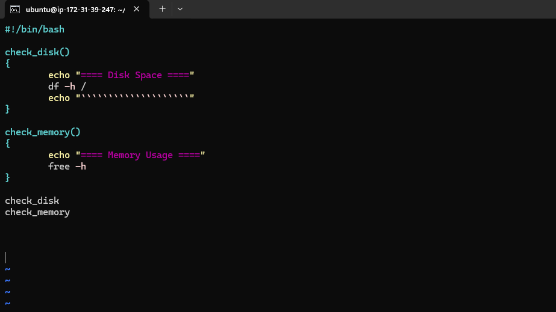
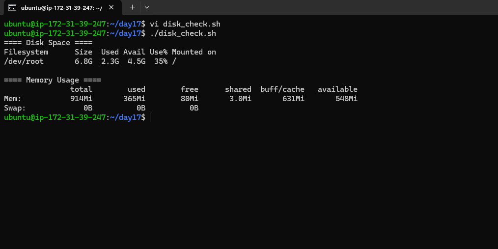
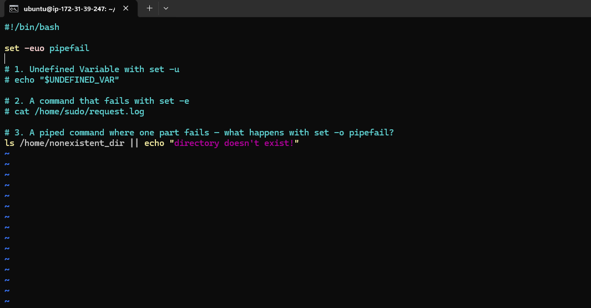
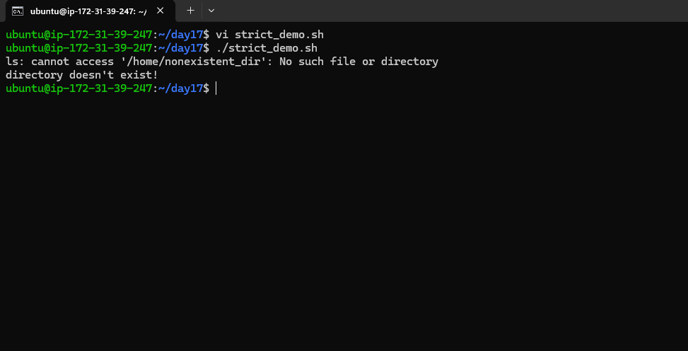
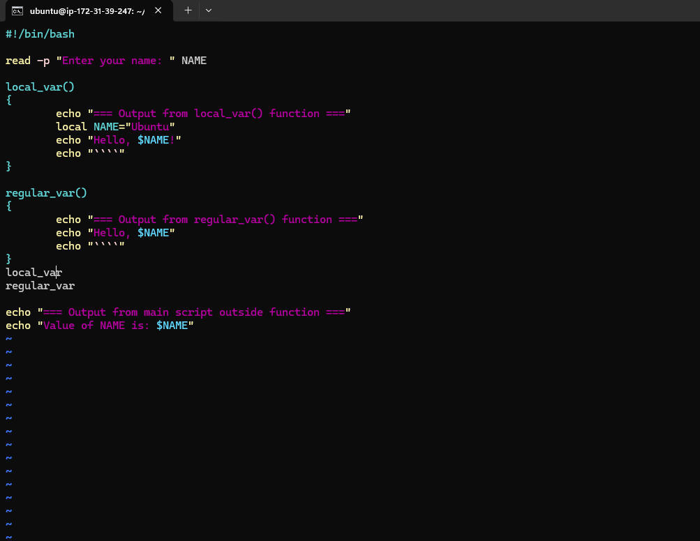
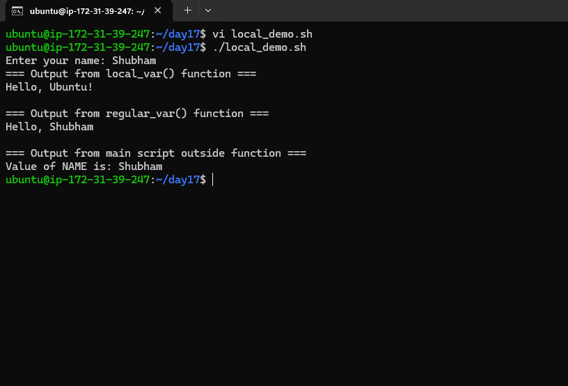
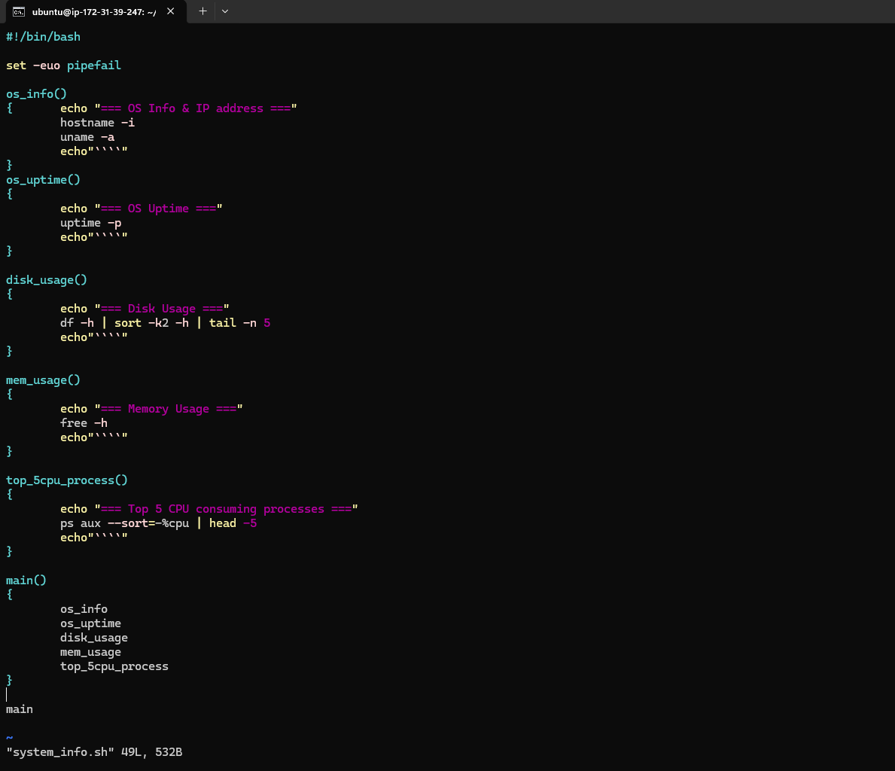
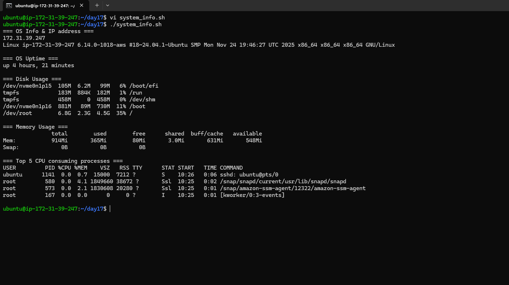

# Day 18 – Shell Scripting: Functions & Slightly Advanced Concepts

## Task
Write cleaner, reusable scripts — learn functions, strict mode, and real-world patterns.

You will:
- Write and call **functions**
- Use **`set -euo pipefail`** for safer scripts
- Work with **return values** and **local variables**
- Build a slightly advanced script

---

## Challenge Tasks

### Task 1: Basic Functions
1. Create `functions.sh` with:
   - A function `greet` that takes a name as argument and prints `Hello, <name>!`
   - A function `add` that takes two numbers and prints their sum
   - Call both functions from the script   
   
    
---

### Task 2: Functions with Return Values
1. Create `disk_check.sh` with:
   - A function `check_disk` that checks disk usage of `/` using `df -h`
   - A function `check_memory` that checks free memory using `free -h`
   - A main section that calls both and prints the results
   
    

---

### Task 3: Strict Mode — `set -euo pipefail`
1. Create `strict_demo.sh` with `set -euo pipefail` at the top
2. Try using an **undefined variable** — what happens with `set -u`?
3. Try a command that **fails** — what happens with `set -e`?
4. Try a **piped command** where one part fails — what happens with `set -o pipefail`?

**Document:** What does each flag do?
- `set -e` →
- `set -u` →
- `set -o pipefail` →

- **set -e** → Exit on error
```
- If any command returns a non-zero exit status, the script stops immediately.
- Example: ls /nonexistent_dir will terminate the script.
```

- **set -u** → Treat unset variables as errors
```
- Using an undefined variable causes the script to exit.
- Example: echo $UNDEFINED_VAR will throw an error instead of printing an empty string.
```

- **set -o pipefail** → Fail on pipeline errors
```
- Normally, only the last command in a pipeline determines success/failure.
- With pipefail, if any command in the pipeline fails, the whole pipeline fails.
- Example: cat /nonexistent_file  grep "something" will exit because cat fails, even though grep might succeed.
```
  
  
   
    


---

### Task 4: Local Variables
1. Create `local_demo.sh` with:
   - A function that uses `local` keyword for variables
   - Show that `local` variables don't leak outside the function
   - Compare with a function that uses regular variables   

   
    

---

### Task 5: Build a Script — System Info Reporter
Create `system_info.sh` that uses functions for everything:
1. A function to print **hostname and OS info**
2. A function to print **uptime**
3. A function to print **disk usage** (top 5 by size)
4. A function to print **memory usage**
5. A function to print **top 5 CPU-consuming processes**
6. A `main` function that calls all of the above with section headers
7. Use `set -euo pipefail` at the top

Output should look clean and readable.    

   
    
---

## Hints
- Function syntax: `function_name() { ... }`
- Local vars: `local MY_VAR="value"`
- Strict mode: `set -euo pipefail` as first line after shebang
- Pass args to functions: `greet "Shubham"` → access as `$1` inside
- `$?` gives the exit code of last command

---

### What I learned
- Making reusable & modular scripts using functions
- How to build a System Info Reporter script
- local variables
- set -euo pipefail to handle errors within a script
