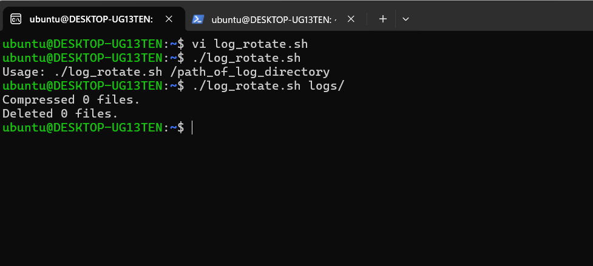
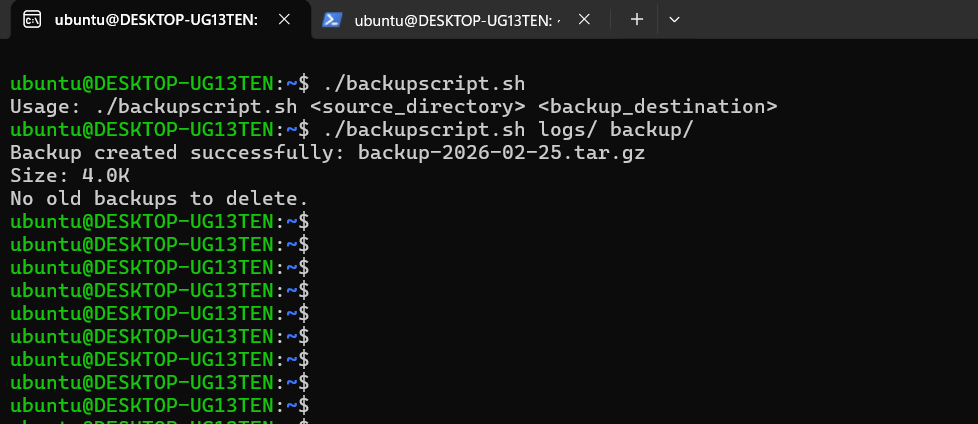
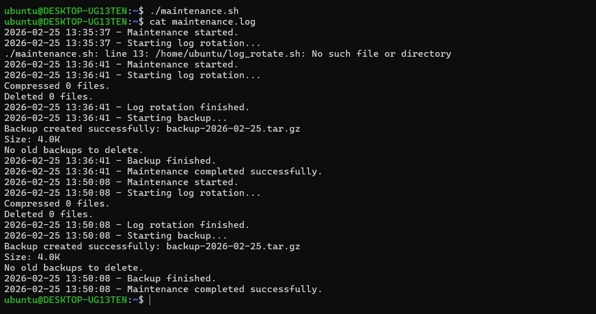
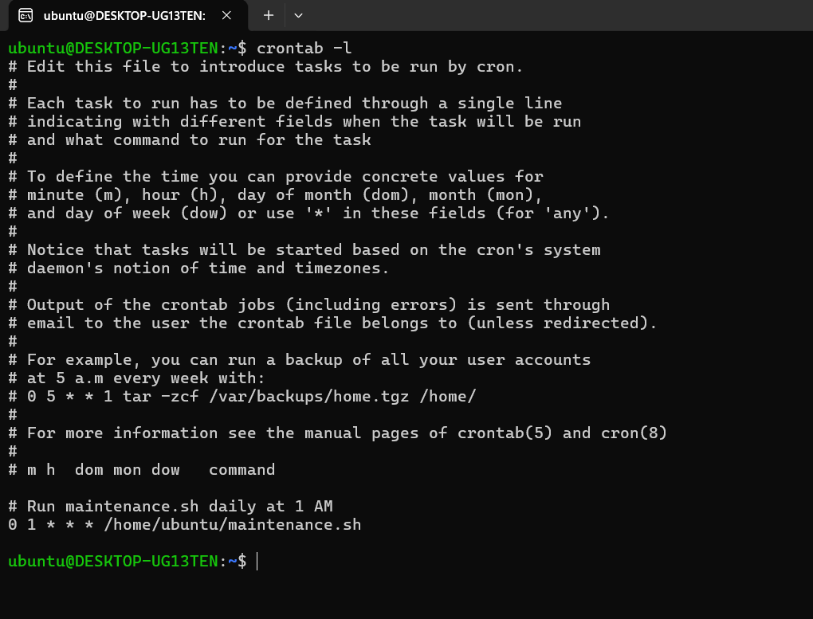

# Day 19 – Shell Scripting Project: Log Rotation, Backup & Crontab

## Task
Apply everything from Days 16–18 in real-world mini projects.

You will:
- Write a **log rotation** script
- Write a **server backup** script
- Schedule them with **crontab**

---

## Expected Output
- A markdown file: `day-19-project.md`
- All scripts you write during the tasks

---

## Challenge Tasks

### Task 1: Log Rotation Script
Create `log_rotate.sh` that:
1. Takes a log directory as an argument (e.g., `/var/log/myapp`)
2. Compresses `.log` files older than 7 days using `gzip`
3. Deletes `.gz` files older than 30 days
4. Prints how many files were compressed and deleted
5. Exits with an error if the directory doesn't exist

**log_rotate.sh**
```bash
#!/bin/bash

LOG_DIR=$1

if [ -z "$LOG_DIR" ]; then
        echo "Usage: $0 /path_of_log_directory"
        exit 1

elif [ ! -d "$LOG_DIR" ]; then
        echo "Enter a valid directory path!"
        exit 1
fi

# Compress .log files older than 7 days and count them
compressed=$(find "$LOG_DIR" -type f -name "*.log" -mtime +7 -exec gzip {} \; -print | wc -l)

# Delete .gz files older than 30 days and count them
deleted=$(find "$LOG_DIR" -type f -name "*.gz" -mtime +30 -delete -print | wc -l)

# Prints how many files were compressed and deleted
echo "Compressed $compressed files."
echo "Deleted $deleted files."
```


---

### Task 2: Server Backup Script
Create `backup.sh` that:
1. Takes a source directory and backup destination as arguments
2. Creates a timestamped `.tar.gz` archive (e.g., `backup-2026-02-08.tar.gz`)
3. Verifies the archive was created successfully
4. Prints archive name and size
5. Deletes backups older than 14 days from the destination
6. Handles errors — exit if source doesn't exist

**backup.sh**
```bash
#!/bin/bash

set -euo pipefail

# === Functions ===

usage() {
    echo "Usage: $0 <source_directory> <backup_destination>"
    exit 1
}

check_source() {
    local src="$1"
    if [ ! -d "$src" ]; then
        echo "Error: Source directory '$src' does not exist."
        exit 1
    fi
}

create_backup() {
    local src="$1"
    local dest="$2"
    local timestamp
    timestamp=$(date +"%Y-%m-%d")
    local archive_name="backup-$timestamp.tar.gz"
    local archive_path="$dest/$archive_name"

    mkdir -p "$dest"
    tar -czf "$archive_path" -C "$src" .

    echo "$archive_path"
}

verify_backup() {
    local archive="$1"
    if [ -f "$archive" ]; then
        local size
        size=$(du -h "$archive" | cut -f1)
        echo "Backup created successfully: $(basename "$archive")"
        echo "Size: $size"
    else
        echo "Error: Backup archive was not created."
        exit 1
    fi
}

cleanup_old_backups() {
    local dest="$1"
    local deleted_count
    deleted_count=$(find "$dest" -name "backup-*.tar.gz" -type f -mtime +14 | wc -l)

    if [ "$deleted_count" -gt 0 ]; then
        find "$dest" -name "backup-*.tar.gz" -type f -mtime +14 -exec rm -f {} \;
        echo "Deleted $deleted_count old backup(s) older than 14 days."
    else
        echo "No old backups to delete."
    fi
}

# === Main Script ===

if [ "$#" -ne 2 ]; then
    usage
fi

SOURCE_DIR="$1"
DEST_DIR="$2"

check_source "$SOURCE_DIR"
ARCHIVE_PATH=$(create_backup "$SOURCE_DIR" "$DEST_DIR")
verify_backup "$ARCHIVE_PATH"
cleanup_old_backups "$DEST_DIR"
```



---

### Task 3: Crontab
1. Read: `crontab -l` — what's currently scheduled?
2. Understand cron syntax:
   ```
   * * * * *  command
   │ │ │ │ │
   │ │ │ │ └── Day of week (0-7)
   │ │ │ └──── Month (1-12)
   │ │ └────── Day of month (1-31)
   │ └──────── Hour (0-23)
   └────────── Minute (0-59)
   ```
3. Write cron entries (in your markdown, don't apply if unsure) for:
   - Run `log_rotate.sh` every day at 2 AM
   - Run `backup.sh` every Sunday at 3 AM
   - Run a health check script every 5 minutes
   
```bash

# Run log_rotate.sh every day at 2 AM
0 2 * * * /path/to/log_rotate.sh /var/log/myapp

# Run backup.sh every Sunday at 3 AM
0 3 * * 0 /path/to/backup.sh /path/to/source /path/to/destination

# Run health_check.sh every 5 minutes
*/5 * * * * /path/to/health_check.sh

```

---

### Task 4: Combine — Scheduled Maintenance Script
Create `maintenance.sh` that:
1. Calls your log rotation function
2. Calls your backup function
3. Logs all output to `/var/log/maintenance.log` with timestamps
4. Write the cron entry to run it daily at 1 AM

**maintenance.sh**

```bash
#!/bin/bash

set -euo pipefail

LOG_FILE="/home/ubuntu/maintenance.log"

log() {
    echo "$(date '+%Y-%m-%d %H:%M:%S') - $1" >> "$LOG_FILE"
}

run_log_rotation() {
    log "Starting log rotation..."
    /home/ubuntu/log_rotate.sh /home/ubuntu/logs >> "$LOG_FILE" 2>&1
    log "Log rotation finished."
}

run_backup() {
    log "Starting backup..."
    /home/ubuntu/backupscript.sh /home/ubuntu/logs /home/ubuntu/backups >> "$LOG_FILE" 2>&1
    log "Backup finished."
}

main() {
    log "Maintenance started."
    run_log_rotation
    run_backup
    log "Maintenance completed successfully."
}

main
```




---

## Hints
- Compress old files: `find /path -name "*.log" -mtime +7 -exec gzip {} \;`
- Timestamp: `date +%Y-%m-%d`
- Tar: `tar -czf backup.tar.gz /source/dir`
- Cron edit: `crontab -e`
- Log with timestamp: `echo "$(date): message" >> logfile`

---
