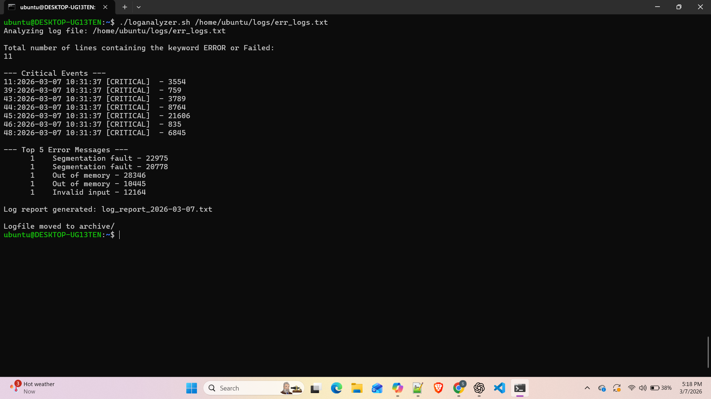

# Day 20 – Bash Scripting Challenge: Log Analyzer and Report Generator

## Script

File: log_analyzer.sh   

Features:
- Input validation
- Error detection
- Critical event detection
- Error frequency analysis
- Automatic report generation
- Log archiving

```bash
#!/bin/bash

LOGFILE=$1
DATE=$(date +%Y-%m-%d)
REPORT=log_report_$DATE.txt
ERROR_COUNT=0
TOTAL_LINES=$(wc -l < "$LOGFILE")

input_validation()
{
        if [ -z $LOGFILE ]; then
                echo "Usage: $0 <logfile_path>"
                exit 1
        fi

        if [ ! -f $LOGFILE ]; then
                echo "Logfile doesn't exist!"
                exit 1
        fi
}

error_count()
{
        echo ""
        echo "Total number of lines containing the keyword ERROR or Failed: "
        ERROR_COUNT=$(grep -Ei "ERROR|Failed" $LOGFILE | wc -l)
        echo $ERROR_COUNT
}

critical_events()
{
        echo ""
        echo "--- Critical Events ---"
        grep -n "CRITICAL" $LOGFILE
}

top_error_messages()
{
        echo ""
        echo "--- Top 5 Error Messages ---"
        grep "ERROR" $LOGFILE | awk '{$1=$2=$3=""; print}' | sort | uniq -c | sort -rn | head -5
}

summary_report()
{
        {
                echo "Log Analysis Report"
                echo "==============================="
                echo "Date of Analysis: $DATE"
                echo "Log File: $LOGFILE"
                echo "Total Lines Processed: $TOTAL_LINES"
                echo "Total Error Count: $ERROR_COUNT"
                echo ""

                echo "--- Top 5 Error Messages ---"
                grep "ERROR" "$LOGFILE" \
                | awk '{$1=$2=$3=""; print}' \
                | sort \
                | uniq -c \
                | sort -rn \
                | head -5

                echo ""

                echo "--- Critical Events ---"
                grep -n "CRITICAL" "$LOGFILE" || echo "No critical events found."
        } > $REPORT
        echo ""
        echo "Log report generated: $REPORT"
}

archive_processed_logs()
{
        ARCHIVE="archive"
        mkdir -p $ARCHIVE
        mv $LOGFILE $ARCHIVE
        echo ""
        echo "Logfile moved to archive/"
}

main()
{
        input_validation
        echo "Analyzing log file: $LOGFILE"
        error_count
        critical_events
        top_error_messages
        summary_report
        archive_processed_logs
}
main
```
## Commands Used

grep   
awk   
sort   
uniq   
wc   
date   
mv   
mkdir  

## Output   


## What I Learned

1. Log analysis automation using Bash scripting.
2. grep, awk, sort, and uniq for data analysis.
3. Modular scripts using functions for maintainability.
