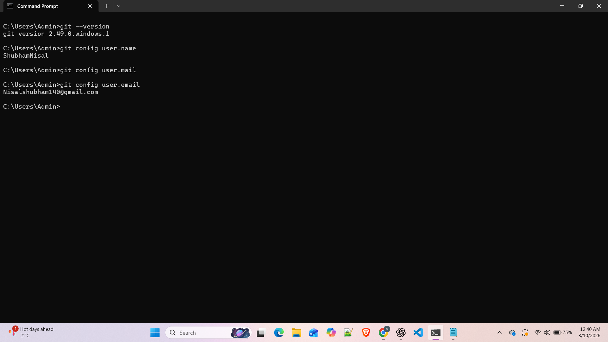
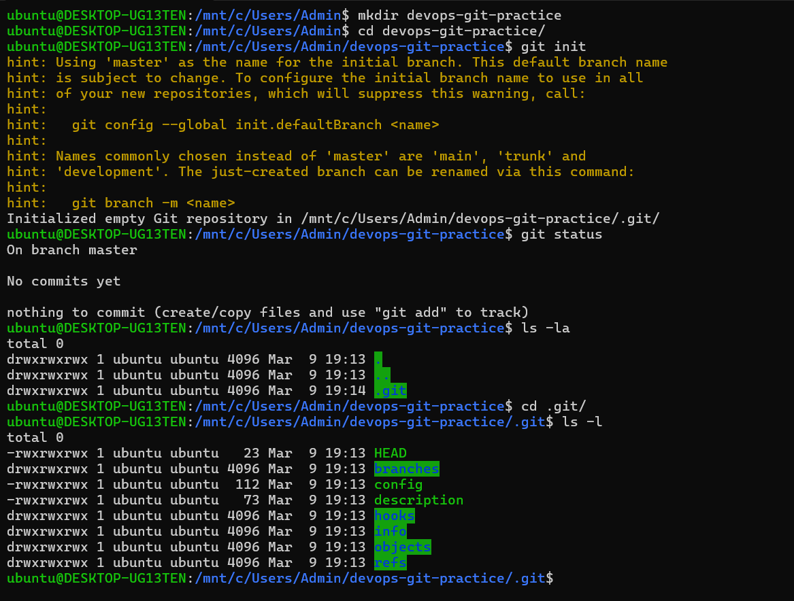
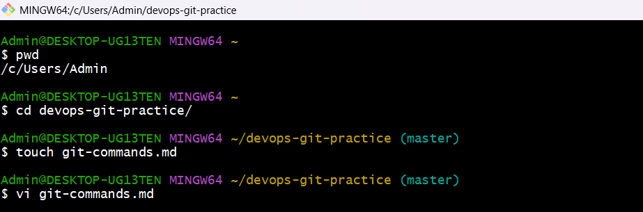
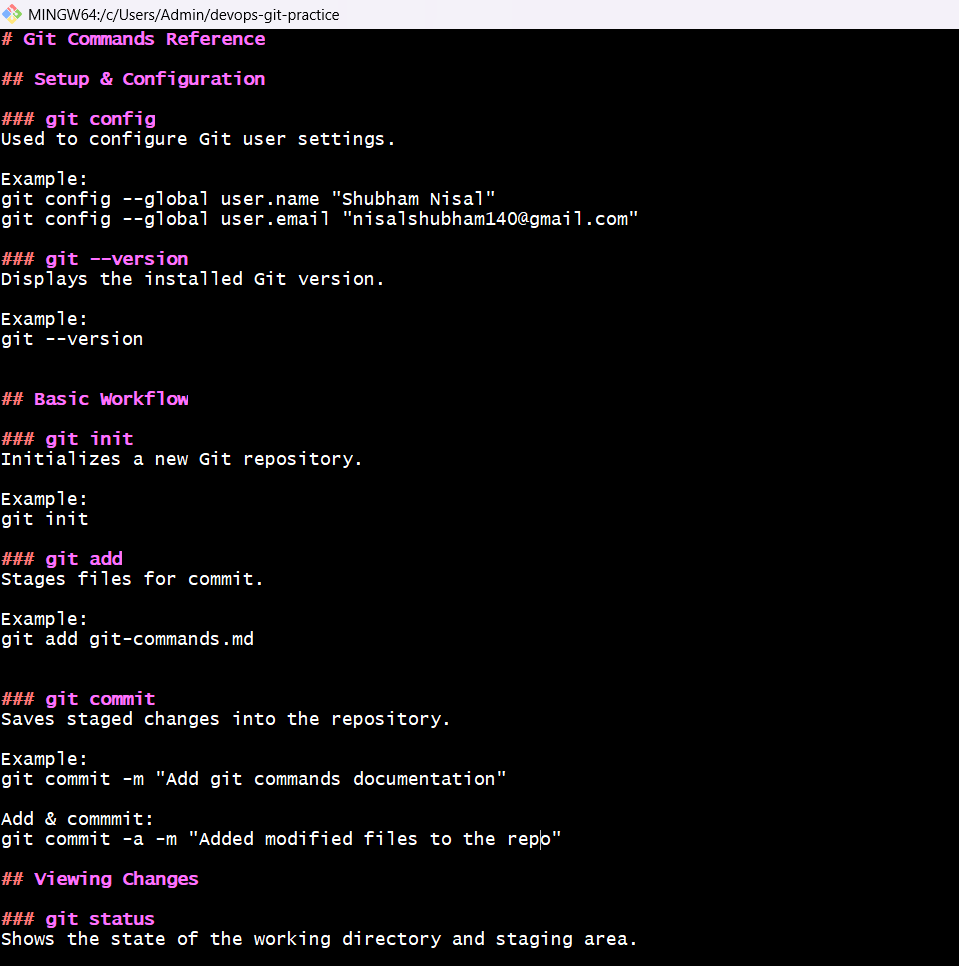
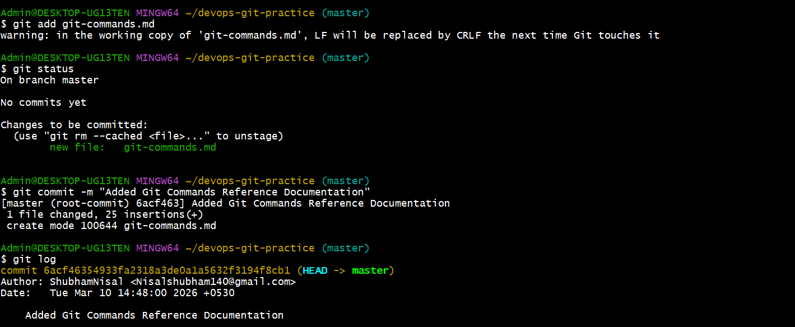
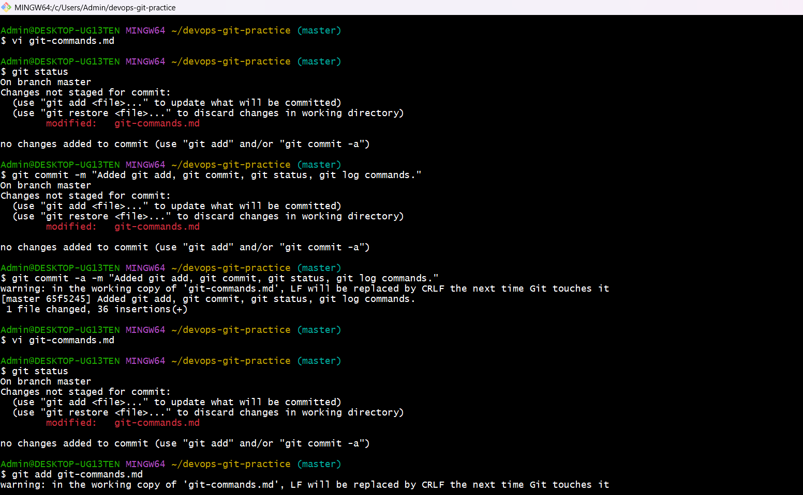
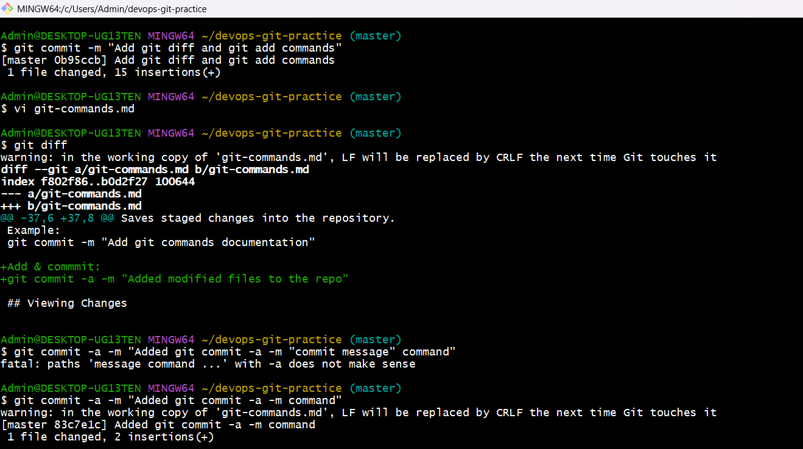
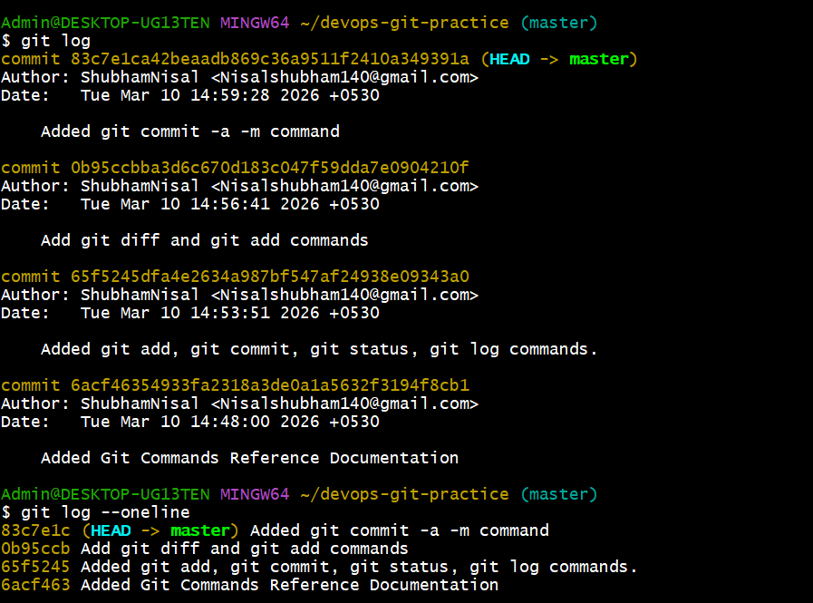

# Day 22 – Introduction to Git: Your First Repository

## Challenge Tasks

### Task 1: Install and Configure Git
1. Verify Git is installed on your machine
2. Set up your Git identity — name and email
3. Verify your configuration



---

### Task 2: Create Your Git Project
1. Create a new folder called `devops-git-practice`
2. Initialize it as a Git repository
3. Check the status — read and understand what Git is telling you
4. Explore the hidden `.git/` directory — look at what's inside



---

### Task 3: Create Your Git Commands Reference
1. Create a file called `git-commands.md` inside the repo
2. Add the Git commands you've used so far, organized by category:
   - **Setup & Config**
   - **Basic Workflow**
   - **Viewing Changes**
3. For each command, write:
   - What it does (1 line)
   - An example of how to use it




---

### Task 4: Stage and Commit
1. Stage your file
2. Check what's staged
3. Commit with a meaningful message
4. View your commit history



---

### Task 5: Make More Changes and Build History
1. Edit `git-commands.md` — add more commands as you discover them
2. Check what changed since your last commit
3. Stage and commit again with a different, descriptive message
4. Repeat this process at least **3 times** so you have multiple commits in your history
5. View the full history in a compact format





---

### Task 6: Understand the Git Workflow
Answer these questions in your own words (add them to a `day-22-notes.md` file):
1. What is the difference between `git add` and `git commit`?
```
git add moves changes from the working directory to the staging area.

git commit saves the staged changes permanently into the Git repository as a snapshot.

So the flow is:

Working Directory → Staging Area → Repository
```
2. What does the **staging area** do? Why doesn't Git just commit directly?
```
The staging area allows developers to choose exactly what changes should be included in a commit.

Instead of committing everything automatically, Git allows you to stage selected files. This helps create clean and meaningful commits.
```
3. What information does `git log` show you?
```
git log shows:

-Commit hash (unique ID)
-Author name
-Author email
-Date and time
-Commit message

This helps track the history of changes.
```
4. What is the `.git/` folder and what happens if you delete it?
```
.git is the core directory where Git stores all repository data.

It contains:

commit history
branches
configuration
objects

If the .git folder is deleted, the project will no longer be a Git repository, and all version history will be lost.
```
5. What is the difference between a **working directory**, **staging area**, and **repository**?
```
Working Directory:
Where files are edited and modified.

Staging Area:
Intermediate area where changes are prepared before committing.

Repository:
The Git database where all committed history is stored.

Workflow:
Working Directory → git add → Staging Area → git commit → Repository
```
---

## Ongoing Task

**Keep updating `git-commands.md` every day** as you learn new Git commands in the upcoming days. This will become your personal Git reference. Maintain a clean commit history — one commit per update with a clear message.

---

## Hints
- All you need today are about 8-10 Git commands — Google them, try them, break things
- Read what `git status` tells you — it's your best friend
- Use `man git-<command>` or `git <command> --help` to explore

---
