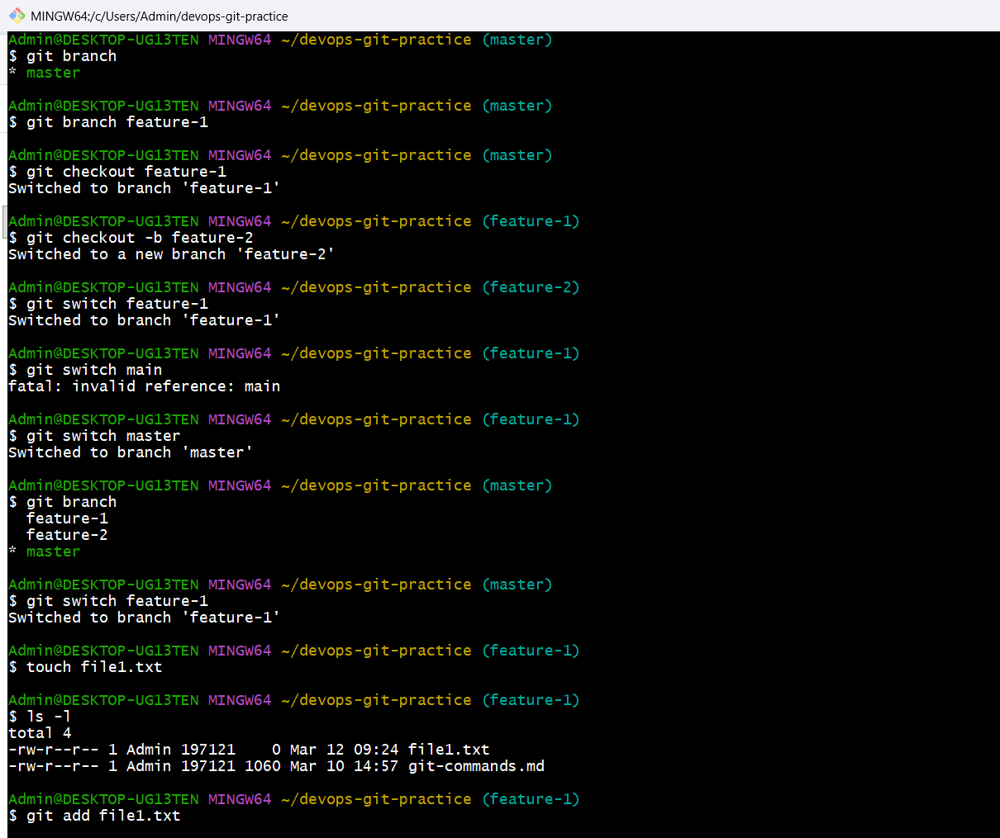
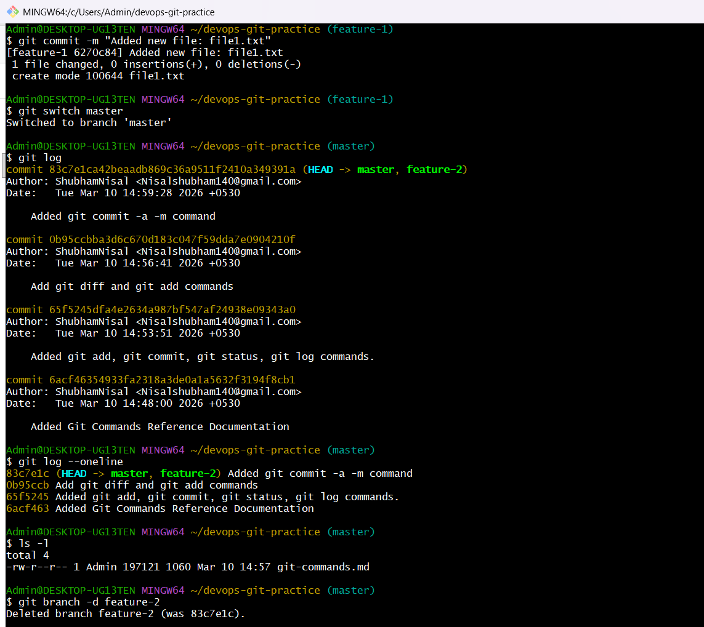
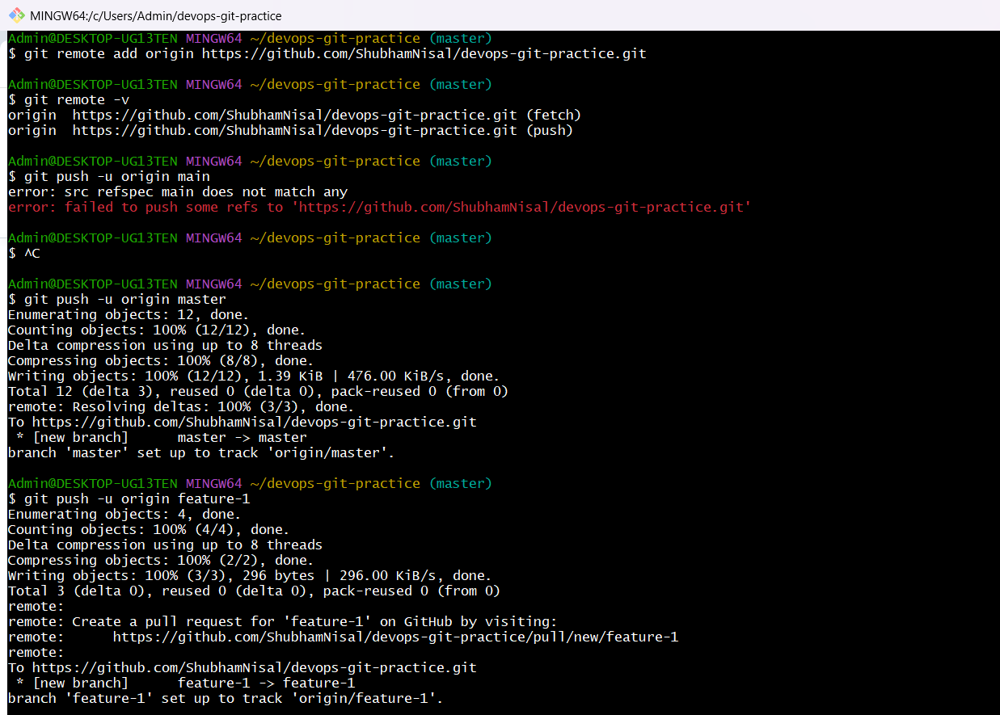
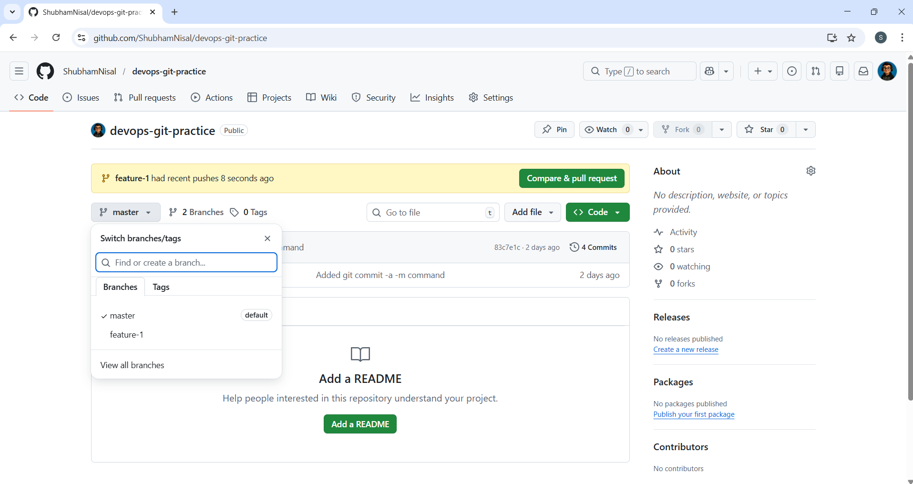
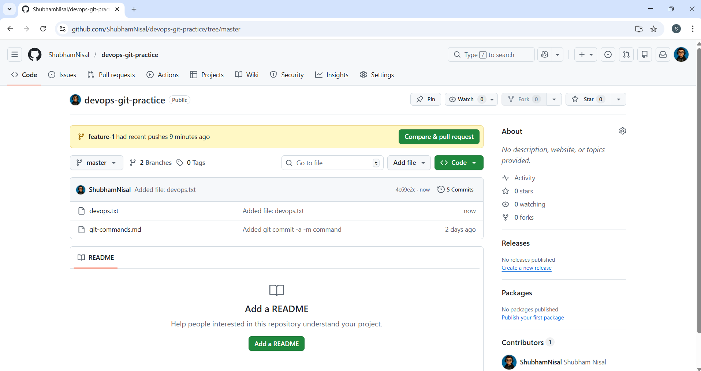
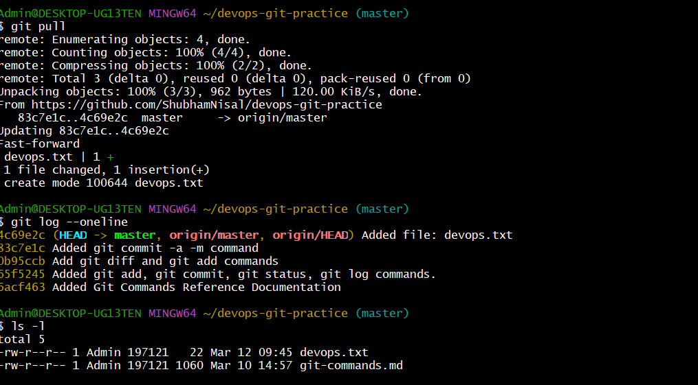
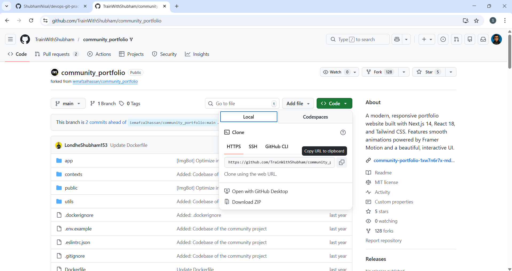
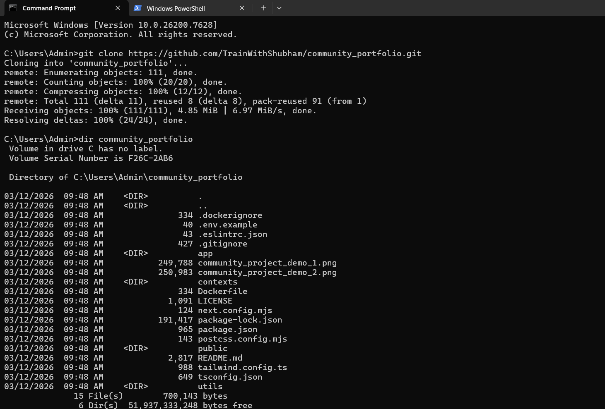
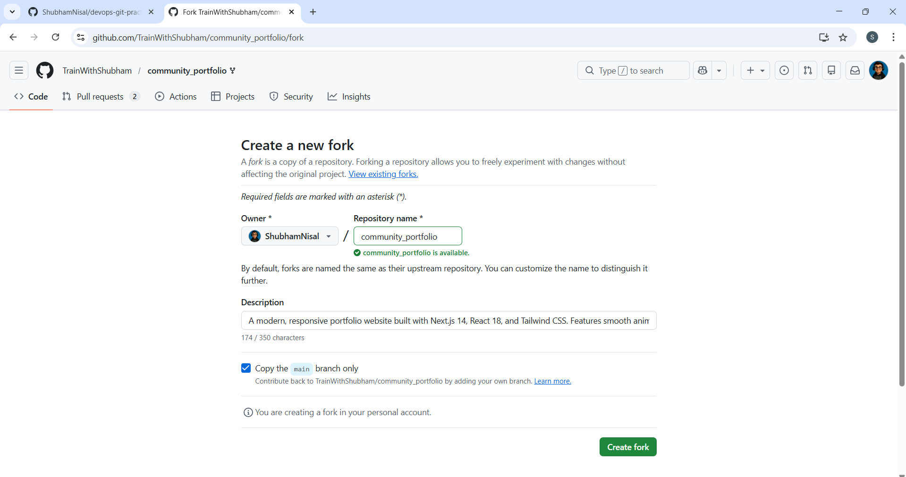
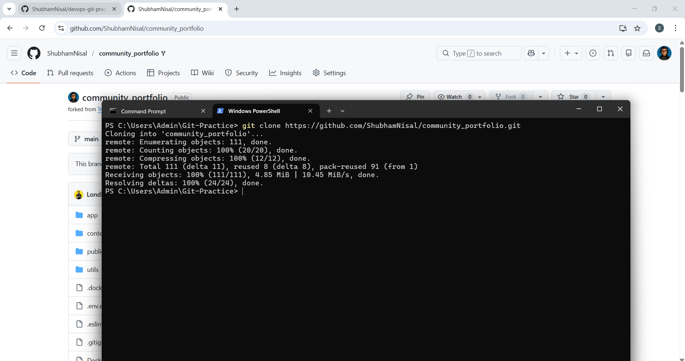

# Day 23 – Git Branching & Working with GitHub


## Challenge Tasks

### Task 1: Understanding Branches   


1. What is a branch in Git?
    - A branch is a lightweight, movable pointer to a specific commit. It provides a way to diverge from the main line of development and continue work in an isolated environment without affecting the main project.
  
2. Why do we use branches instead of committing everything to `main`?
    - Branches allow safe development and experimentation.   
    Benefits:
      - Prevent breaking production code
      - Enable multiple developers to work in parallel
      - Allow testing features before merging to main
      - Maintain a clean and stable main branch 
    
3. What is `HEAD` in Git?
    - HEAD is a pointer that indicates the current branch or commit you are working on.   
       
      Example:   
      If you are on the main branch, HEAD points to the latest commit on main.

4. What happens to your files when you switch branches?
    - When switching branches:
      - Git updates the working directory to match the state of that branch.
      - Files that exist in the target branch appear.
      - Files that don't exist disappear.
      - Uncommitted changes may block switching if they conflict. 

---

### Task 2: Branching Commands — Hands-On
In your `devops-git-practice` repo, perform the following:
1. List all branches in your repo
2. Create a new branch called `feature-1`
3. Switch to `feature-1`
4. Create a new branch and switch to it in a single command — call it `feature-2`
5. Try using `git switch` to move between branches — how is it different from `git checkout`?
6. Make a commit on `feature-1` that does **not** exist on `main`
7. Switch back to `main` — verify that the commit from `feature-1` is not there
8. Delete a branch you no longer need
9. Add all branching commands to your `git-commands.md`




---

### Task 3: Push to GitHub
1. Create a **new repository** on GitHub (do NOT initialize it with a README)
2. Connect your local `devops-git-practice` repo to the GitHub remote
3. Push your `main` branch to GitHub
4. Push `feature-1` branch to GitHub    
    

5. Verify both branches are visible on GitHub    
    

6. Answer in your notes: What is the difference between `origin` and `upstream`?
    - origin:   
      The default remote name for the repository you cloned or pushed to.   
      Usually points to your repository on GitHub.
      
    - upstream:    
      Refers to the original repository from which a fork was created.    
      Used to pull updates from the main project.

---

### Task 4: Pull from GitHub
1. Make a change to a file **directly on GitHub** (use the GitHub editor)    


2. Pull that change to your local repo    


3. Answer in your notes: What is the difference between `git fetch` and `git pull`?
- git fetch
  
  Downloads new commits from the remote repository but does not merge them into the current branch.
  Used to inspect changes before integrating.
  
  Example:
  ```git fetch origin```
  
- git pull
  
  Fetches changes and automatically merges them into the current branch.
  
  Example:
  ```git pull origin main```

---

### Task 5: Clone vs Fork
1. **Clone** any public repository from GitHub to your local machine    
    
    
2. **Fork** the same repository on GitHub, then clone your fork    
   
    

3. Answer in your notes:
 - What is the difference between clone and fork?
   - Clone      
      - Creates a local copy of a remote repository.
      
      Example:

        ```git clone <repo-url>```
        
    - Fork   
        - Creates a copy of someone else's repository in your GitHub account.   
        - This allows you to modify the project without affecting the original.   
        - Forking is done on GitHub GUI, not Git CLI. 
          
  - When would you clone vs fork?
    - Clone when:    
        You want to work locally on a repository you own or collaborate on
    - Fork when:    
        You want to contribute to someone else's project without direct write access.
        
  - After forking, how do you keep your fork in sync with the original repo?
    - i) Add the original repo as an upstream remote:     
         `git remote add upstream <original-repo-url>`   
         
      ii) Fetch changes:     
         `git fetch upstream`
         
      iii) Merge or rebase:      
         `git merge upstream/main` or `git rebase upstream/main`   
