# Day 24 – Advanced Git: Merge, Rebase, Stash & Cherry Pick

## Challenge Tasks

### Task 1: Git Merge — Hands-On
1. Create a new branch `feature-login` from `main`, add a couple of commits to it
2. Switch back to `main` and merge `feature-login` into `main`
3. Observe the merge — did Git do a **fast-forward** merge or a **merge commit**?
4. Now create another branch `feature-signup`, add commits to it — but also add a commit to `main` before merging
5. Merge `feature-signup` into `main` — what happens this time?
6. Answer in your notes:
   - What is a fast-forward merge?    
     ` When the target branch has no new commits and Git simply moves the pointer forward.`
   - When does Git create a merge commit instead?    
     ` Merge commit is created when both branches have new commits and Git combines them.`
   - What is a merge conflict? (try creating one intentionally by editing the same line in both branches)    
     ` Occurs when two branches modify the same line of the same file.`

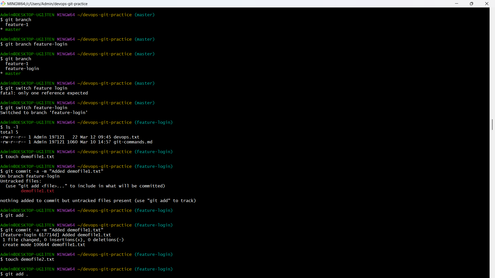
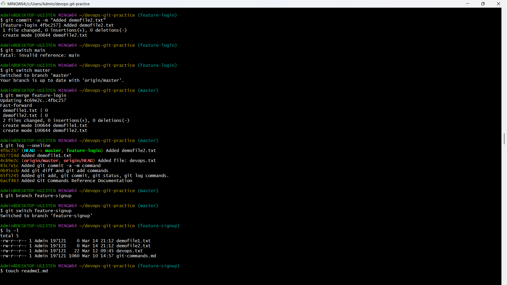
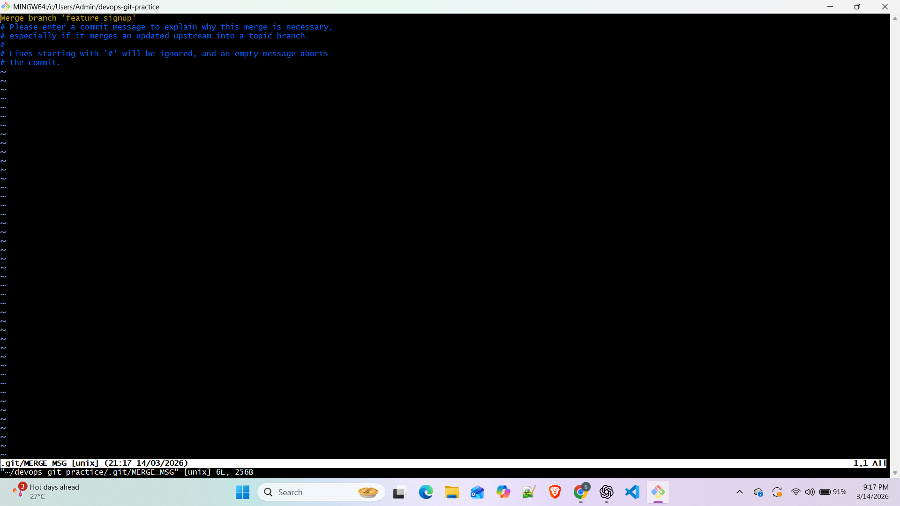
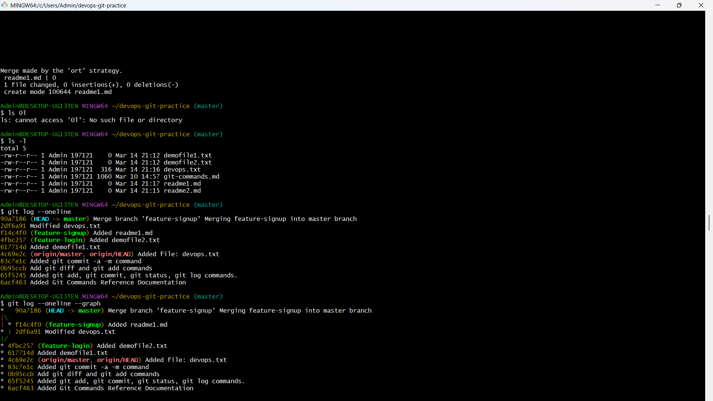

---

### Task 2: Git Rebase — Hands-On
1. Create a branch `feature-dashboard` from `main`, add 2-3 commits
2. While on `main`, add a new commit (so `main` moves ahead)
3. Switch to `feature-dashboard` and rebase it onto `main`
4. Observe your `git log --oneline --graph --all` — how does the history look compared to a merge?
5. Answer in your notes:
   - What does rebase actually do to your commits?   
       ```
       When you rebase, Git performs the following steps: 
          1) Finds the common ancestor of your current (feature) branch and the target branch (e.g., main).
          2) Temporarily saves the changes introduced by each commit on your feature branch as a patch.
          3) Resets your current branch to the latest commit of the target branch.
          4) Replays each saved commit from your feature branch one by one on top of the new base. 
       ```
   - How is the history different from a merge?
     ```
       Merge keeps the "truth" of when branches diverged and joined (non-linear). 
       Rebase creates a clean, straight line (linear).
   - Why should you **never rebase commits that have been pushed and shared** with others?
     ```
       Never rebase commits already pushed to a shared repo. 
       It changes commit IDs, which will break the history for everyone else on the team.
     ```
   - When would you use rebase vs merge?
     ```
       Use Rebase for local cleanup before sharing code. 
       Use Merge to preserve the historical record of how a feature was integrated.
     ```

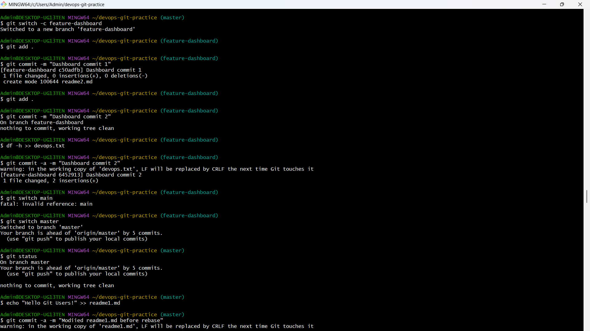
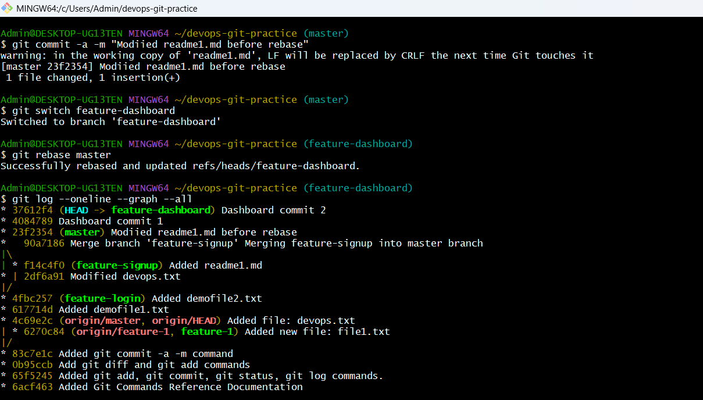

---

### Task 3: Squash Commit vs Merge Commit
1. Create a branch `feature-profile`, add 4-5 small commits (typo fix, formatting, etc.)
2. Merge it into `main` using `--squash` — what happens?
3. Check `git log` — how many commits were added to `main`?
4. Now create another branch `feature-settings`, add a few commits
5. Merge it into `main` **without** `--squash` (regular merge) — compare the history
6. Answer in your notes:
   - What does squash merging do?
     ```
       Combines multiple commits into a single commit.
     ```
   - When would you use squash merge vs regular merge?
     ```
     Use Squash Merge When:   

      - Feature branch has many small commits   
      - You want a clean main branch history   
      - Commits include debugging or temporary changes    
      
     Use Regular Merge When:    
      - You want to preserve the full development history      
      - Multiple developers contributed commits    
      - The commit history is meaningful    
      
     ```
   - What is the trade-off of squashing?
     ```
       You lose the granular history of how the feature was built step-by-step.
     ```

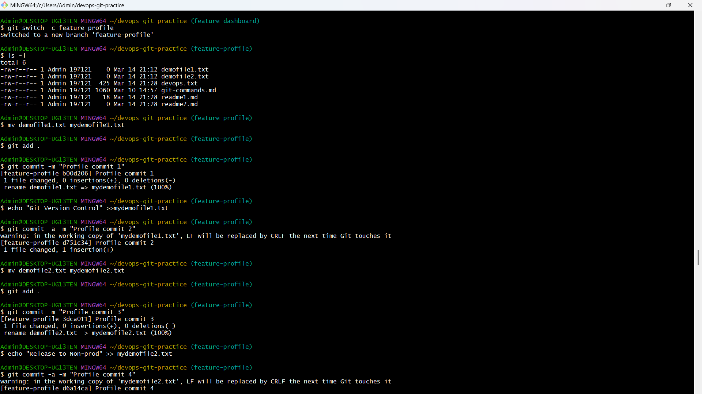
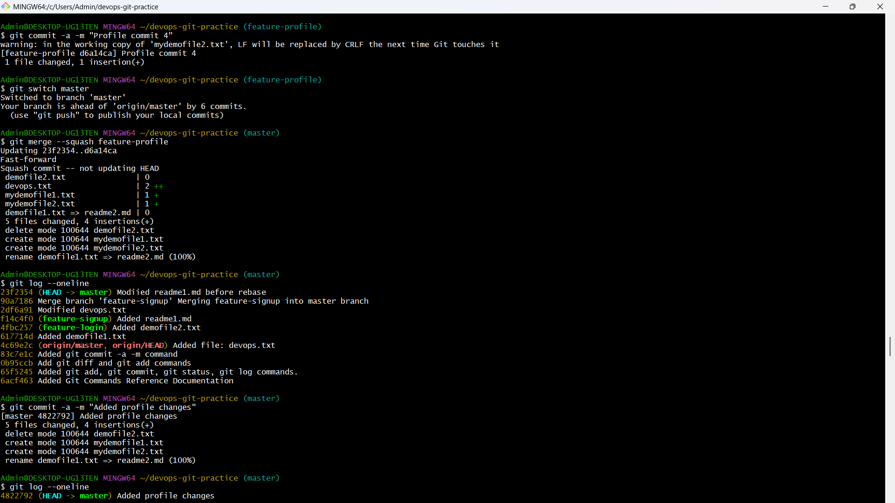
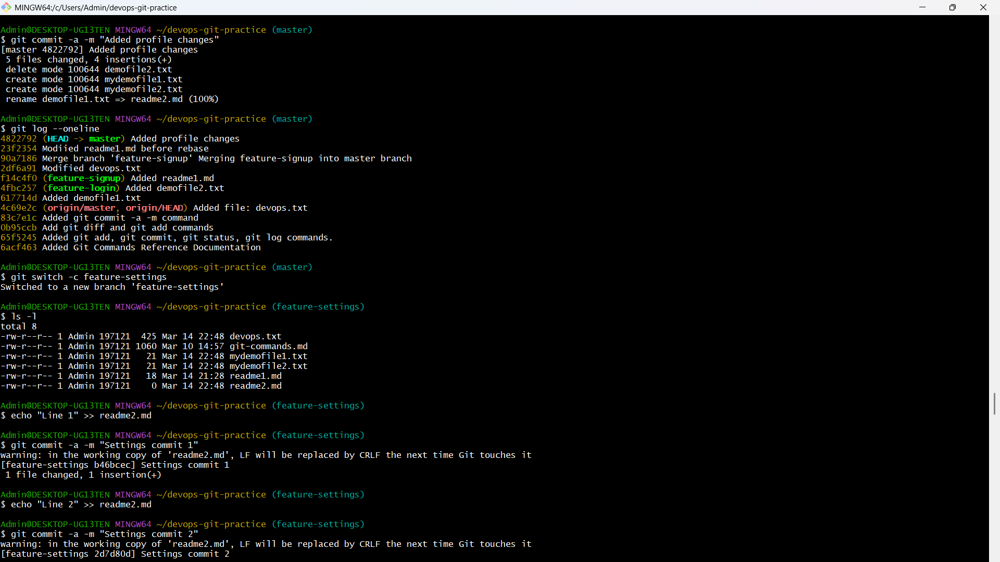
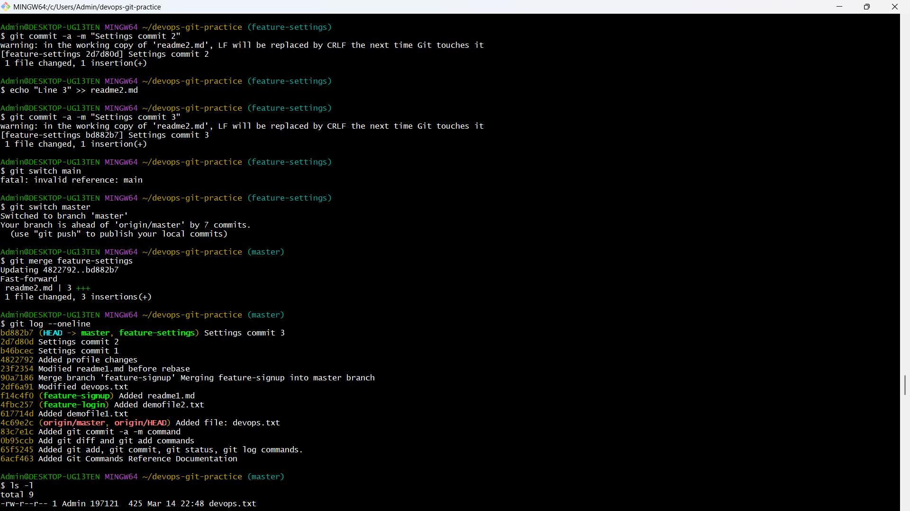

---

### Task 4: Git Stash — Hands-On
1. Start making changes to a file but **do not commit**
2. Now imagine you need to urgently switch to another branch — try switching. What happens?
3. Use `git stash` to save your work-in-progress
4. Switch to another branch, do some work, switch back
5. Apply your stashed changes using `git stash pop`
6. Try stashing multiple times and list all stashes
7. Try applying a specific stash from the list
8. Answer in your notes:
   - What is the difference between `git stash pop` and `git stash apply`?
     ```
     git stash apply       
     Applies stashed changes but keeps the stash in the stash list.   

     git stash pop    
     Applies stashed changes and removes them from the stash list.   
     ```
   - When would you use stash in a real-world workflow?
     ```
     Git stash is useful when:    

        You are in the middle of work but need to switch branches    
        You need to quickly fix a production issue    
        You want to temporarily save unfinished work without committing    

      Example scenario:    
        You are working on a feature but suddenly need to switch to a hotfix branch.     
        sInstead of committing unfinished code, you stash it.
     ```

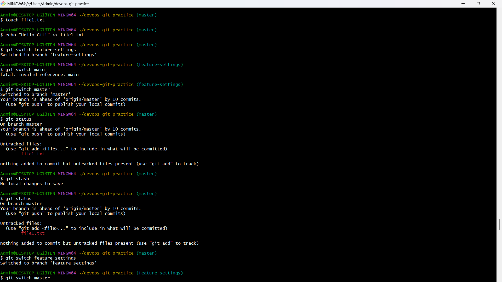
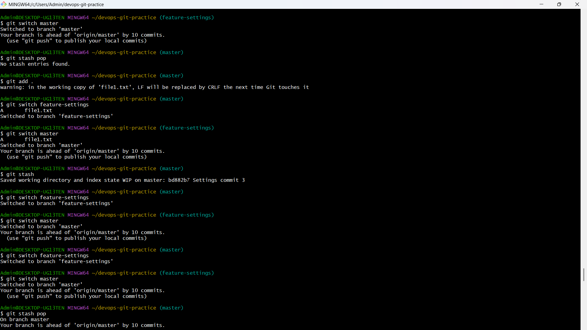
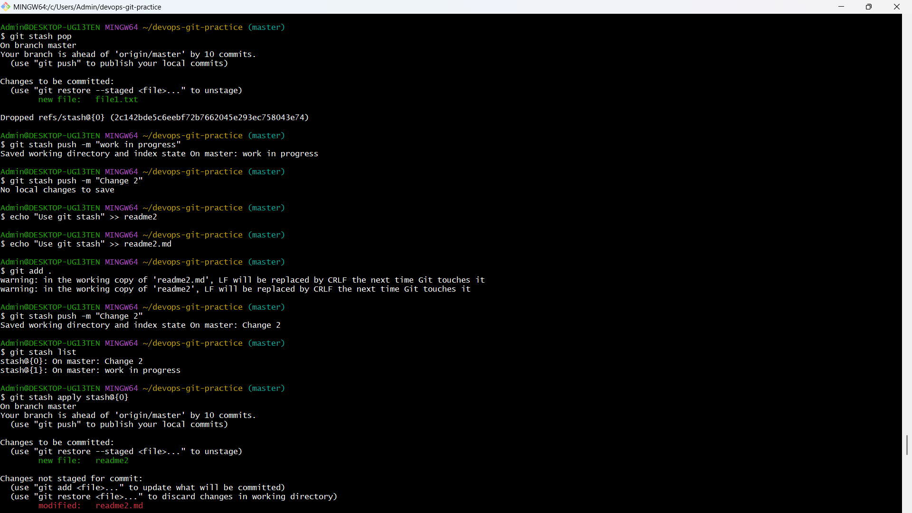

---

### Task 5: Cherry Picking
1. Create a branch `feature-hotfix`, make 3 commits with different changes
2. Switch to `main`
3. Cherry-pick **only the second commit** from `feature-hotfix` onto `main`
4. Verify with `git log` that only that one commit was applied
5. Answer in your notes:
   - What does cherry-pick do?
   ```
   git cherry-pick copies a specific commit from one branch and applies it to another branch.    

   Instead of merging the entire branch, only the selected commit is applied.   

   Example:    
    git cherry-pick <commit-hash>   
   ```
   - When would you use cherry-pick in a real project?
     ```
     Cherry-pick is commonly used when:
        A bug fix from one branch must be applied to another branch
        You want only a specific commit instead of the entire branch
        Applying a production hotfix to multiple branches

      Example:
        A bug fix was done in develop, and you need the same fix in main without merging the whole (unfinished) feature.
     ```
   - What can go wrong with cherry-picking?
     ```
     It creates "duplicate" commits (same changes, different hash). 
     If you eventually merge the original branch, you might run into redundant conflicts.
     ```
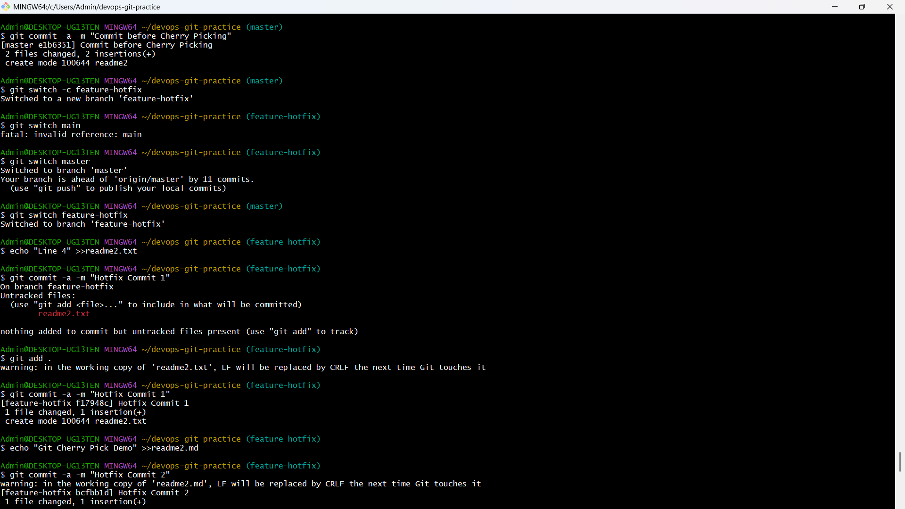
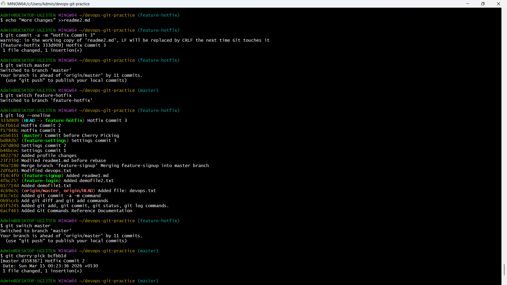
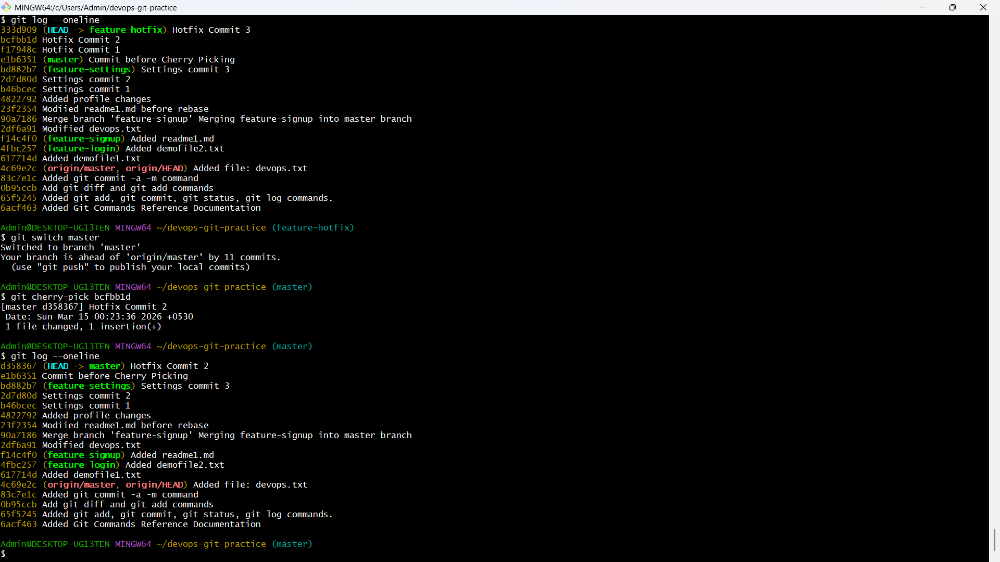

---

## Hints
- Visualize history: `git log --oneline --graph --all`
- To intentionally create a merge conflict: edit the **same line** of the **same file** on two branches
- Stash with a message: `git stash push -m "description"`
- Cherry-pick needs a commit hash — find it with `git log --oneline`

---
