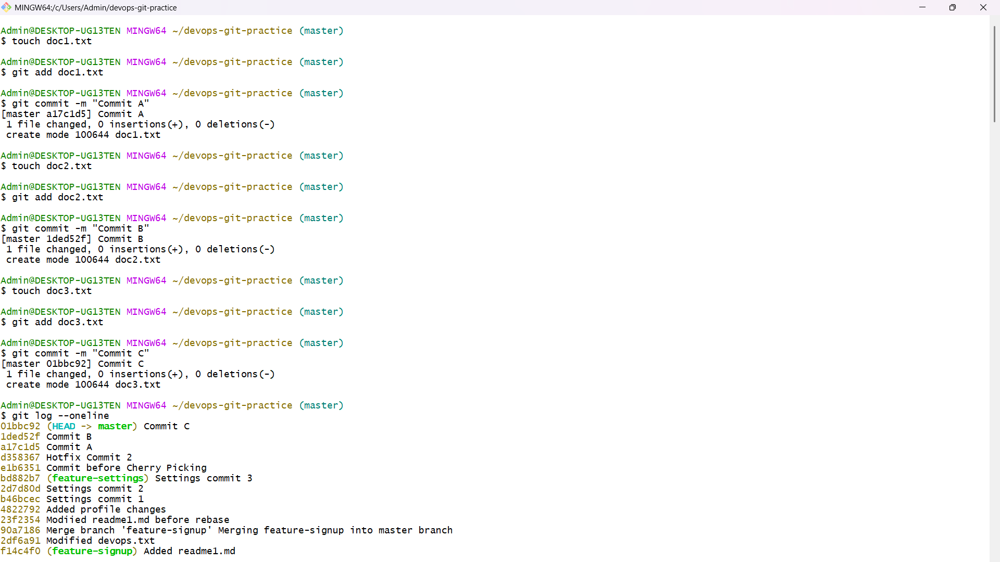
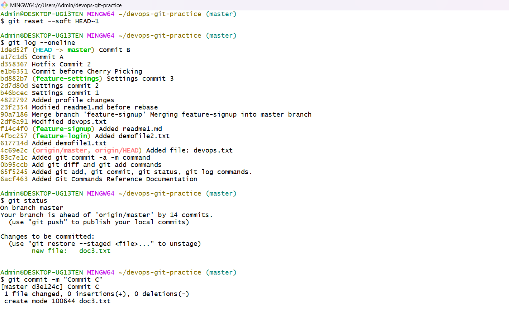
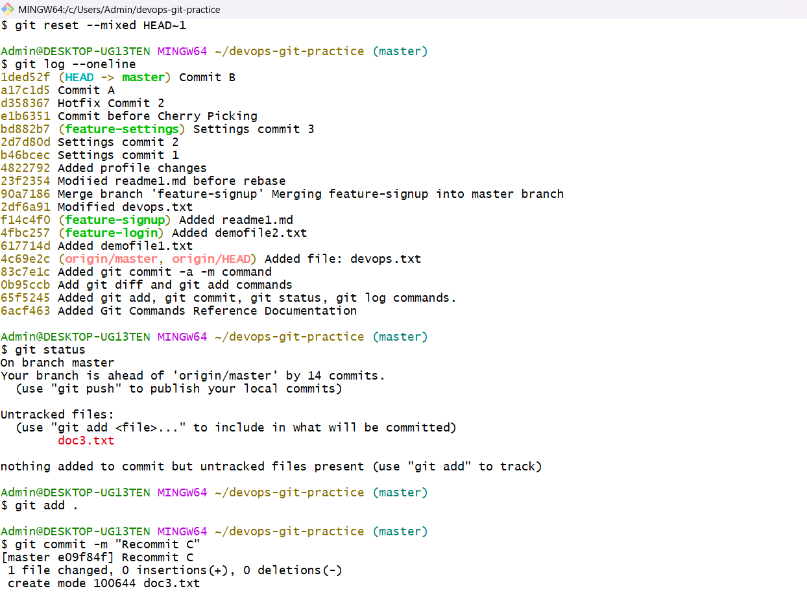
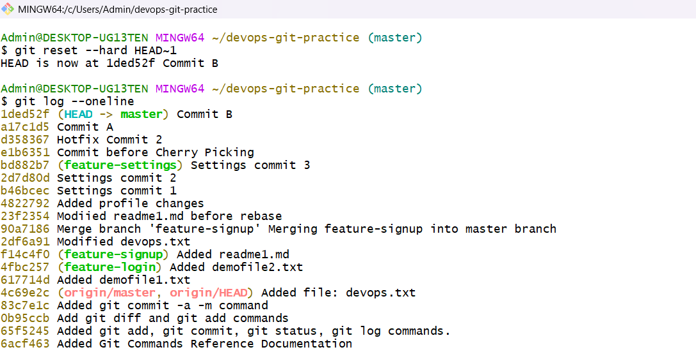
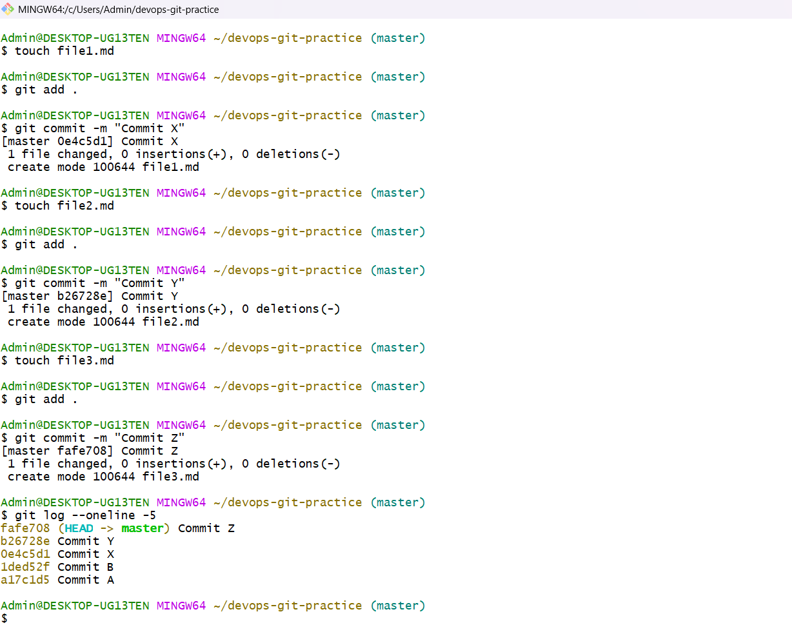
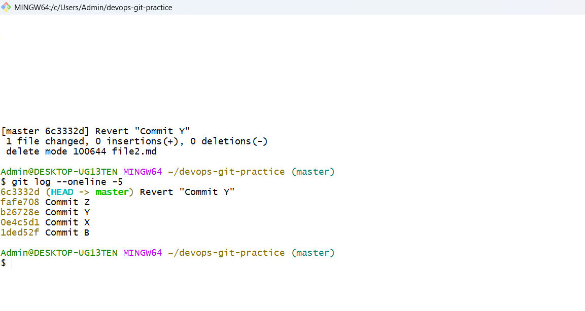
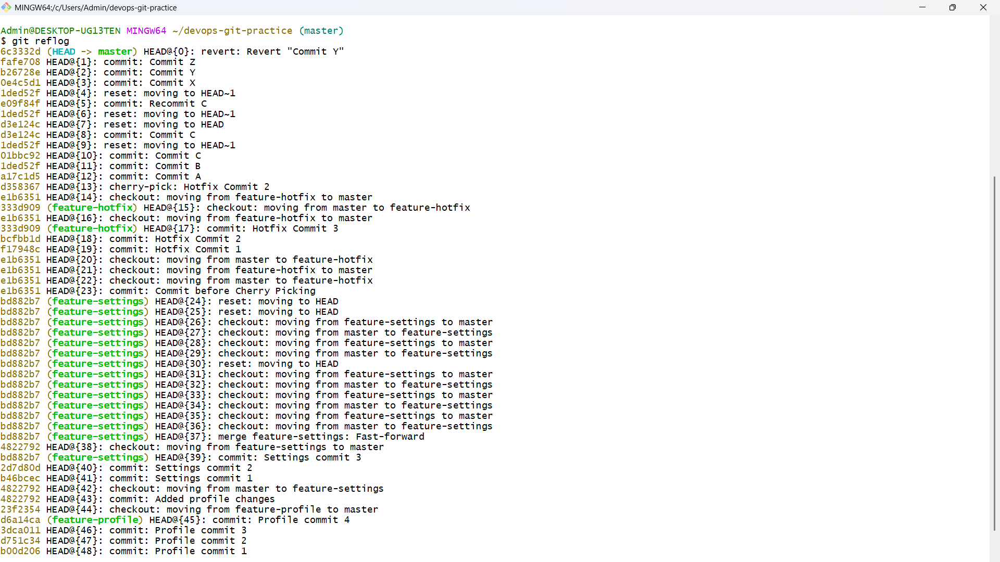

# Day 25 – Git Reset vs Revert & Branching Strategies

## Challenge Tasks

### Task 1: Git Reset — Hands-On
1. Make 3 commits in your practice repo (commit A, B, C)   
    


2. Use `git reset --soft` to go back one commit — what happens to the changes?    

    

- Commit C is removed    
- Changes from C are still staged     

3. Re-commit, then use `git reset --mixed` to go back one commit — what happens now?    

    

- Commit C is removed    
- Changes are unstaged but still in files    

4. Re-commit, then use `git reset --hard` to go back one commit — what happens this time?   

    
    

- Commit C is removed
- Changes are completely deleted

5. Answer in your notes:
   - What is the difference between `--soft`, `--mixed`, and `--hard`?
   ```
    Difference:
    --soft → keeps changes staged
    
    --mixed → keeps changes unstaged (untracked)
    
    --hard → permanently deletes changes (files are deleted from everywhere - commit, staging & file system)
   ```
   
   - Which one is destructive and why?
   ```
   --hard is destructive because it deletes committed work from your working directory.
   ```
     
   - When would you use each one?
   ```
   Use --soft to modify last commit
   Use --mixed to unstage changes
   Use --hard to discard changes entirely
   ```
   - Should you ever use `git reset` on commits that are already pushed?
   ```
   Never use git reset on commits already pushed to a shared branch, as it rewrites history, causing conflicts for others.
   ```
   
---

### Task 2: Git Revert — Hands-On
1. Make 3 commits (commit X, Y, Z)   

    

2. Revert commit Y (the middle one) — what happens?
3. Check `git log` — is commit Y still in the history?   



- A new commit is created (Y’)
- It undoes changes of Y

4. Answer in your notes:
   - How is `git revert` different from `git reset`?
   ```
   reset rewrites history and removes commits. revert creates a new commit to undo changes, preserving history.
   ```
   - Why is revert considered **safer** than reset for shared branches?
   ```
   git revert is safer as - it does not modify the existing history. It adds information, so other developers won't have conflicts.
   ```
   - When would you use revert vs reset?
   ```
   revert → shared branches
   reset → local cleanup
   ```
 #### git reflog: 
```
- `git reflog` is your safety net — it shows everything Git has done, even after a hard reset
```

 

---

### Task 3: Reset vs Revert — Summary
Create a comparison in your notes:

| | `git reset` | `git revert` |
|---|---|---|
| What it does | Moves HEAD pointer backwards; changes staging/working dir. | Creates a new commit that undoes changes. |
| Removes commit from history? | Yes (rewrites history). | No (adds history). |
| Safe for shared/pushed branches? | No (never use). | Yes (perfect for shared). |
| When to use | Local, unpushed, mistakes. | Shared branches, public commits. |

---

### Task 4: Branching Strategies
Research the following branching strategies and document each in your notes with:
- How it works (short description)
- A simple diagram or flow (text-based is fine)
- When/where it's used
- Pros and cons

1. **GitFlow** — develop, feature, release, hotfix branches
- How it works (short description): 
  ```
  Highly structured. 
  Features branch from develop, merged into develop. 
  develop merges into release. 
  release merges into main and develop. 
  Hotfixes branch from main.
  ```
  
- A simple diagram or flow (text-based is fine) :    
  ```
  Main <- Release <- Develop <- Feature
  ```
  
- When/where it's used :    
  ```
  Large enterprises, software with scheduled releases (e.g., annual releases).
  ```

- Pros : 
  ```
  Structured, safe for complex releases.
  ```
- Cons :   
  ```
  Complex, heavy for small teams.
  ```

2. **GitHub Flow** — simple, single main branch + feature branches
- How it works: 
  ```
  Anything in main is deployable. Feature branches are created from main, merged back via PR.
  ```
- Diagram: 
  ```
  Feature -> Main
  ```
- Used: 
  ```
  Startups, SaaS teams, continuous deployment.
  ```
- Pros: 
  ```
  Fast, simple, promotes CI/CD.
  ```
- Cons: 
  ```
  Not suitable for versioned releases.
  ```
3. **Trunk-Based Development** — everyone commits to main, short-lived branches
- How it works: 
  ```
  Developers merge small changes into the main branch (trunk) multiple times a day. 
  Short-lived branches or feature flags are used.
  ```
- Diagram: 
  ```
  Short-lived-branch -> Main (repeatedly)
  ```
- Used: 
  ```
  High-performance teams (Google, Facebook).
  ```
- Pros: 
  ```
  No merge hell, fast feedback, best for CI.
  ```
- Cons: 
  ```
  Requires discipline, high test coverage needed.
  ```

4. Answer:
   - Which strategy would you use for a startup shipping fast?
     ```
     GitHub Flow.
     ```
   - Which strategy would you use for a large team with scheduled releases?
     ```
     GitFlow
     ```
   - Which one does your favorite open-source project use? (check any repo on GitHub)
     ```
     Mostly GitHub Flow (short-lived feature branches, PRs into main).
     ```

---

### Task 5: Git Commands Reference Update
Update your `git-commands.md` to cover everything from Days 22–25:
- Setup & Config
- Basic Workflow (add, commit, status, log, diff)
- Branching (branch, checkout, switch)
- Remote (push, pull, fetch, clone, fork)
- Merging & Rebasing
- Stash & Cherry Pick
- Reset & Revert

---   
