# Day 26 – GitHub CLI: Manage GitHub from Your Terminal

## Challenge Tasks

### Task 1: Install and Authenticate
1. Install the GitHub CLI on your machine   

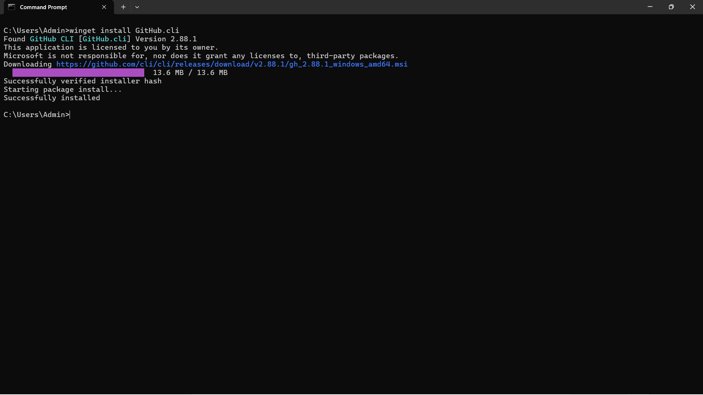  

2. Authenticate with your GitHub account   

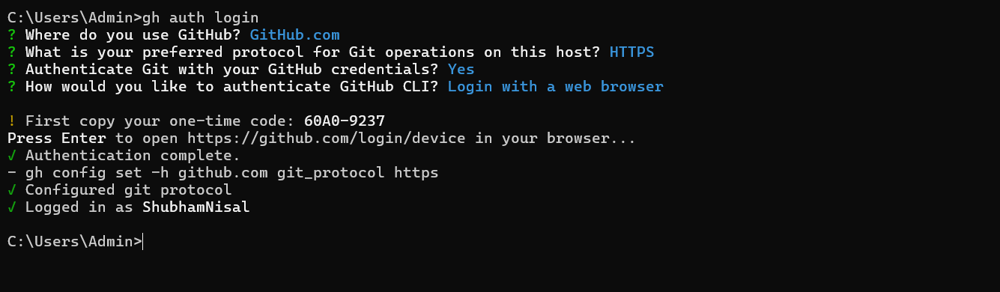  

3. Verify you're logged in and check which account is active

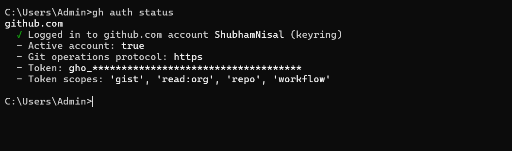  

4. Answer in your notes: What authentication methods does `gh` support?    
The `gh auth login` command supports the following methods:
- **Web Browser**: Authenticates via a one-time code in your default browser.
- **Personal Access Token (PAT)**: Useful for environments without a browser (like remote servers).
- **GitHub Actions Token**: Automatically available within GitHub Actions workflows.

---

### Task 2: Working with Repositories
1. Create a **new GitHub repo** directly from the terminal — make it public with a README
2. Clone a repo using `gh` instead of `git clone`
3. View details of one of your repos from the terminal
4. List all your repositories
5. Open a repo in your browser directly from the terminal
6. Delete the test repo you created (be careful!)

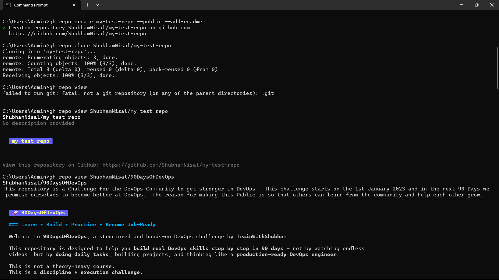   
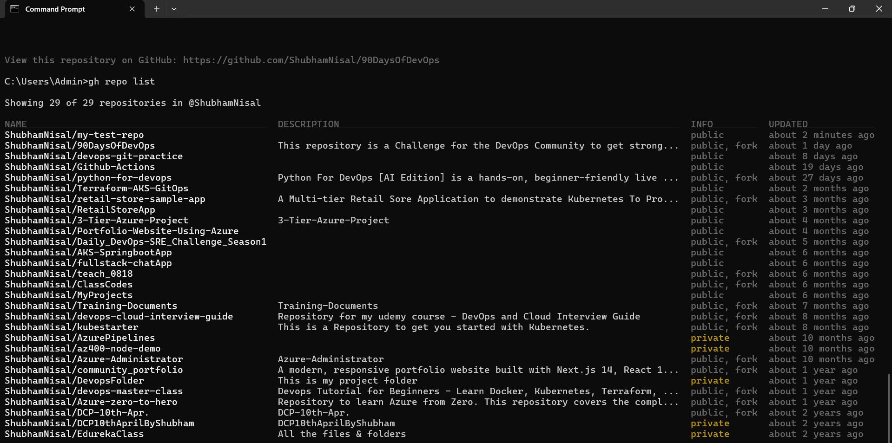   
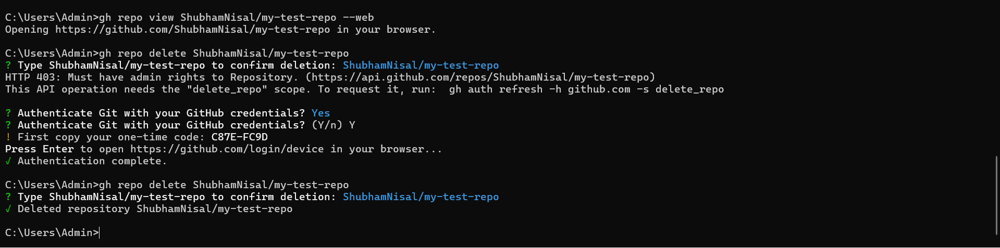   

---

### Task 3: Issues
1. Create an issue on one of your repos from the terminal — give it a title, body, and a label
2. List all open issues on that repo
3. View a specific issue by its number
4. Close an issue from the terminal

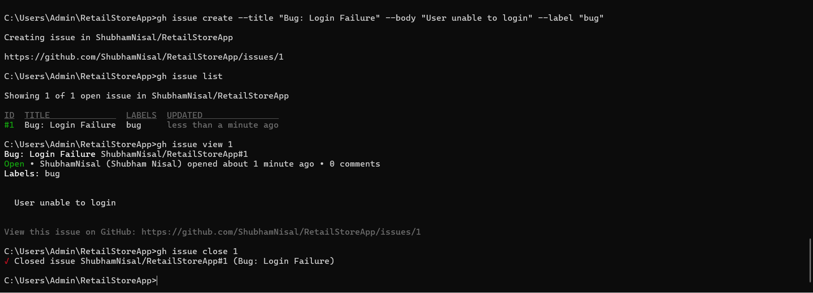  

5. Answer in your notes: How could you use `gh issue` in a script or automation?   
`gh issue` is incredibly powerful for automation. For example:
- **Automated Bug Reports**: A script could catch a failed build and use `gh issue create` to log the logs directly into a new issue.
- **Bulk Updates**: You can use `gh issue list --json number` and a loop to add labels or close issues that meet specific criteria.
- **Onboarding**: Automatically create a "Welcome" issue with a checklist when a new repo is initialized.

---

### Task 4: Pull Requests
1. Create a branch, make a change, push it, and create a **pull request** entirely from the terminal
2. List all open PRs on a repo
3. View the details of your PR — check its status, reviewers, and checks
4. Merge your PR from the terminal

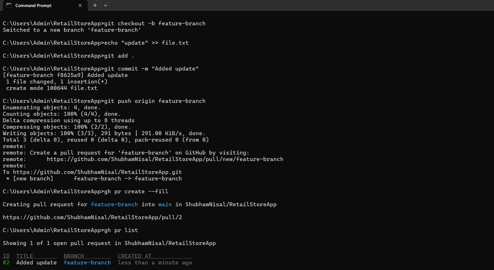  
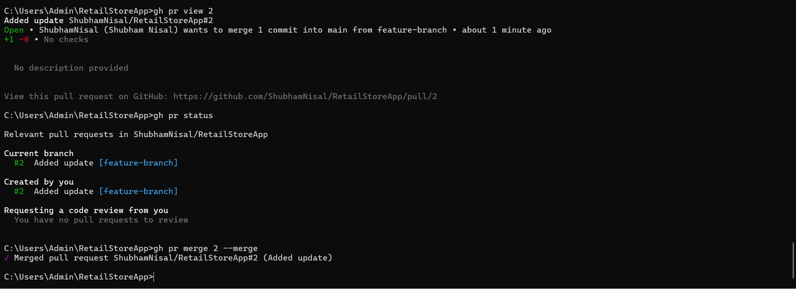  

5. Answer in your notes:

   - What merge methods does `gh pr merge` support?
     - **Merge Methods**: `gh pr merge` supports **Merge Commit** (`--merge`), **Rebase** (`--rebase`), and **Squash** (`--squash`).
   
   - How would you review someone else's PR using `gh`?
     - **Reviewing PRs**: You can use `gh pr checkout <number>` to pull the code locally, `gh pr diff` to see changes, and `gh pr review --approve` (or `--comment`/`--request-changes`) to submit your feedback.

---

### Task 5: GitHub Actions & Workflows (Preview)
1. List the workflow runs on any public repo that uses GitHub Actions
2. View the status of a specific workflow run

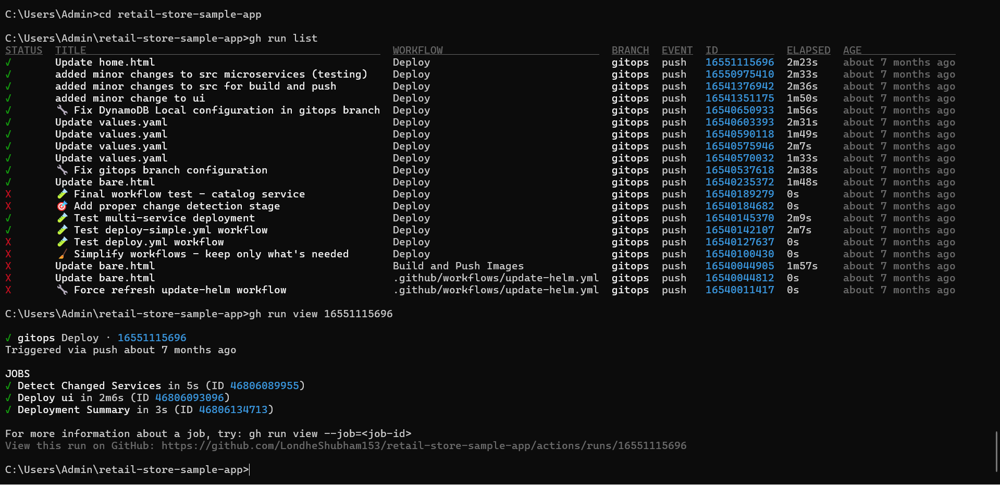     

3. Answer in your notes: How could `gh run` and `gh workflow` be useful in a CI/CD pipeline?
- **gh run**: Useful for monitoring the status of a pipeline from a local machine or another script (e.g., waiting for a build to finish before deploying).
- **gh workflow**: Can be used to manually trigger "dispatch" events (`gh workflow run`) or enable/disable workflows without touching the YAML files.

---

### Task 6: Useful `gh` Tricks
Explore and try these — add the ones you find useful to your `git-commands.md`:
1. `gh api` — make raw GitHub API calls from the terminal
2. `gh gist` — create and manage GitHub Gists
3. `gh release` — create and manage releases
4. `gh alias` — create shortcuts for commands you use often
5. `gh search repos` — search GitHub repos from the terminal

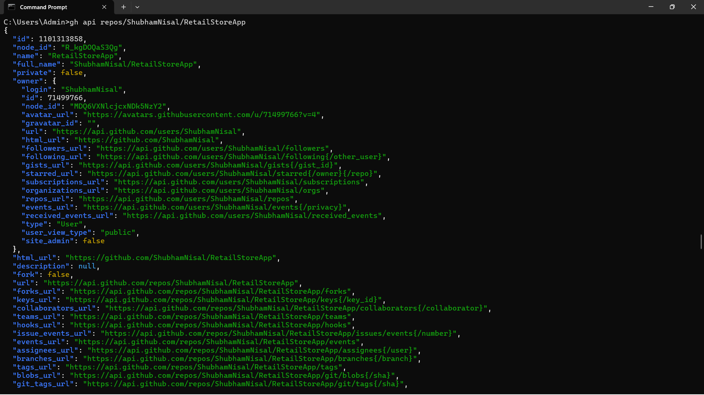    
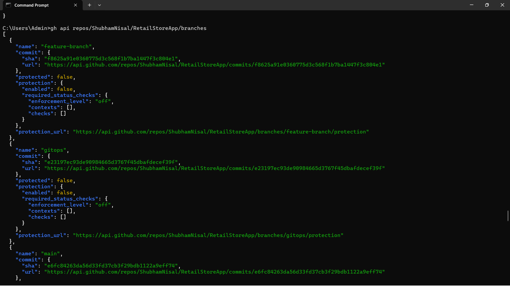    
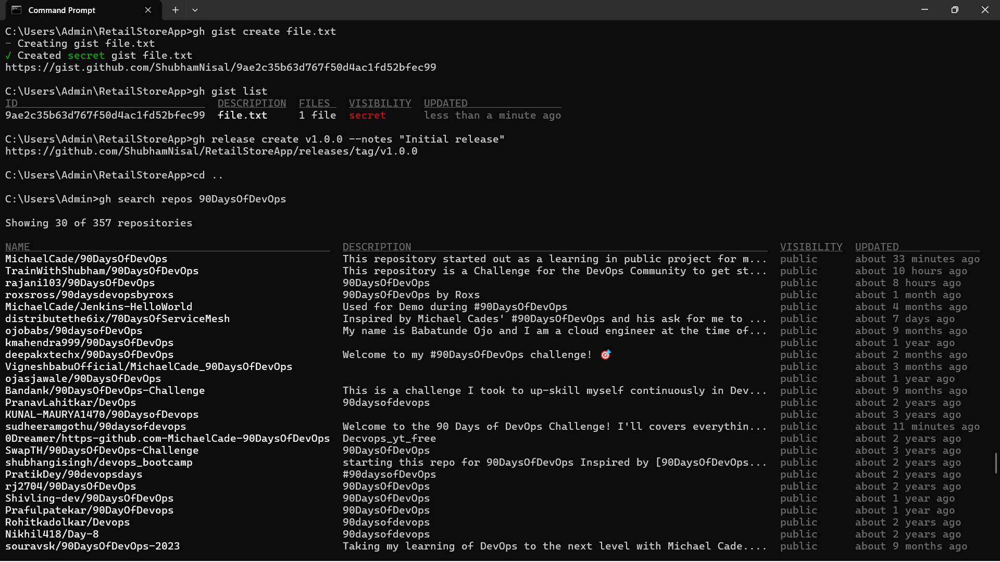    
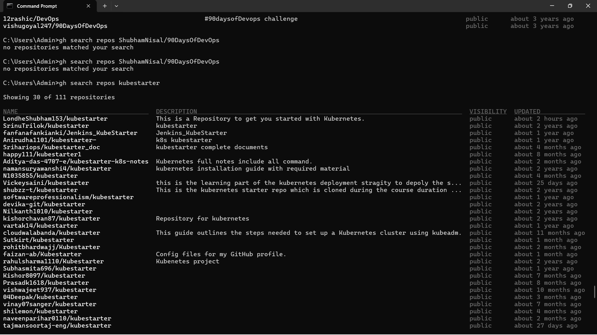    

---
