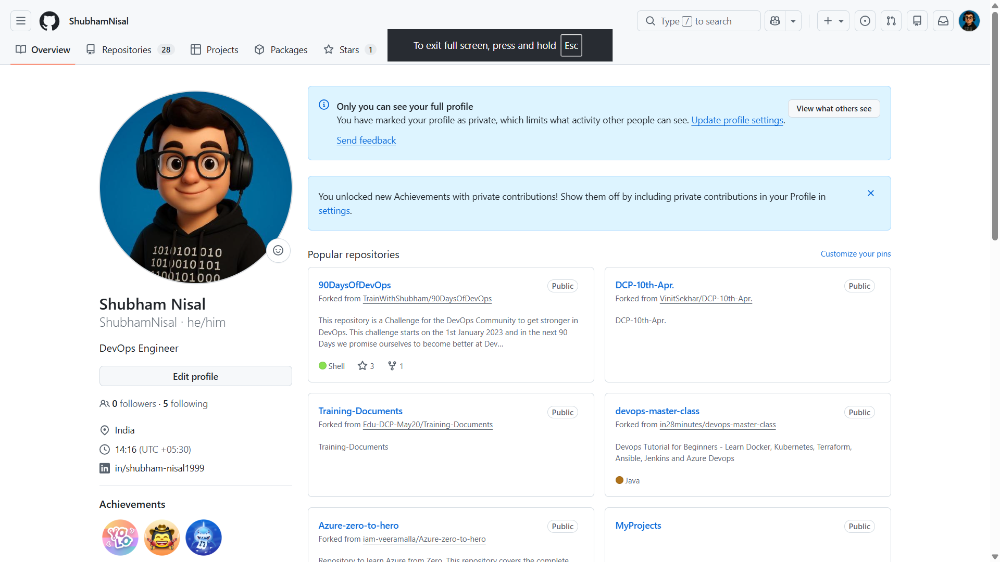
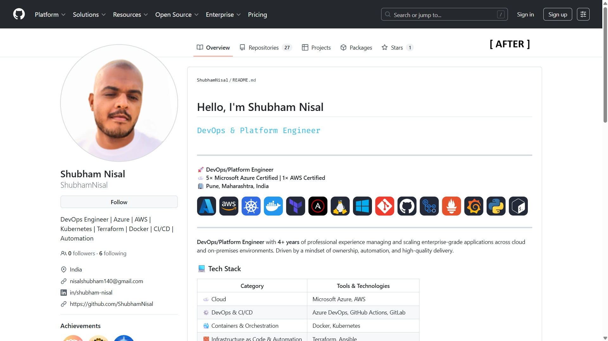

# Day 27 – GitHub Profile Makeover: Build Your Developer Identity

## Task

Your GitHub profile is your **developer resume**. Recruiters, hiring managers, and open-source maintainers will look at your GitHub before your LinkedIn. Today, you'll clean up your profile, organize your repositories, and create a profile README that tells your story.

This is not a coding day — it's a **branding day**. Treat it seriously.

---

  # 🔍 Profile Audit (Before)

Reviewed my GitHub profile from a recruiter’s perspective:

- **Profile Picture:** My profile was an animated picture, so not professional  
- **Bio:** It was an empty bio  
- **Pinned Repositories:** It was indeed some random forks  
- **Repository Names:** Some unclear or inconsistent  
- **Descriptions:** Missing or minimal in a few repositories  
- **README Files:** Not present or not detailed in some repos  
- **Would a recruiter understand what you've been working on?** : Not exactly, as there were lot many tutorial/learning forks and less personal project repos

---

# 🚀 Changes Made

### 🔹 1. Created Profile README
- Added a dedicated profile README repository  
- Included:  
  - Professional introduction  
  - Skills & learning areas  
  - Links to key repositories  
  - Contact information  

### 🔹 2. Organized Repositories
- **90-days-of-devops** → Daily work organized into folders, clear README explaining the challenge  
- **shell-scripts** → Real-world automation scripts, documented with purpose  -- More To be added
- **python-scripts** → Consolidated Python utilities, added descriptions  --To be added
- **devops-notes** → Centralized notes & cheat sheets, organized by topics (Git, Linux, Shell)   --To be added

### 🔹 3. Improved Documentation
- Added/updated `README.md` for all major repositories  --To be added
- Included clear explanations, structure, and usage  
- Added repository descriptions on GitHub  

### 🔹 4. Updated Pinned Repositories
Selected 6 repositories that best represent my skills:
- 90-days-of-devops  
- shell-scripts  
- python-scripts  
- devops-notes  
- More to be added

### 🔹 5. Cleanup
- Deleted or ignored unused/empty repositories  
- Renamed repositories with better naming conventions  
- Ensured no sensitive data (keys, credentials) is exposed  

---

# 📸 Before & After
- Screenshot of GitHub profile before changes  
  
- Screenshot after improvements  
  

---

# 📈 Key Improvements
- **Better Structure & Organization** → Easier for recruiters to navigate and understand my work  
- **Stronger First Impression** → Profile README clearly communicates role, skills, and current focus  
- **Improved Documentation** → Repositories now explain what they do and why they exist  

---

# 💡 Key Learnings
- GitHub acts as a developer portfolio, not just code storage  
- Clear documentation adds significant value to projects  
- Organizing and presenting work is as important as building it  

---

# 🚀 Next Steps
- Continuously update repositories as I progress in the DevOps journey  
- Improve scripts and projects with production-level practices  
- Add more real-world DevOps projects  
