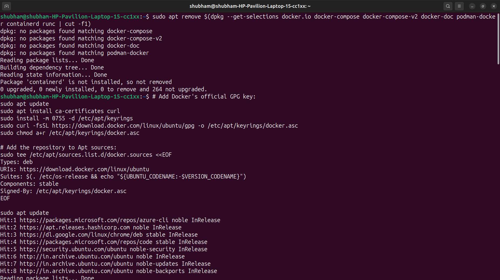
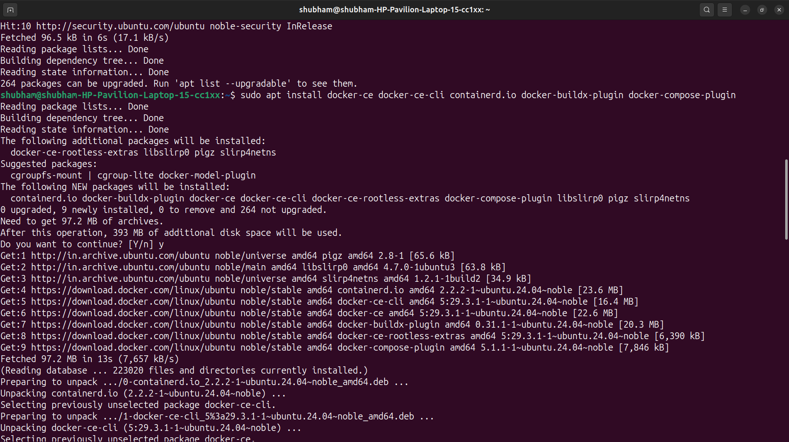
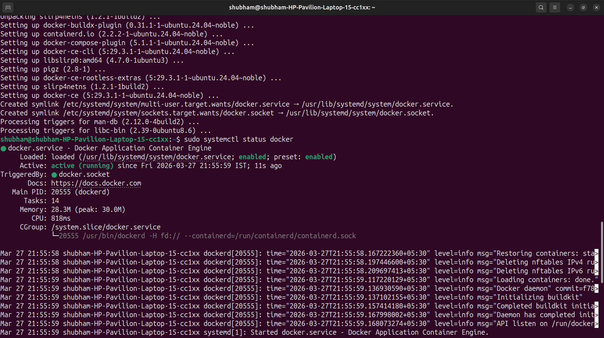
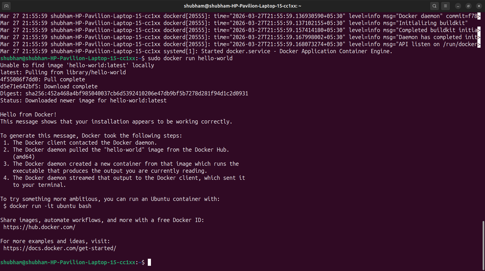
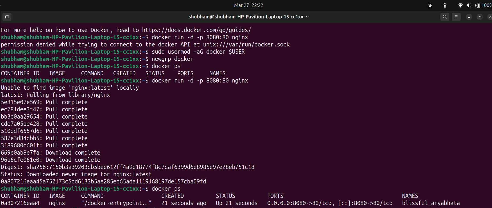
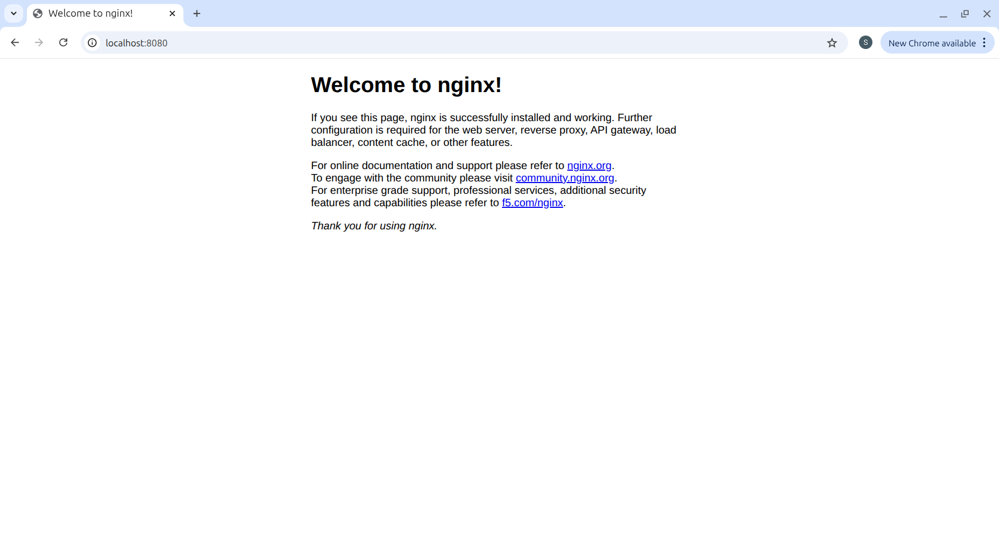
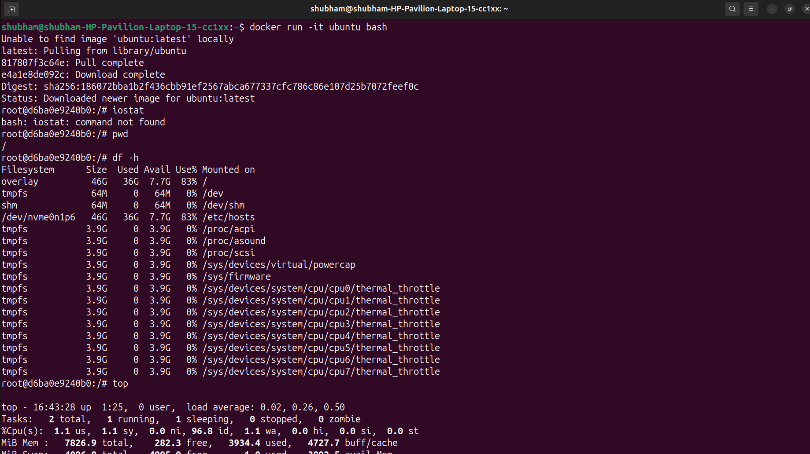
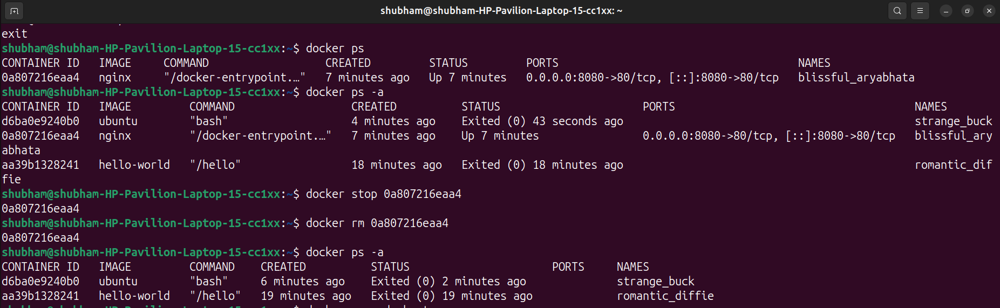
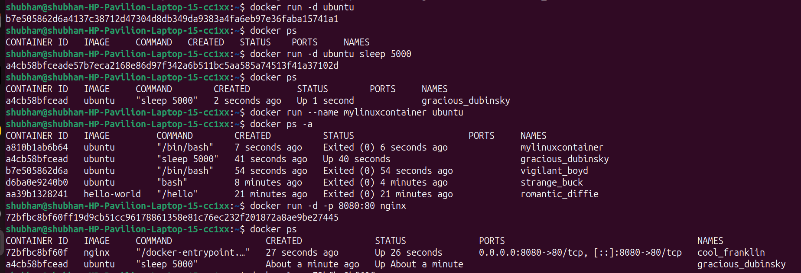
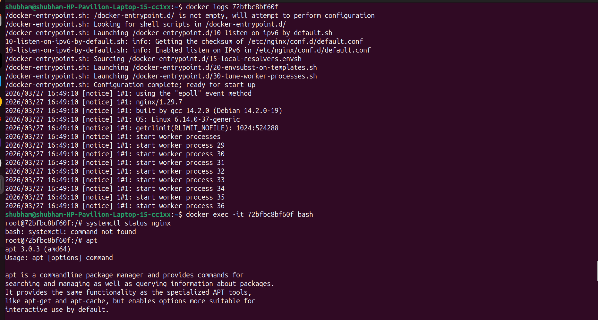

# Day 29 – Introduction to Docker

---

## Challenge Tasks

### Task 1: What is Docker?
Research and write short notes on:
- What is a container and why do we need them?
  ```
  Container:
  A container is a lightweight, standalone package that includes:
  -Application code
  -Runtime
  -Libraries
  -Dependencies
  It ensures the app runs consistently across environments (dev, test, prod).

  Why do we need containers?
  Eliminates “works on my machine” issues
  Faster deployment
  Lightweight (compared to VMs)
  Scalable & portable
  ```
  
- Containers vs Virtual Machines — what's the real difference?

    | Feature              | Containers                          | Virtual Machines                  |
  |----------------------|-------------------------------------|-----------------------------------|
  | Isolation            | Process-level isolation             | Full OS-level isolation           |
  | Performance          | Lightweight, fast startup           | Heavy, slower startup             |
  | Resource Usage       | Shares host OS kernel               | Requires separate OS per VM       |
  | Portability          | Highly portable across environments | Less portable, larger images      |


  **Key Difference:**  
  VMs emulate hardware and run full operating systems, while containers share the host OS kernel and isolate applications at the process level. This makes containers faster and more efficient.


- What is the Docker architecture? (daemon, client, images, containers, registry)
  Draw or describe the Docker architecture in your own words.

  **Docker Architecture**
  - **Docker Daemon (`dockerd`)**: Runs on the host machine, manages images, containers, networks, and volumes.
  - **Docker Client (`docker`)**: CLI tool that communicates with the daemon using REST API.
  - **Images**: Read-only templates used to create containers.
  - **Containers**: Running instances of images.
  - **Registry**: Centralized service (like Docker Hub) to store and distribute images.

  **Architecture Description in My Words:**  
  Think of Docker as a kitchen:
  - The **daemon** is the chef who cooks.
  - The **client** is the waiter who takes your order.
  - The **images** are recipes.
  - The **containers** are the actual dishes prepared.
  - The **registry** is the recipe book library.

---


---

### Task 2: Install Docker
1. Install Docker on your machine (or use a cloud instance)
  - Installation Documentation followed : https://docs.docker.com/engine/install/ubuntu/    
     
      

  
2. Verify the installation    
      
  
3. Run the `hello-world` container   
      
  
4. Read the output carefully — it explains what just happened
   - Docker didn't find the image in local
   - Docker pulled image from Docker Hub
   - Created container
   - Executed it
   - Displayed Hello Docker Output

---

### Task 3: Run Real Containers
1. Run an **Nginx** container and access it in your browser      
       
    
   
3. Run an **Ubuntu** container in interactive mode — explore it like a mini Linux machine      
        
4. List all running containers
5. List all containers (including stopped ones)
6. Stop and remove a container    

    

---

### Task 4: Explore
1. Run a container in **detached mode** — what's different?
  - detached mode: Runs in background without attaching to terminal.
2. Give a container a custom **name**
3. Map a **port** from the container to your host    
       

4. Check **logs** of a running container    
5. Run a command **inside** a running container   
       

---

## Hints
- `docker run`, `docker ps`, `docker stop`, `docker rm`
- Interactive mode: `-it` flag
- Detached mode: `-d` flag
- Port mapping: `-p host:container`
- Naming: `--name`
- Logs: `docker logs`
- Exec into container: `docker exec`

---

## Why This Matters for DevOps
Docker is the foundation of modern deployment. Every CI/CD pipeline, Kubernetes cluster, and microservice architecture starts with containers. Today you took the first step.

---
