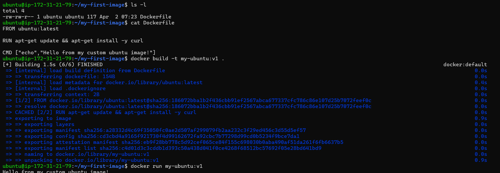
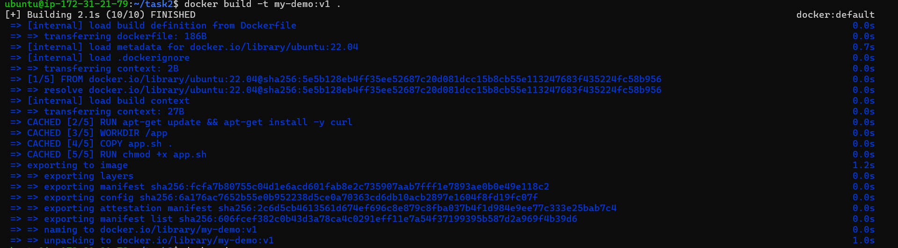
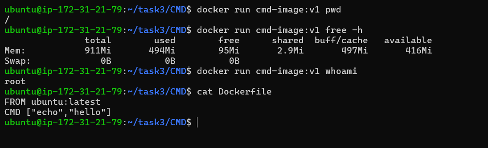
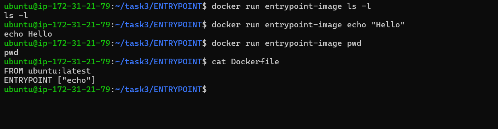
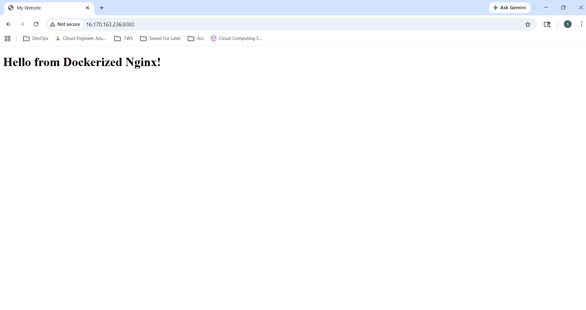
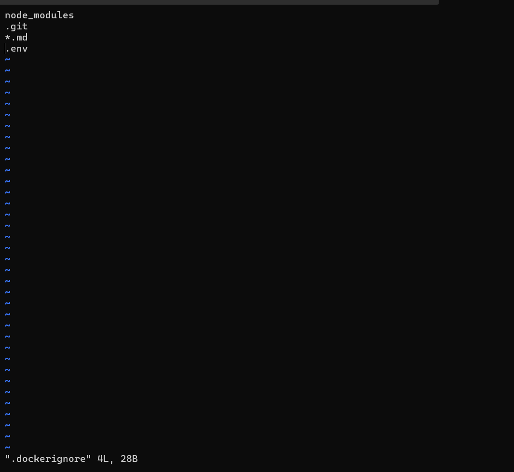
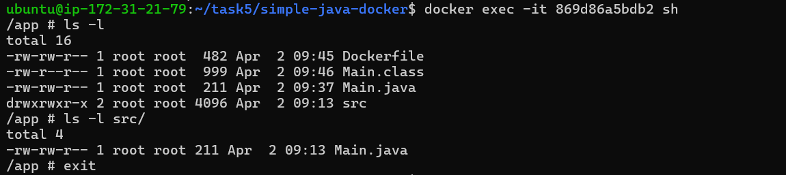
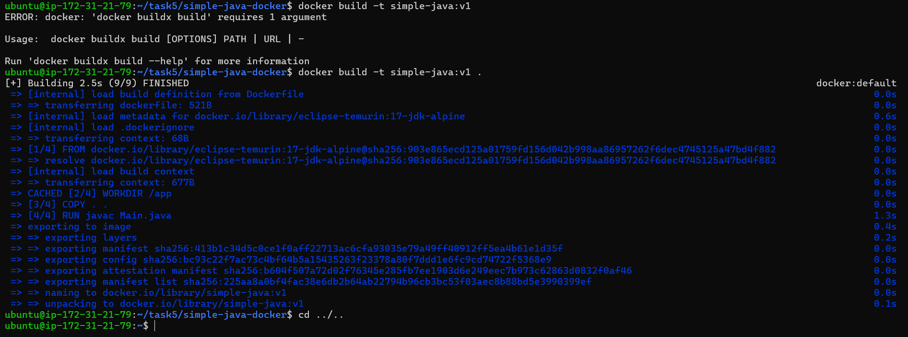

# Day 31 – Dockerfile: Build Your Own Images

## Task
Today's goal is to **write Dockerfiles and build custom images**.

This is the skill that separates someone who uses Docker from someone who actually ships with Docker.

---

## Challenge Tasks

### Task 1: Your First Dockerfile
1. Create a folder called `my-first-image`
2. Inside it, create a `Dockerfile` that:
   - Uses `ubuntu` as the base image
   - Installs `curl`
   - Sets a default command to print `"Hello from my custom image!"`
3. Build the image and tag it `my-ubuntu:v1`
4. Run a container from your image

**Verify:** The message prints on `docker run`

   

---

### Task 2: Dockerfile Instructions
Create a new Dockerfile that uses **all** of these instructions:
- `FROM` — base image
- `RUN` — execute commands during build
- `COPY` — copy files from host to image
- `WORKDIR` — set working directory
- `EXPOSE` — document the port
- `CMD` — default command

Build and run it. Understand what each line does.

```
FROM ubuntu:22.04

RUN apt-get update && apt-get install -y curl

WORKDIR /app

COPY app.sh .

RUN chmod +x app.sh

EXPOSE 3000

CMD ["./app.sh"]
```

   

```
- FROM: Defines base image
- RUN: Executes commands at build time
- COPY: Moves files from host → container
- WORKDIR: Sets default directory inside container
- EXPOSE: Documents intended port (not enforced)
- CMD: Default command when container starts
```

---

### Task 3: CMD vs ENTRYPOINT
1. Create an image with `CMD ["echo", "hello"]` — run it, then run it with a custom command. What happens?
   
```
if you run with additional arguments- docker run cmd-image:v1 pwd, it prints the present working directory, CMD is overridden
```

2. Create an image with `ENTRYPOINT ["echo"]` — run it, then run it with additional arguments. What happens?

   

```
if you run - docker run entrypoint-image pwd , it prints the string "pwd". The command echo in the ENTRYPOINT is not overridden, thereby forcing the ENTRYPOINT.
```

3. Write in your notes: When would you use CMD vs ENTRYPOINT?

```
- CMD: Good for defaults, can be overridden easily.
- ENTRYPOINT: Forces a command, appends arguments. Best for fixed executables
```

---

### Task 4: Build a Simple Web App Image
1. Create a small static HTML file (`index.html`) with any content
```
<!DOCTYPE html>
<html>
<head>
  <title>My Website</title>
</head>
<body>
  <h1>Hello from Dockerized Nginx!</h1>
</body>
</html>
```

2. Write a Dockerfile that:
   - Uses `nginx:alpine` as base
   - Copies your `index.html` to the Nginx web directory
```
FROM nginx:alpine

COPY index.html /usr/share/nginx/html/
```

3. Build and tag it `my-website:v1`

```
docker build -t my-website:v1 .
```

4. Run it with port mapping and access it in your browser

   


---

### Task 5: .dockerignore
1. Create a `.dockerignore` file in one of your project folders
2. Add entries for: `node_modules`, `.git`, `*.md`, `.env`
3. Build the image — verify that ignored files are not included

   
   

---

### Task 6: Build Optimization
1. Build an image, then change one line and rebuild — notice how Docker uses **cache**
```
- Docker builds in layers.
- If you change one line, only that layer and subsequent ones rebuild.
- Place frequently changing instructions (like COPY . .) last.

```
2. Reorder your Dockerfile so that frequently changing lines come **last**
3. Write in your notes: Why does layer order matter for build speed?
```
Docker caches each layer
If an early layer changes → all layers rebuild, results in slow builds.
Therefore, Keep the frequently changing layer/code at the bottom

Faster builds = better productivity
```

     

---
