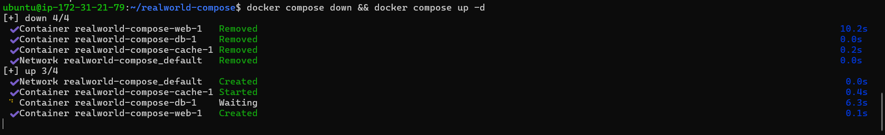
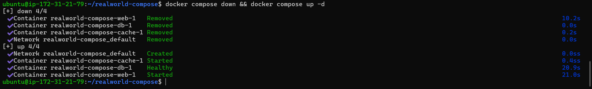
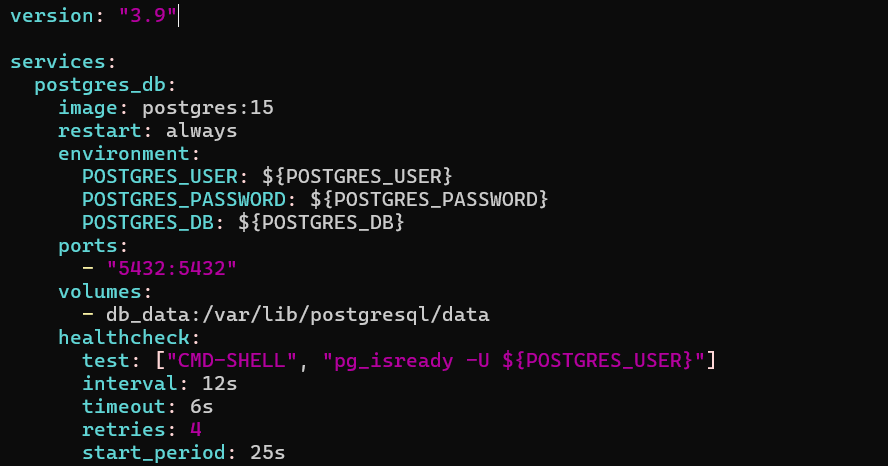
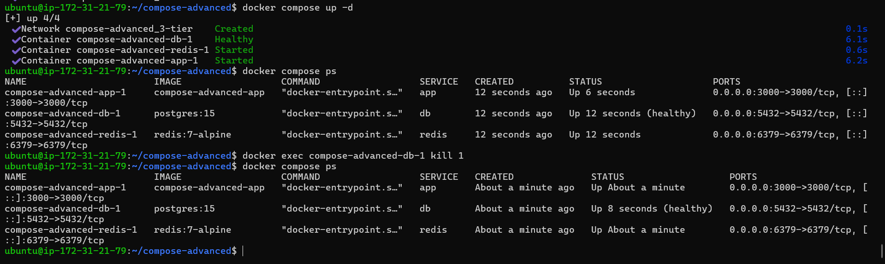
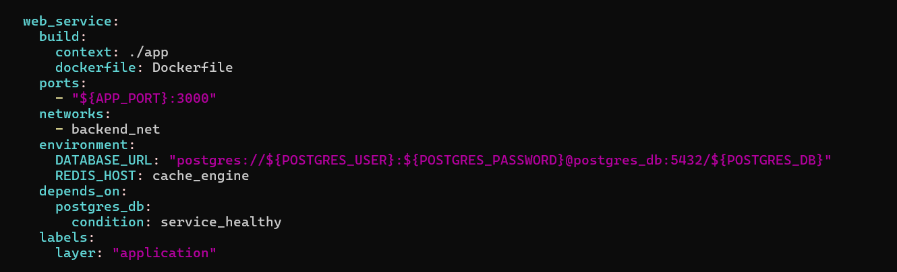
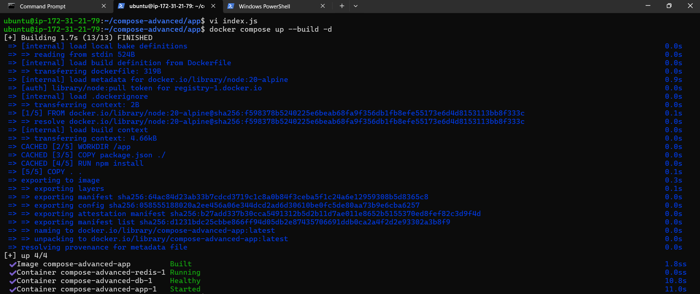

# Day 34 – Docker Compose: Real-World Multi-Container Apps

## Task
Today's goal is to **build more complex, production-like setups with Docker Compose**.

Yesterday was basics. Today you handle real scenarios — app + database + cache, healthchecks, restart policies, and service dependencies.

---

## Challenge Tasks

### Task 1: Build Your Own App Stack
Create a `docker-compose.yml` for a 3-service stack:
- A **web app** (use Python Flask, Node.js, or any language you know)
- A **database** (Postgres or MySQL)
- A **cache** (Redis)

  [Files](DockerizedApp/)

Write a simple Dockerfile for the web app. The app doesn't need to be complex — even a "Hello World" that connects to the database is enough.

---

### Task 2: depends_on & Healthchecks
1. Add `depends_on` to your compose file so the app starts **after** the database
2. Add a **healthcheck** on the database service
3. Use `depends_on` with `condition: service_healthy` so the app waits for the database to be truly ready, not just started

**Test:** Bring everything down and up — does the app wait for the DB?

  - App waits for DB to be healthy
    
      

---

### Task 3: Restart Policies
1. Add `restart: always` to your database service
      

2. Manually kill the database container — does it come back?
  - In case of `restart: always` container comes back after killing it with command:     
    docker exec compose-advanced-db-1 kill 1    
    
    
3. Try `restart: on-failure` — how is it different?
  - restart: always → container restarts even after manual stop/kill.
  - restart: on-failure → restarts only if container exits with non-zero code.


4. Write in your notes: When would you use each restart policy?
  - Use always for critical infra (DB, cache).
  - Use on-failure for apps where you want to debug crashes.

---

### Task 4: Custom Dockerfiles in Compose
1. Instead of using a pre-built image for your app, use `build:` in your compose file to build from a Dockerfile
      
  
2. Make a code change in your app
3. Rebuild and restart with one command    
  - docker compose up --build -d

      


---

### Task 5: Named Networks & Volumes
1. Define **explicit networks** in your compose file instead of relying on the default
2. Define **named volumes** for database data
3. Add **labels** to your services for better organization

-   [docker-compose.yml](DockerizedApp/docker-compose.yml)

---

### Task 6: Scaling (Bonus)
1. Try scaling your web app to 3 replicas using `docker compose up --scale`    
  -       
  
2. What happens? What breaks?    
- You'll get 3 relpicas of the web service, but it errors out:
  ```
  Error response from daemon: failed to set up container networking: driver failed programming external connectivity on endpoint compose-advanced-app-3 
  (52c9f35afec44a13c087c33006afdee408fe2f2d90ca8fbea166191dbf6deeba): Bind for 0.0.0.0:3000 failed: port is already allocated
  ```

3. Write in your notes: Why doesn't simple scaling work with port mapping?
  - Port mapping (5000:5000) breaks because only one container can bind to host port 5000.

---

## Hints
- Build from Dockerfile: `build: ./app`
- Healthcheck: `healthcheck:` with `test`, `interval`, `timeout`
- Rebuild: `docker compose up --build`
- Scale: `docker compose up --scale web=3`


