# Day 35 – Multi-Stage Builds & Docker Hub

## Task
Today's goal is to **build optimized images and share them with the world**.

Multi-stage builds are how real teams ship small, secure images. Docker Hub is how you distribute them. Both are interview favourites.

---

## Expected Output
- A markdown file: `day-35-multistage-hub.md`
- Dockerfiles demonstrating multi-stage builds
	- Files:    
		[Single-Node](app/single-node/Dockerfile)     
		[Multistage-Node](app/multistage-node/Dockerfile)      
		[Best-Practice-Node](app/bestpractice-node/Dockerfile)     
    
- An image pushed to your Docker Hub account
	- https://hub.docker.com/repository/docker/shubhamnisal/optimized-node/general
 	- https://hub.docker.com/repository/docker/shubhamnisal/multistage-node/general

---

## Challenge Tasks

### Task 1: The Problem with Large Images
1. Write a simple Go, Java, or Node.js app (even a "Hello World" is fine)
2. Create a Dockerfile that builds and runs it in a **single stage**
3. Build the image and check its **size**

Note down the size — you'll compare it later.
```
Observation: Image size ~ 1GB+ (because it includes full Node.js + build tools)
```

[Files](app/single-node/)

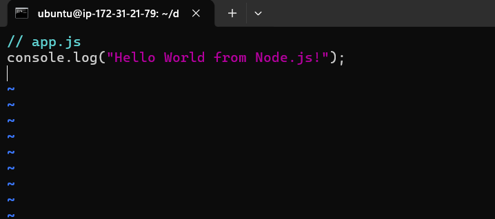   

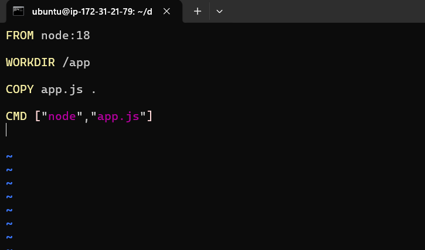   

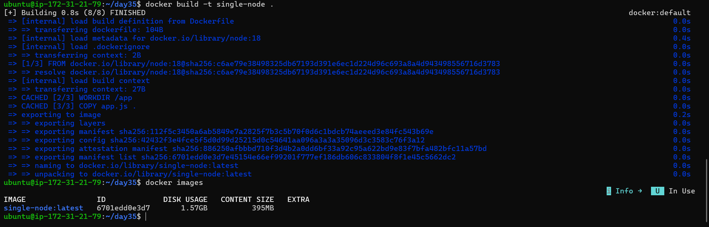   

---

### Task 2: Multi-Stage Build
1. Rewrite the Dockerfile using **multi-stage build**:
   - Stage 1: Build the app (install dependencies, compile)
   - Stage 2: Copy only the built artifact into a minimal base image (`alpine`, `distroless`, or `scratch`)
2. Build the image and check its size again
3. Compare the two sizes

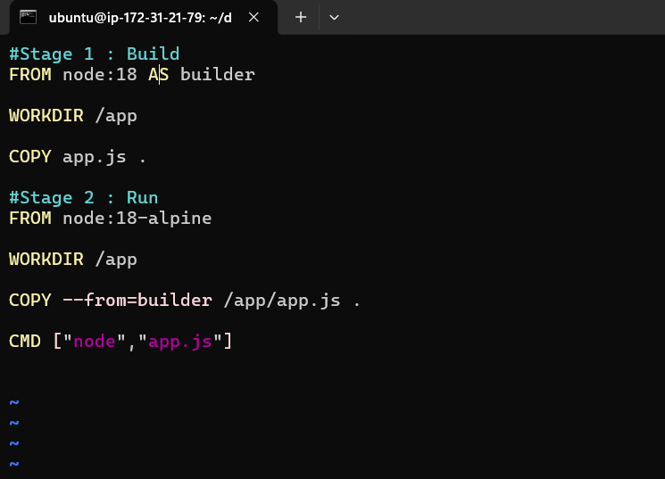   

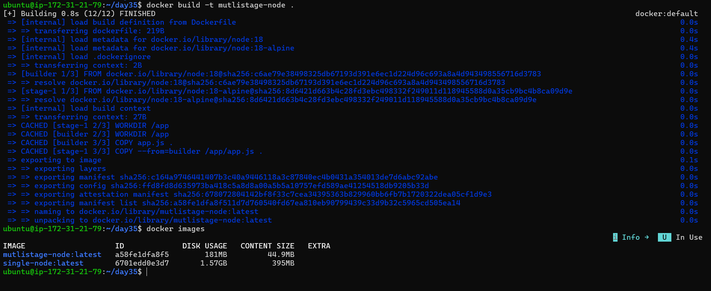  

Write in your notes: Why is the multi-stage image so much smaller?
- Only runtime essentials are copied.
- Build tools, caches, and unnecessary files are excluded


---

### Task 3: Push to Docker Hub
1. Create a free account on [Docker Hub](https://hub.docker.com) (if you don't have one)
2. Log in from your terminal
3. Tag your image properly: `yourusername/image-name:tag`
4. Push it to Docker Hub
5. Pull it on a different machine (or after removing locally) to verify

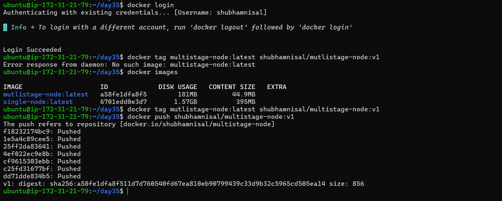   
			  
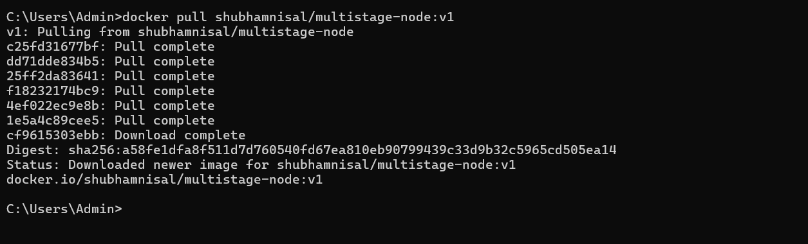    

---

### Task 4: Docker Hub Repository
1. Go to Docker Hub and check your pushed image
2. Add a **description** to the repository
3. Explore the **tags** tab — understand how versioning works
4. Pull a specific tag vs `latest` — what happens?

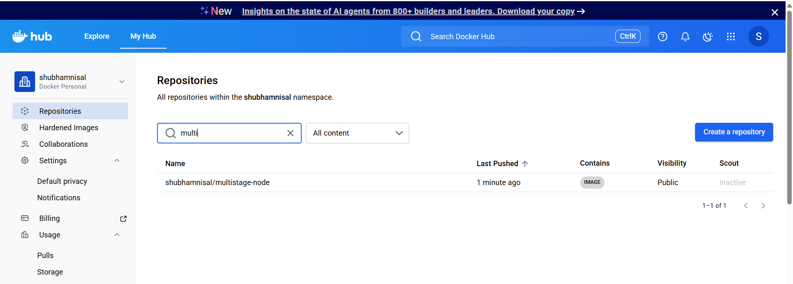   

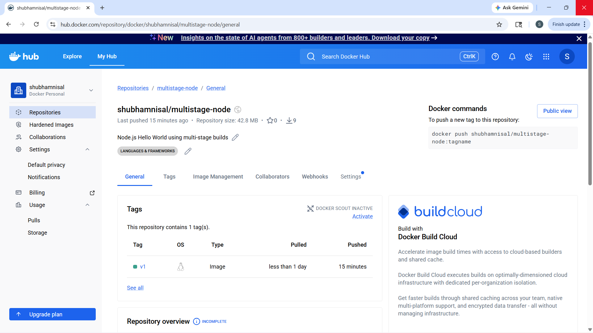   			 

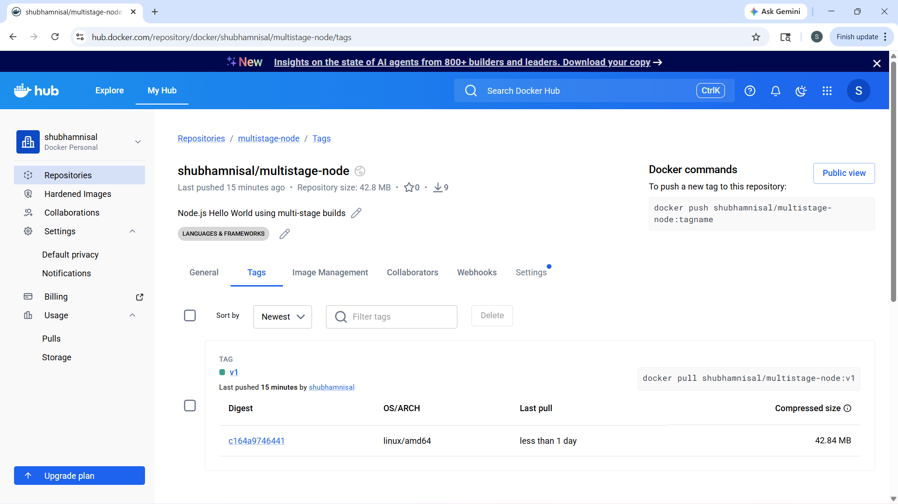   

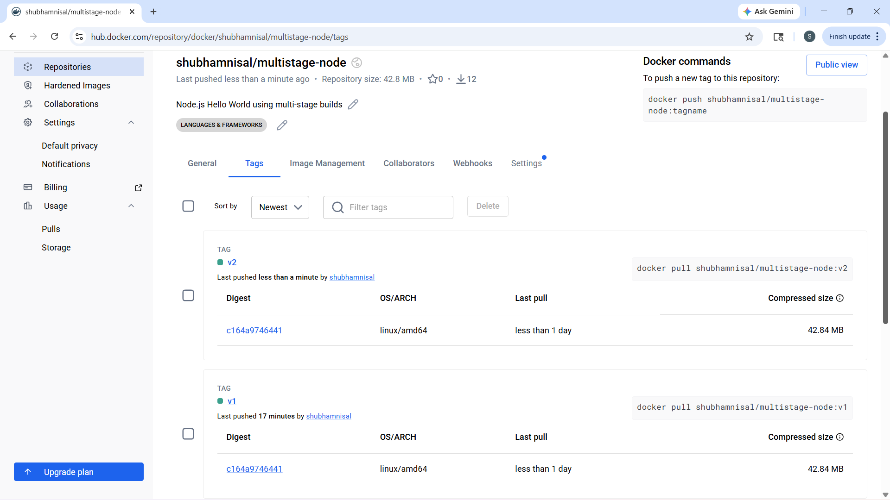   			  

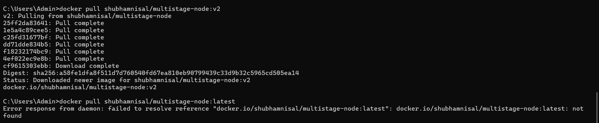   

---

### Task 5: Image Best Practices
Apply these to one of your images and rebuild:
1. Use a **minimal base image** (alpine vs ubuntu — compare sizes)
2. **Don't run as root** — add a non-root USER in your Dockerfile
3. Combine `RUN` commands to **reduce layers**
4. Use **specific tags** for base images (not `latest`)

Check the size before and after.

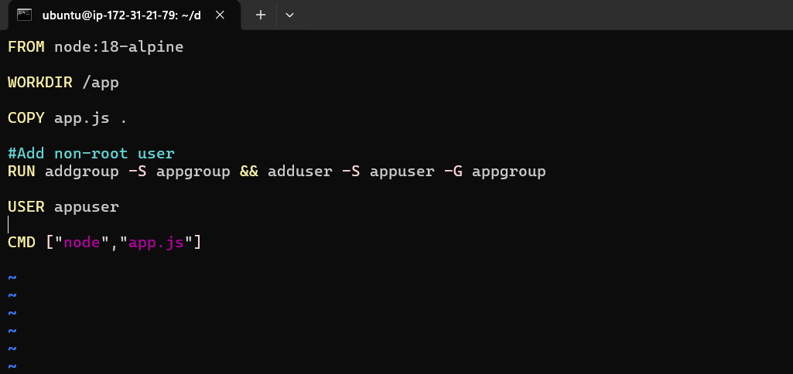   

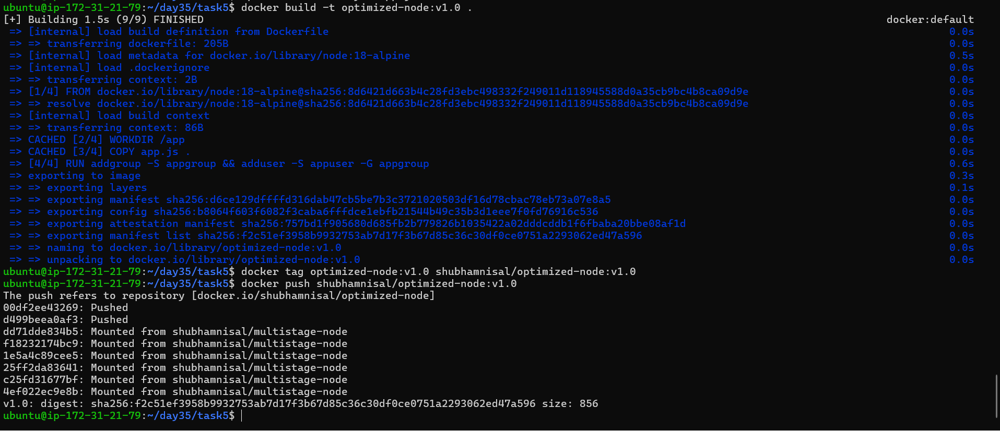   	

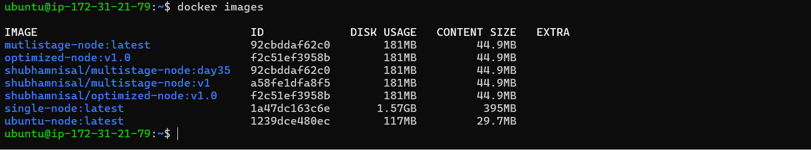   

---

## Hints
- Multi-stage: use `FROM ... AS builder` then `COPY --from=builder`
- Login: `docker login`
- Tag: `docker tag local-image:tag username/repo:tag`
- Push: `docker push username/repo:tag`
- Non-root user: `RUN adduser` + `USER`

---
